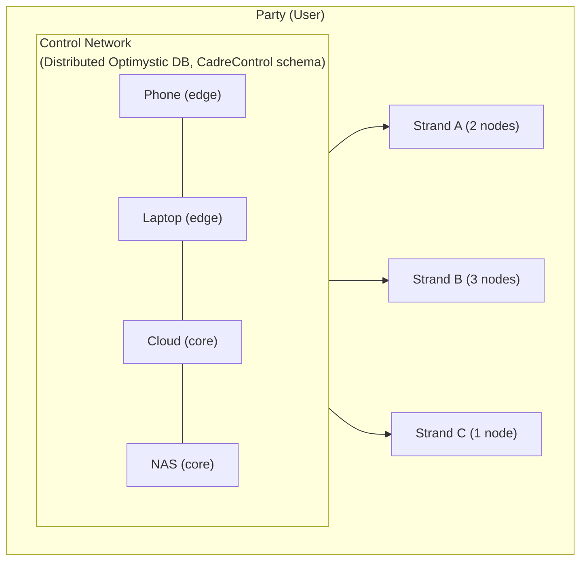
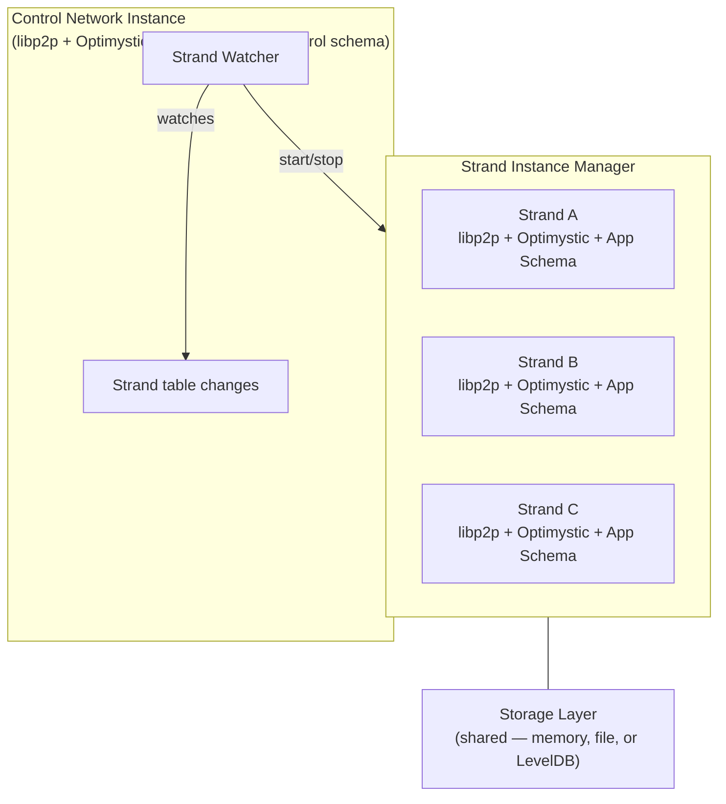
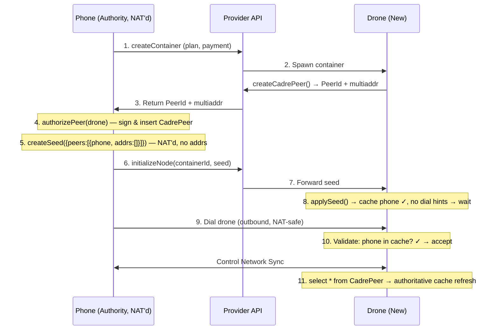
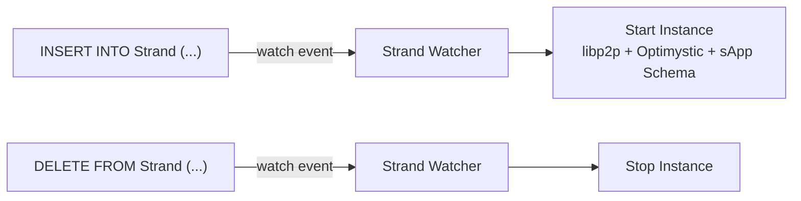
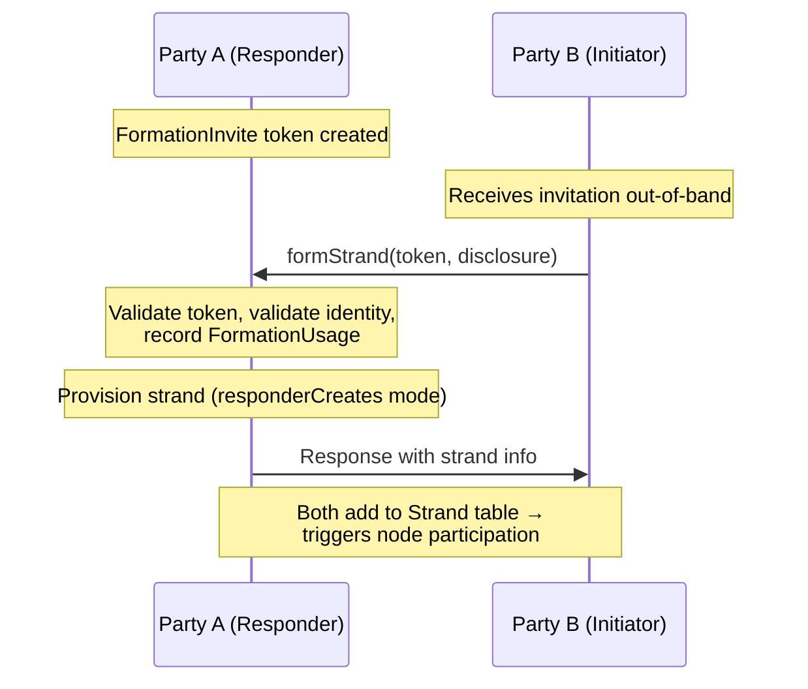
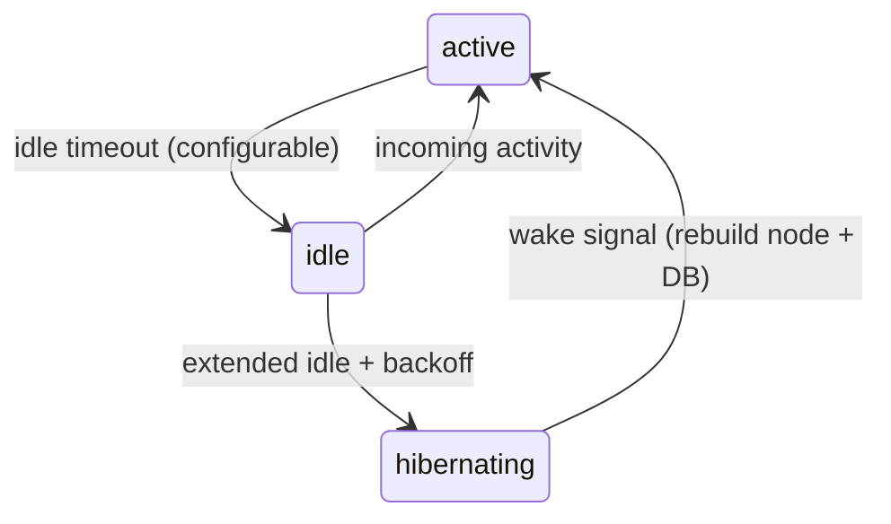
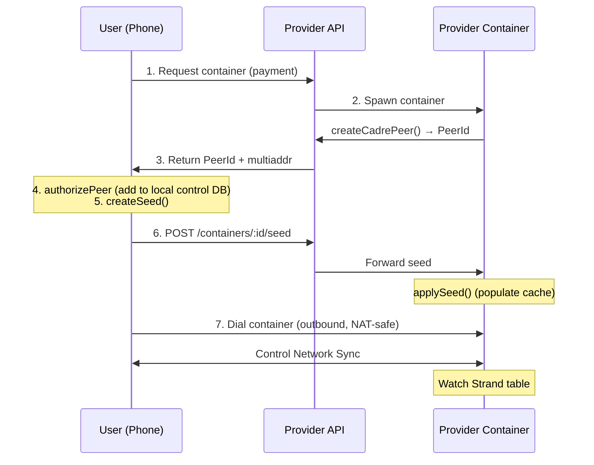
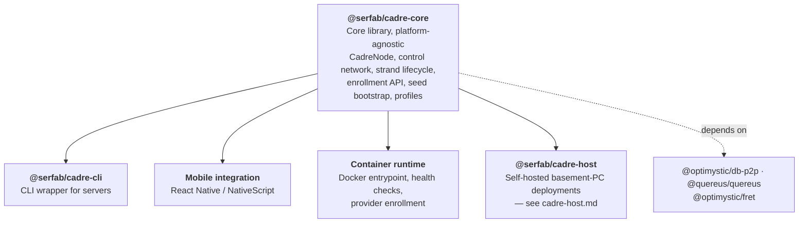

# Sereus Cadre Architecture

This document describes the architecture of the Sereus Cadre system—the infrastructure that enables parties to control sets of nodes participating in distributed strand networks.

## Overview

A **cadre** is a party's personal cluster of nodes that collectively represent their presence across strands. Cadre nodes range from always-on cloud servers with terabytes of storage to intermittently-connected mobile devices. The cadre system provides:

- **Unified control**: A single control network through which a party manages all their nodes
- **Strand participation**: Automatic lifecycle management for joining, syncing, and leaving strand networks
- **Flexible deployment**: Support for self-hosted nodes (see [@serfab/cadre-host](cadre-host.md) for basement-PC deployments), provider-hosted containers, and mobile devices
- **Key-based authorization**: Cryptographic authority delegation without central servers



## Core Components

### Control Network

The control network is a private Optimystic network involving only the party's own cadre nodes. It uses the `CadreControl` schema to maintain:

| Table | Purpose |
|-------|---------|
| `AuthorityKey` | Keys authorized to make control changes |
| `ValidationKey` | Keys that can validate strand formation disclosures |
| `Strand` | List of strands the party participates in |
| `CadrePeer` | Registry of nodes in the cadre |
| `FormationInvite` | Open invitations to form strands with this party |
| `FormationUsage` | Audit log of formation invite consumption |

#### Network scoping (current implementation)

Cadre uses `@optimystic/db-p2p` to create libp2p+Optimystic nodes. In that implementation, **libp2p service protocols are namespaced by** `networkName` via:

- `protocolPrefix = /optimystic/${networkName}`
- control network uses `networkName = control-${partyId}`

Cadre-specific protocols are separate and live under `/sereus/*` (e.g. seed delivery uses `/sereus/seed/1.0.0`; control-network push-wake uses `/sereus/strand-wake/1.0.0`, see [Strand Hibernation → Wake Mechanisms](#strand-hibernation)).

### Strand Networks

Each strand is an independent Optimystic network with its own:
- Network namespace: `networkName = strand-${strandId}` (libp2p services are scoped under `/optimystic/strand-${strandId}` in `@optimystic/db-p2p`)
- Member list (for closed strands)
- Application schema
- Peer cohort (union of all member cadres)

**Strand membership schema.** Every strand applies the `Strand` membership/RBAC schema (`schemas/strand.qsql` — `Header`, `Invite`, `ConsumedInvite`, `Member`, `MemberPeer`, `Authority`) automatically, alongside the sApp DDL under `declare schema App { ... }`. The cadre-core `StrandDatabase` and the `@serfab/quereus-plugin-sereus` connectors (`connectToStrand` / `connectToStrandBrowser`) share **one** composition — `composeStrand` — so plugin registration, node wiring, the warm-restart catalog hydrate, and schema apply all live in a single place. `StrandDatabase` owns only the `Database` lifecycle and delegates the rest to `connectToStrand` with its injected libp2p node. Immediately after the catalog hydrate, `composeStrand` applies the `Strand` schema unconditionally (every strand has membership semantics) and then the sApp schema if one was supplied; the membership schema ships as an embedded `STRAND_SCHEMA` constant (kept byte-equivalent to `schemas/strand.qsql`) so it works on filesystem-less platforms, mirroring cadre-core's `CONTROL_SCHEMA`. This makes the membership tables present and their `verify()`-gated constraints active on every strand. It does **not** populate them: inserting the `Header` row and bootstrapping the founding `Authority`/`Member` and invite/peer flows is tracked by the lifecycle ticket `strand-membership-lifecycle-population`, so the change is additive and does not gate sApp (`App.*`) reads or writes.

### Cadre Node

A cadre node is a running instance of the `@serfab/cadre-core` library. Each node:

1. **Connects to the control network** using its PeerId and authorized bootstrap addresses
2. **Watches the `Strand` table** for changes (reactive pattern - which is a TODO for Optimystic so we'll have to poll for now)
3. **Starts/stops strand instances** as rows are added/removed
4. **Publishes a signed peer-address record** to its own `CadrePeer` row (`CadreNode.registerSelf`): its current dialable/relay multiaddrs (signaling `/p2p-circuit` first), an ed25519 `PublicKey` whose libp2p identity *is* its PeerId, a monotonic `UpdatedAt` freshness stamp, and a self-`Sig` over those fields. It re-publishes on relay-reservation/address change and on a TTL heartbeat. Any member can then **resolve** another member's current signaling address from its PeerId alone via `CadreNode.resolvePeerAddrs(peerId)` — which re-verifies the signature, checks the `PublicKey↔PeerId` binding and freshness, and applies a pluggable trust gate — so a NAT-to-NAT WebRTC dial can be negotiated without copy/paste.



## Node Profiles

Cadre nodes operate in one of two profiles, distinguished by their storage role:

> **Designed, not yet implemented:** The concentric storage-ring model described in this section (Ring Zulu participation beyond the on/off hint, Rings 0–3, keyspace partitioning, and capacity quotas) describes the **intended design**. The current implementation is the `arachnode-stub.ts` no-op stub (exported from `@serfab/cadre-core` but not yet wired into the runtime path). The only wired effect of profile selection today is the FRET `edge`/`core` choice plus a single Ring Zulu enable flag passed as a hint to the libp2p node (`strand-instance-manager.ts:202,210`). Treat the table and ring prose below as design reference. Tracked by `tickets/backlog/later/5-ring-zulu-storage-rings.md`.

| Profile | Arachnode | Typical Deployment | Ring Participation |
|---------|-----------|--------------------|--------------------|
| **Transaction** | Disabled | Mobile devices, intermittent connectivity | Transaction verification via FRET only |
| **Storage** | Enabled (Ring Zulu + Storage Rings) | Servers, NAS, always-on nodes | Full block storage with capacity quotas |

In the intended design, transaction-profile nodes skip Arachnode initialization entirely (no StorageMonitor, RingSelector, or RestorationCoordinator) for a lighter cold start, while storage-profile nodes initialize the full Arachnode subsystem including Ring Zulu and concentric storage rings. _Those Arachnode components do not exist yet_ — see the callout above. Currently profile selection only sets the FRET `edge`/`core` profile and the Ring Zulu enable hint.

### Strand Filtering

Mobile nodes typically run as part of a specific application and should not participate in all strands. The configuration includes an optional **strand filter**:

| Filter Mode | Behavior |
|-------------|----------|
| `all` | Participate in all strands in the control network (default for servers) |
| `sAppId:<id>` | Only participate in strands matching the specified sAppId |
| `strandId:<id>` | Only participate in a single specific strand |
| `none` | Control network only, no strand participation |

This allows a mobile app to embed a cadre node that only participates in the app's strand while the user's server nodes handle the full portfolio.

- **Ring Zulu (Transaction)**: Storage-profile nodes participate — transaction verification, ephemeral caching, forward to storage rings
- **Ring 3** (8 partitions) → **Ring 2** (4 partitions) → **Ring 1** (2 partitions) → **Ring 0** (full keyspace): Concentric storage rings. Storage-profile nodes join the appropriate ring based on capacity.

## Enrollment and Bootstrap

Adding a new node to a cadre involves a "cold start" problem: the new node needs control network data to validate connections, but can't get that data without first connecting. The **control network seed** solves this by pre-populating the new node's cache with enough authorization data to establish the first connection.

### The Cold Start Problem

When a new node joins a cadre:

1. **New node has empty control DB** — no `CadrePeer` entries, can't validate anyone
2. **Existing nodes enforce authorization in the DB layer** — CadreControl constraints reject unauthorized control writes; there is not yet a libp2p connection-gating layer
3. **NAT complicates dialing** — phones behind NAT can't receive incoming connections

The seed provides the minimal state needed to break this chicken-and-egg cycle.

### Control Network Seed

A seed contains everything a new node needs to join the control network:

```typescript
interface ControlNetworkSeed {
  // Identity - which control network to join
  partyId: string;

  // Authorization cache entries for peer validation
  peers: SeedPeer[];

  // Signature over { partyId, peers }
  signature: string;

  // ed25519 public key (base64url) used to verify `signature`
  signerKey: string;
}

interface SeedPeer {
  peerId: string;           // libp2p peer ID
  multiaddrs: string[];     // Dial hints (may be empty if NAT'd)
  isAuthority: boolean;     // Hint: an authority-hosting peer to prefer dialing
  publicKey?: string;       // ed25519 public key (base64url) — set on authority peers (derived from the AuthorityKey table, not used to gate the seed's own signerKey)
}
```

`SeedPeer` is the **cold-start projection** of a `CadrePeer` row: a seed pre-populates the peerstore so an unconnected node can make its first dials. Once connected, the authoritative, replicated form of the same mapping is the `CadrePeer` row itself, which is a signed **`PeerAddressRecord`**:

```typescript
interface PeerAddressRecord {
  peerId: string;       // libp2p peer ID (base58btc) — the CadrePeer row key
  publicKey: string;    // ed25519 (base64url) whose libp2p identity IS peerId
  addrs: string[];      // current dialable multiaddrs, signaling (/p2p-circuit) first
  updatedAt: number;    // epoch ms — strictly increasing freshness stamp per peer
  sig: string;          // ed25519 self-signature over (peerId, addrs, updatedAt)
}
```

The peer self-publishes and self-signs this record (the `CadreControl.CadrePeer` schema enforces the self-signature, monotonic `UpdatedAt`, and immutable `PeerId`/`PublicKey` on update); a resolver re-verifies it. Unlike a `SeedPeer` dial hint, a `PeerAddressRecord` is freshness-stamped and individually trust-checkable, so `resolvePeerAddrs` never hands back a stale relay reservation. The **authority node self-registers its own `CadrePeer` row at startup** (`registerSelf`, wired into `cadre start --authority` right after seed-bootstrap init), so every seed it mints already carries the authority's own dialable address as an authority peer — otherwise the seed would omit the authority (and thus any address for a receiver to dial it) until the TTL heartbeat first published the row. Trust in a seed rests on its `signerKey` being a known/pinned authority, not on the authority peer being present (see `SeedTrustPolicy`); self-registration furnishes the dial target, it does not pass a gate. The background heartbeat keeps the row fresh thereafter. A FRET-backed, coordinate-keyed liveness store remains future work (`tickets/backlog/fret-backed-peer-record-liveness.md`).

The seed is **cache pre-population**, not a separate database. After applying the seed, the node's normal query mechanisms (`select * from CadrePeer`) fetch authoritative state from peers, naturally merging with the seed data.

### Unified Node Behavior

After applying a seed, a node follows a simple unified algorithm regardless of network topology:

1. Populate peerstore with peers + multiaddrs from seed
2. Attempt outbound dials (best effort) — prefer peers flagged `isAuthority` first
3. Once connected: begin control network sync (Optimystic), refresh via `select * from CadrePeer`
4. Periodic refresh (until reactivity): re-query CadrePeer, update local cache

The node doesn't need to know who will dial whom — it tries everything and accepts whatever works first.

### Enrollment Flow: Phone Adds Provider Drone

The most common case: a user on a NAT'd phone adds a provider-hosted node.



Key points:
- Phone is NAT'd → seed has no multiaddrs for phone → drone waits
- Phone dials drone (outbound from phone's perspective) → NAT-safe
- Drone validates phone against seed cache → connection accepted
- Normal sync populates authoritative state

### Enrollment Flow: Server Adds Phone

When a server (public IP) adds a phone to its cadre:


No seed needed — server is dialable, so phone just connects and syncs.

### Enrollment Flow: Server Adds Drone

When a server adds another provider-hosted node:


Seed includes `bootstrapAddrs` because server IS dialable. Drone initiates connection to server.

### When Is a Seed Needed?

| Instigator | Adding | Seed Needed? | Who Dials Whom? |
|------------|--------|--------------|-----------------|
| Phone (NAT) | Drone (public) | **Yes** — drone needs phone's CadrePeer in cache | Phone → Drone |
| Phone (NAT) | Phone (NAT) | **Yes** — both need each other; use relay addrs | Both → Relay |
| Server (public) | Phone (NAT) | **No** — phone can dial server directly | Phone → Server |
| Server (public) | Drone (public) | **Yes** — includes `multiaddrs` so drone can dial | Drone → Server |

The key asymmetry:
- **Instigator has public IP**: Seed includes `multiaddrs`, new node dials in
- **Instigator is NAT'd**: Seed has no `multiaddrs`, instigator dials out after seed is applied

### Seed Delivery Protocol

Seeds can be delivered through multiple mechanisms. For direct delivery when the new node is dialable, we define a libp2p protocol:

**Protocol ID**: `/sereus/seed/1.0.0`


**Message Types**:

```typescript
// Instigator → New Node
interface SeedMessage {
  partyId: string;                    // Control network to join
  peers: SeedPeer[];                  // Authorization cache entries
  signature: string;                  // Signed by an authority key
  signerKey: string;                  // Authority ed25519 public key (base64url)
}

// New Node → Instigator
interface SeedAckMessage {
  accepted: boolean;
  reason?: string;                    // Present if accepted=false
}
```

**Validation**:
- The `signature` is an ed25519 signature over `digest(canonicalJson({partyId, peers}), 'sha256')` — a canonical (recursively key-sorted, `undefined`-dropped, whitespace-free) serialization shared with cadre-host's update-manifest signing. Both signer and verifier route through the same `canonicalSeedPayload` builder so the signed bytes are independent of key insertion order
- New node verifies `signature` using `signerKey` (ed25519)
- `signerKey` must clear a **trust anchor that does not come from the seed body** — a signature only proves the seed is internally consistent, and both `signerKey` and the seed's own `isAuthority` peer flags are attacker-supplied, so a forged self-asserting seed must not be able to vouch for itself. The receiver evaluates a `SeedTrustPolicy` against its *own* known authority keys (`CadreControl.AuthorityKey`), in priority order:
  - **DB-anchored** (default): the signer is trusted iff its key is already in the receiver's `AuthorityKey` table (steady state — the node is enrolled / has synced control state).
  - **Pinned out-of-band**: authority keys delivered outside the seed — carried by `CadreInvite.authorityKeys`, or pinned by operator config — let a cold-start invitee accept its first seed.
  - **TOFU (opt-in)**: an interactive confirmation callback invoked on first sight of an unknown signer key; off by default.
  - **Secure default**: a cold-start node with an empty `AuthorityKey` table, no pinned keys, and no TOFU confirmation **rejects** the seed.
- Authority identity is sourced from the `AuthorityKey` table, **not** from the libp2p `peerId`. An Ed25519 PeerId embeds its public key, so each peer's ed25519 key is derived from its `PeerId` and a peer is marked `isAuthority` iff that derived key is in `AuthorityKey` — making multi-authority cadres representable and decoupling authority status from the transport identity.
- A seed carries only peer-address hints (`peers[]`); warm-cache prepopulation with signed Optimystic log entries is deferred (see backlog `seed-warm-cache-prepopulation`)

**Alternative Delivery Mechanisms**:

| Mechanism | When Used | Notes |
|-----------|-----------|-------|
| Direct protocol | New node is dialable | Instigator dials, sends seed directly |
| Provider API | Provider-hosted node | `POST /containers/:id/seed` via HTTPS |
| QR code / deep link | Mobile onboarding | Seed encoded in URL, opened by app |
| Environment variable | Container startup | `CADRE_SEED` contains base64-encoded seed |

All mechanisms deliver the same `SeedMessage` payload; only the transport differs.

### Simple API

From the **instigator's** perspective:

```typescript
// 1. Authorize the new peer
await cadreNode.authorizePeer(newNodePeerId, newNodeMultiaddrs);

// 2. Generate seed for the new peer
const seed = await cadreNode.createSeed();
// Includes: partyId, all authorized peers, our multiaddrs if dialable

// 3. Deliver seed (choose based on context)

// Option A: Direct protocol (if new node is dialable)
await cadreNode.deliverSeed(newNodeMultiaddr, seed);

// Option B: Via provider API
await provider.initializeNode(containerId, seed);

// Option C: Encode for out-of-band delivery
const encodedSeed = cadreNode.encodeSeed(seed);  // base64
// Share via QR, link, etc.

// 4. If we're NAT'd and new node can't dial us, we dial them
if (!weHavePublicIp) {
  await cadreNode.connectToPeer(newNodeMultiaddr);
}
```

From the **new node's** perspective:

```typescript
// 1. Receive seed (one of these, depending on delivery mechanism)

// Option A: Listen for direct delivery
cadreNode.on('seed', async (seed) => {
  await cadreNode.applySeed(seed);
});

// Option B: From environment (container startup)
const seed = process.env.CADRE_SEED
  ? decodeSeed(process.env.CADRE_SEED)
  : null;
if (seed) {
  await cadreNode.applySeed(seed);
}

// 2. Start node - automatic connection handling
await cadreNode.start();
// Node now:
// - Accepts connections from peers in cache
// - Dials any peers with known multiaddrs
// - Syncs once connected
```

### Helper Functions for Common Scenarios

The Seed Bootstrap API includes helper functions for common enrollment patterns:

**Server/Phone adds Drone (via provider API)**:
```typescript
// Authority receives drone info from provider API
const droneInfo = await provider.createContainer(plan);

// One call: authorize + create seed
const { seed, encodedSeed } = await cadreNode.addDrone({
  dronePeerId: droneInfo.peerId,
  droneMultiaddrs: droneInfo.multiaddrs
});

// Send seed to provider for drone initialization
await provider.initializeNode(droneInfo.containerId, encodedSeed);
```

**Server invites Phone (QR/link flow)**:
```typescript
// Server creates invite
const { invite, encodedInvite } = await serverNode.createInvite(
  'secret-token',  // Optional token
  3600000          // Expires in 1 hour
);
// Share encodedInvite via QR code or link

// Phone receives invite and dials
const invite = phoneNode.decodeInvite(encodedInvite);
await phoneNode.dialInvite(invite);
// Phone is now connected, sends join request with token

// Server accepts phone
await serverNode.acceptPhone(
  { phonePeerId: phonePeerId, token: 'secret-token' },
  invite
);
```

**Phone adds Phone (NAT-to-NAT via relay)**:
```typescript
// Authority phone adds new phone with relay support
const { seed, encodedSeed } = await authorityPhone.addPhoneWithRelay(newPhonePeerId);
// Seed includes relay addresses for the new phone to dial through

// Share encodedSeed out-of-band
// New phone applies seed and connects via relay
```

## Strand Lifecycle

### Reactive Strand Management

Cadre nodes watch the control network's `Strand` table for changes. When a strand is added, each node:

1. Creates a new libp2p node via `@optimystic/db-p2p` with `networkName = strand-${strandId}` (protocols scoped under `/optimystic/strand-${strandId}`)
2. Loads the strand's sApp schema via declarative schema
3. Bootstraps into the strand's cohort
4. Begins participating in transactions



### Strand Mode: Bootstrap vs Networked

Each strand instance is started in one of two modes (`StrandMode`), which selects the default transactor wired into the optimystic plugin:

| Mode | Default Transactor | When Used |
|------|--------------------|-----------|
| `networked` (default) | `network` — issues transactions through the strand's libp2p cohort | Multi-peer participation; the normal strand lifecycle |
| `bootstrap` | `local` — executes transactions against host-local raw storage with no peer round trips | Solo-node startup (e.g. first-launch, single-device cadre) where the cohort isn't reachable yet but the strand still needs to apply schema and accept DML |

In `bootstrap` mode the same `IRawStorage` instance handed to `createLibp2pNode` is also passed to the optimystic plugin via `rawStorageFactory`, so DML executed through the local transactor lands on the host's persistent backend (e.g. file system on Node, MMKV on React Native) instead of an in-memory store. Sharing the single instance — rather than constructing a second `IRawStorage` over the same id/prefix — keeps the libp2p and database read paths consistent and avoids cache divergence. The mode is fixed for the lifetime of a `StrandDatabase`; transitioning requires restarting the strand.

When a strand is launched without an explicit mode — the control-discovered (`handleStrandAdded`) path, or an `addStrand` caller that omits it — `CadreNode` auto-selects the mode from `CadrePeer` membership in the control network: `bootstrap` when no peer rows other than self exist (solo cold-start), `networked` once the cohort has other members. The same `CadrePeer` rows seed the strand node's `bootstrapNodes` discovery list: each peer's comma-joined `Multiaddr` field is split, empty fragments dropped, and the result deduplicated (see `strand-cohort.ts`). Membership presence drives the mode even when a peer's addrs are not yet known, so a cohort with unaddressed peers still comes up `networked`.

### Strand Formation

When forming a new strand with another party, a native cadre-core formation transport (`strand-formation-protocol.ts`, protocol id `/sereus/formation/1.0.0`) negotiates provisioning. It mirrors the non-deprecated seed-bootstrap service (length-prefixed JSON frames over libp2p streams) and replaces the deprecated `strand-proto`. The `StrandFormationManager` drives it from the `cadre-core` interfaces, carrying the caller's **real** invitation token + `StrandFormationDisclosure` and **both** parties' real cadre peer addresses end-to-end:

- **`StrandFormationManager`**: Responder side wires the inbound `FormationListener` to `DisclosureValidator` (identity), `FormationUsageRecorder` (token), and `StrandProvisioner` (provisioning); initiator side validates the responder's result via `FormationResponseValidator`. `ControlFormationUsageRecorder` (`control-formation-recorder.ts`) is the DB-backed `FormationUsageRecorder`: it persists authority-signed `FormationInvite` rows and redeems them by inserting the `Strand` + `FormationUsage` rows atomically (the authority-signature-free consent branch of `Strand.Authorized`), replacing the earlier in-memory stubs.
- **`StrandSolicitationService.registerResponder(node)`**: Registers the libp2p node to handle incoming formation requests
- **`StrandSolicitationService.formStrand(invitation, disclosure, node)`**: Initiates strand formation over the real protocol
- **`CadreNode` high-level API**: `createOpenInvitation()`, `formStrand()`, `encodeInvitation()`, `decodeInvitation()`

Cadre-disclosure timing is enforced: the responder reveals its own party id + cadre addresses only after the token and disclosure validate; a rejection discloses neither. The initiator's `FormationResponseValidator` (built-in structural default) rejects a responder that omits its disclosed identity/cadre or returns an empty/non-responder-created strand.



### Strand Hibernation

A party may participate in many strands (potentially hundreds), but most are inactive at any given time. Maintaining live libp2p connections for all strands wastes resources. The hibernation system manages strand instance lifecycle based on activity:

**Strand States:**

| State | Description | Strand-network resources |
|-------|-------------|--------------------------|
| `active` | Actively transacting, recent activity | Full libp2p node + `StrandDatabase` running |
| `idle` | No recent activity (lightweight status flag) | Still fully running — node + DB retained. Connection trimming while idle is a planned refinement, not yet implemented |
| `hibernating` | Long-term inactive | **Released** — libp2p node stopped, `StrandDatabase` closed, zero strand-network connections/transports/DB handles. Instance identity + metadata retained for rehydration |

**Activity-Based Transitions:**



**Idle vs. Hibernating Behavior:**
- `idle` is currently a lightweight status flag: the strand keeps its libp2p node and `StrandDatabase` fully running. Trimming connections while idle ("minimal connections") is a planned refinement, not yet implemented.
- `hibernating` releases the strand's resources: `CadreNode.handleStrandHibernate` quiesces the strand via `StrandInstanceManager.quiesceStrand` (stops the libp2p node, closes the `StrandDatabase`), so it holds no open strand-network connections, transports, or DB handles. The instance record — strand id, sApp info, member key, latency hint — is retained so the strand can be rehydrated.
- Waking a hibernating strand rebuilds it: `handleStrandWake` re-resolves the cohort discovery seed and mode (a strand may have grown `bootstrap → networked` since launch) and calls `StrandInstanceManager.resumeStrand`, which reconstructs the libp2p node + `StrandDatabase`.

**Wake Mechanisms:**
1. **Local wake** (implemented): application activity (`recordStrandActivity`) on a hibernating strand, or an explicit `wakeStrand()` call, rehydrates it. Overlapping wake triggers are coalesced by `HibernationManager` so only one runtime is rebuilt.
2. **Check-in wake** (implemented): while hibernating, a self-rescheduling check-in timer fires on an **exponential backoff** — the base `checkInInterval` multiplied by `checkInBackoffFactor` after each idle check-in, capped at the per-hint `checkInMaxInterval` (the concrete "minutes → hours → days" ceiling). Each tick invokes `CadreNode.handleStrandCheckIn`, which **resumes** the strand, holds it live for a bounded window (`checkInWindowMs`) so its strand network can reach cohort peers and the app can drive reads, then **re-hibernates** if nothing surfaced (escalating the next delay) or stays `active` if activity landed (backoff resets on the next hibernation). The manager awaits each check-in before scheduling the next, so a slow check-in never overlaps. Because Optimystic syncs **pull-on-read** and exposes no cheap repo-level "pull pending" hook (`IRepo` is get/pend/commit/cancel only), the check-in realizes "query the cohort for pending activity" as this resume-as-reachability cycle — using machinery that exists and never reporting a false "synced" — rather than a bespoke strand head/version probe. A lighter same-cadre control-network pre-check that avoids a full resume is a future optimization (see backlog).
3. **Push wake** (implemented): another cadre peer — e.g. an always-on server that participates in a strand and sees new activity — signals a hibernating peer over the **control network** (the only network a hibernating peer keeps connected) to bring a strand online. The transport is a native libp2p request/response protocol on the control node, `WAKE_PROTOCOL = /sereus/strand-wake/1.0.0` (`strand-wake-protocol.ts`), modeled on the seed protocol: 4-byte length-prefixed JSON frames, one request → one ack per stream. The request is `WakeRequest { strandId, reason? }` and the reply `WakeAck { accepted, status?, reason? }`. The receiver (`StrandWakeService`, registered by `CadreNode.start`) gates every request on `CadrePeer` membership (`CadreNode.isMember(remotePeerId)`) — the **v1 authorization**: the control network already restricts membership to this party's cadre peers, and a wake is low-risk (it only causes the receiver to come online for a strand it already participates in), so no signature beyond membership is required. On a valid wake the receiver routes through the same wake path as a local wake (`wakeStrand → resumeStrand`), so resume coalescing prevents a push-wake racing a concurrent check-in. The sender API is `CadreNode.pushWake(targetPeerId, strandId, reason?)`, which resolves the target's signed control-network address from its `CadrePeer` record (`resolvePeerAddrs`, signaling/relay first so NAT'd peers are reachable via their circuit-relay address) and dials the protocol. **Who** triggers push-wake automatically (a server fanning wakes to hibernating peers on detected activity) and **mobile FCM/APNs** delivery are integration policy, not core transport — owned by `tickets/backlog/3-mobile-background-service.md`.

**sApp Latency Hints:**

Applications can provide latency hints in the strand header that influence hibernation behavior:

The check-in column shows the **base** interval (first check-in after hibernating) and the **cap** the exponential backoff escalates toward:

| Hint | Idle Timeout | Check-in (base → cap) | Use Case |
|------|--------------|-----------------------|----------|
| `realtime` | Never hibernate | N/A | Messaging, live collaboration |
| `interactive` | 5 minutes | 30 seconds → ~1 hour | Active apps, transactions |
| `background` | 1 minute | 5 minutes → ~6 hours | Social feeds, notifications |
| `archive` | 10 seconds | 1 hour → ~3 days | Rarely accessed data |

## Network Isolation

Each strand operates as a completely isolated libp2p network. This isolation is achieved through:

1. **Network name scoping**: Each strand uses `networkName = strand-${strandId}` which results in protocol prefix `/optimystic/strand-${strandId}` for libp2p services (identify, cluster, repo, sync) within `@optimystic/db-p2p`
2. **Separate libp2p node**: Each strand instance runs its own libp2p node with independent connection management
3. **Independent DHT**: Each strand's FRET overlay is scoped to its `networkName`
4. **Separate storage namespace**: Each strand's Optimystic data is partitioned by strand ID

- **Control Network** (`/optimystic/control-<party-id>`): peers = only this party's cadre nodes; data = CadreControl schema
- **Strand Network A** (`/optimystic/strand-<uuid-a>`): peers = Cohort A (Party 1, 2, 3); data = sApp A schema
- **Strand Network B** (`/optimystic/strand-<uuid-b>`): peers = Cohort B (Party 1, 4); data = sApp B schema
- ... and so on for each strand

No cross-network communication. Each network has its own connection pool, gossipsub mesh, FRET routing table, and cluster coordination.

## Provider Integration

Cloud providers can host cadre nodes on behalf of users. The provider never has access to user keys—nodes generate their own libp2p identity and are authorized via signed messages.

### Provider Flow



Provider only sees: container ID, network traffic, opaque seed. Provider never has: authority keys, strand data.

### Relay Integration

For NAT'd nodes to be reachable, they include circuit relay addresses in seeds:

```typescript
// Phone gets its relay-routed address
const relayAddr = await cadreNode.getRelayAddress();
// e.g., /dns4/relay.provider.com/tcp/4001/p2p/<relay>/p2p-circuit/p2p/<phone>

// Include in seed when adding another NAT'd node
const seed = await cadreNode.createSeed();
// seed.peers[0].multiaddrs = [relayAddr]
```

When both nodes are NAT'd (e.g., phone adding another phone), the seed includes relay addresses so the new node can dial through the relay:

```mermaid
sequenceDiagram
    participant P1 as Phone 1 (Authority)
    participant R as Relay
    participant P2 as Phone 2 (New)
    Note over P1: Seed includes relay addr:<br/>/dns4/.../p2p-circuit/p2p/&lt;phone1&gt;
    P1-->>R: Connected to relay
    P2->>R: Dial relay (from seed addr)
    R->>P1: Circuit relay connection
    P1<<->>P2: Control Network Sync
```

Once multiple nodes with public IPs exist in the cadre, the control network becomes more resilient and less dependent on relays.

## Deployment Configurations

### Minimal (Single Phone)

- **Phone** as sole cadre node: transaction-only profile, connectivity via relay when behind NAT, participates in all strands (limited by battery/connectivity)
- Limitations: no redundancy (phone offline = party unreachable), no archival storage, relay-dependent for inbound connectivity

### Standard (Phone + Cloud Node)

- **Phone** (transaction-only, has authority keys) ↔ **Cloud Node** (storage profile, always online, public IP, archival storage)
- Benefits: redundancy (either can serve control network), storage capacity for strand data, cloud node as bootstrap for new nodes/peers

### Enterprise (Multi-Node Mixed)

- **Phone + Laptop** (transaction-only) · **Cloud ×3** (storage/backup) · **On-prem NAS ×2** (primary storage)
- High availability (multiple always-on nodes), geo-distributed storage, key material secured on mobile, scales to many strands

## Package Structure

The cadre system is implemented across several packages:



## Key Data Structures

### CadreNode Configuration

```typescript
interface CadreNodeConfig {
  // Node identity
  privateKey?: Uint8Array;        // If provided, use this keypair

  // Control network connection
  controlNetwork: {
    partyId: string;              // UUID of the party/control network
    bootstrapNodes: string[];     // Multiaddrs to join control network
  };

  // Node profile
  profile: 'transaction' | 'storage';

  // Strand filtering (which strands to participate in)
  strandFilter?:
    | { mode: 'all' }                           // All strands (default for servers)
    | { mode: 'sAppId'; sAppId: string }        // Only strands for specific app
    | { mode: 'strandId'; strandId: string }    // Single specific strand
    | { mode: 'none' };                         // Control network only

  // Storage configuration (only for storage profile)
  // Uses the provider pattern for cross-platform support (Node.js, React Native, etc.)
  storage?: {
    provider: IRawStorage | ((strandId: string) => IRawStorage);  // Storage instance or factory
    quotaBytes?: number;          // Maximum storage to use
  };

  // Network configuration
  network: {
    listenAddrs?: string[];       // Addresses to listen on
    announceAddrs?: string[];     // Addresses to advertise
    relayAddrs?: string[];        // Relay servers to connect through
    enableRelay?: boolean;        // Enable circuit relay (default: true for storage profile)
    transports?: Libp2pTransports; // Custom libp2p transports (default: TCP + relay)
  };

  // Hibernation configuration
  hibernation?: {
    enabled: boolean;             // Whether to hibernate idle strands
    defaultLatencyHint?: 'realtime' | 'interactive' | 'background' | 'archive';
  };
}
```

### Strand Instance State

```typescript
interface StrandInstance {
  strandId: string;
  status: 'starting' | 'active' | 'idle' | 'hibernating' | 'stopping' | 'stopped' | 'error';

  // App information (from strand header, verified by signature)
  sAppInfo: {
    Id: string;                // Public key of app author
    Version: string;
    Schema: string;            // The declarative schema DDL
    Signature: string;         // Author's signature over schema
  };

  // Runtime components (only when active/idle)
  libp2pNode?: Libp2p;
  database?: Database;

  // Membership info (for closed strands)
  memberKey?: string;
  memberPrivateKey?: string;

  // Activity tracking
  connectedPeers: number;
  lastActivity: Date;
  nextCheckIn?: Date;             // For idle/hibernating strands

  // Latency hint (from app or override)
  latencyHint: 'realtime' | 'interactive' | 'background' | 'archive';
}
```

### Cross-Platform Storage Setup

The storage provider pattern decouples cadre-core from any specific storage backend, enabling the same code to run on Node.js servers, React Native mobile apps, and in test environments.

#### Node.js (Servers, CLI)

```typescript
import { CadreNode } from '@serfab/cadre-core';
import { FileRawStorage } from '@optimystic/db-p2p-storage-fs';

const node = new CadreNode({
  // ...
  storage: {
    provider: (strandId) => new FileRawStorage(`/data/sereus/${strandId}`),
    quotaBytes: 10 * 1024 * 1024 * 1024  // 10 GB
  }
});
```

#### React Native (Mobile)

```typescript
import { CadreNode } from '@serfab/cadre-core';
import { RNRawStorage } from '@optimystic/db-p2p-storage-rn';
import { webSockets } from '@libp2p/websockets';
import { circuitRelayTransport } from '@libp2p/circuit-relay-v2';

const node = new CadreNode({
  // ...
  profile: 'transaction',
  strandFilter: { mode: 'sAppId', sAppId: 'com.example.myapp' },
  storage: {
    provider: (strandId) => new RNRawStorage(strandId)
  },
  network: {
    transports: [webSockets(), circuitRelayTransport()],
    listenAddrs: []  // RN nodes typically cannot listen
  }
});
```

#### In-Memory (Testing)

```typescript
import { CadreNode } from '@serfab/cadre-core';
import { MemoryRawStorage } from '@optimystic/db-p2p';

const node = new CadreNode({
  // ...
  storage: {
    provider: () => new MemoryRawStorage()
  }
});
```

#### Available Storage Implementations

| Package | Environment | Class | Description |
|---------|-------------|-------|-------------|
| `@optimystic/db-p2p` | All | `MemoryRawStorage` | In-memory, for testing only |
| `@optimystic/db-p2p-storage-fs` | Node.js | `FileRawStorage` | File system persistence |
| `@optimystic/db-p2p-storage-rn` | React Native | `LevelDBRawStorage` | LevelDB-backed persistence |
| `@optimystic/db-p2p-storage-web` | Browser | `IndexedDBRawStorage` | IndexedDB persistence |

The `provider` field accepts either an `IRawStorage` instance (shared across all strands) or a factory function `(strandId: string) => IRawStorage` (recommended—creates isolated storage per strand). The factory pattern ensures each strand's data is partitioned, simplifying cleanup and preventing cross-strand interference.

### React Native Polyfills

React Native (Hermes engine) requires polyfills for several Web/Node.js APIs that libp2p, multiformats, and Optimystic depend on. These must be loaded before any library code in the app entry point. The full polyfill inventory — including global API shims (crypto, structuredClone, EventTarget via `event-target-polyfill`, Promise.withResolvers, etc.) and Metro module aliases for Node.js built-ins (os, crypto, stream, buffer, net/tls empty stubs) — is documented in:

- [Reference App: Polyfills](reference-app-rn.md#polyfills) — working implementations in `packages/reference-app-rn/polyfills/`
- [@optimystic/db-p2p README: React Native](https://github.com/gotchoices/optimystic/blob/master/packages/db-p2p/README.md#react-native) — polyfill checklist for any RN consumer of db-p2p

### Reference apps (cadre on edge platforms)

Three reference apps exercise the **same** cadre/strand stack on edge platforms —
each brings up a `CadreNode` (transaction profile), joins its control network, and
runs a chat sApp strand, on a different JS runtime. They are cadre references, not
transport-only demos:

| App | Platform | Storage | Coverage |
|-----|----------|---------|----------|
| `packages/reference-app-rn` | React Native / Hermes (phone) | `LevelDBRawStorage` | control network + open chat strand; seed apply; WebSocket/relay transports; Maestro e2e (drone fixture + sidecar) |
| `packages/reference-app-ns` | NativeScript / V8 (Android) · JSC (iOS) | SQLite (`db-p2p-storage-ns`) | control network + open chat strand; seed apply; WebSocket/relay transports; **reuses the RN Maestro e2e** (only the app id differs) |
| `packages/reference-app-web` | Browser | `IndexedDBRawStorage` | control network + **signed** open chat strand (schema-signature gate); solo authority self-genesis; **consent/invitation strand formation** (closed strands) + `CadreControl` authorization-gate ("RBAC") observability; WebSocket/relay/WebRTC transports |

The browser app ([reference-app-web/README.md](../packages/reference-app-web/README.md))
drives the full **consent/invitation formation path** end-to-end — it is the
first reference to call `createOpenInvitation` / `encodeInvitation` (responder)
and `decodeInvitation` / `formStrand` + closed-strand `addStrand` (initiator) —
and surfaces the `CadreControl` authorization gates (authority keys, formation
invites/usage, strand membership type + member-key presence) on its Diagnostics
page, including a live authority-gate probe that shows an unauthorized control
write being rejected. Becoming **dialable** for formation requires a circuit-relay
reservation (resolved from a runtime relay manifest, like the ICE manifest); a
tab with no relay configured stays solo and surfaces a clear "not dialable" error
rather than failing silently. Live two-party cross-cohort convergence (a message
written in one tab converging to the other through a shared closed strand) needs a
relay fixture + a dialable second cadre and is the reference's remaining deferred
e2e tier. Its polyfill surface
is much smaller than RN — modern browsers provide `crypto.subtle`, `EventTarget`,
`ReadableStream`, etc. natively, so only `os`/`net`/`tls`/`stream`/`buffer` need
Vite aliases (never a `crypto` shim). cadre-core pulls in `@optimystic/db-p2p`'s
main entry (which statically imports `@libp2p/tcp`), but supplying an explicit
browser transports array means `tcp()` is never instantiated, so no TCP transport
reaches the bundle's runtime.

The NativeScript app ([reference-app-ns.md](reference-app-ns.md)) is the RN app's
functional twin on a **third JS engine** — V8 (Android) / JSC (iOS) — proving the
stack is not Hermes-specific. Its polyfill surface sits between RN and the browser:
NS 8.8+ provides `crypto.getRandomValues`/`randomUUID`/`subtle.generateKey` and
`TextEncoder` natively (unlike Hermes), but still needs `crypto.subtle.digest`,
`TextDecoder`, `structuredClone`, web streams, `Promise.withResolvers`, timer
`.ref()/.unref()`, `Buffer`, `CustomEvent`, and `Intl.PluralRules` shims, plus a
webpack resolver that mirrors RN's Metro config (`react-native`/`browser`
conditions → db-p2p `rn.js`, the `@libp2p/crypto` browser rewrite, and `node:`
stripping). Its automated e2e **reuses** the RN drone fixture, HTTP sidecar, and
Maestro flows verbatim (only `MAESTRO_APP_ID` changes); the one NS-specific risk —
whether Maestro's `id:` matcher resolves NS `automationText` (Android
`contentDescription` / iOS `accessibilityIdentifier`) — is verified out-of-band via
Maestro Studio, with Appium as the documented fallback.

## References

### Internal Documentation

- [Arachnode Architecture](arachnode.md) - Storage ring system (planned)
- [Strand Management](strands.md) - Strand concepts and negotiation
- [Bootstrap Protocol](strand-proto.md) - Formation protocol details
- [API Specification](api.md) - Cadre peer authorization API
- [Cadre Consistency Model](cadre-consistency.md) - Design exploration: async Right-is-Right + transactional Sync for the control network

### Schemas

- `schemas/control.qsql` - CadreControl schema for control network
- `schemas/strand.qsql` - Strand schema for membership management

### Existing Implementations

- `@gotchoices/optimystic/packages/db-p2p` - libp2p node creation with Optimystic integration
- `packages/strand-proto` - Bootstrap session management (**deprecated**; the formation transport is now native in `cadre-core`'s `strand-formation-protocol.ts`)
- `packages/cadre-core` - Core cadre node library
- `packages/cadre-cli` - CLI wrapper for cadre nodes
- `packages/cadre-provider` - Reference provider service for hosting cadre nodes
- `ops/docker/libp2p-infra` - Container infrastructure for relay/bootstrap nodes

---

## Implementation Status

### `@serfab/cadre-core` (Complete)

- **CadreNode**: Main entry point with `start()`/`stop()` lifecycle, event emission, control network management
- **StrandWatcher**: Poll-based monitoring of `Strand` table with configurable filters (`all`, `sAppId`, `strandId`, `none`)
- **StrandInstanceManager**: Per-strand libp2p node creation with isolated storage paths, sApp schema application, and ed25519 schema signature verification on strand start
- **Schema Verification**: `signSchema()`, `verifySchema()`, `assertSchemaSignature()` — ed25519 signature verification of sApp schemas gating strand join. **Enforced by default (fail-closed)**: the `requireSignedSchemas` node policy defaults to `true`, so an unsigned schema is rejected (`'missing signature'`, distinct from `'invalid signature'`) before any libp2p node or schema DDL is brought up. The policy may be relaxed only by explicit opt-out (`requireSignedSchemas: false`) for dev/test with unsigned demo schemas (e.g. `reference-app-rn`).
- **EnrollmentService**: `createCadrePeer()` for Ed25519 keypair generation
- **Seed Bootstrap API**: `createSeed()`, `applySeed()`, `deliverSeed()`, `encodeSeed()`/`decodeSeed()`, helper functions (`addDrone`, `createInvite`, `acceptPhone`, `addPhoneWithRelay`)
- **Member Registration API**: `registerMember()`, `validateMemberRegistration()` with pluggable verifier/registry interfaces
- **Strand Solicitation API**: `createOpenInvitation()`, `formStrand()`, `validateStrandFormation()` with full `strand-proto` SessionManager integration via `StrandFormationManager`
- **Hibernation**: Activity-based lifecycle with latency hints (`realtime`, `interactive`, `background`, `archive`), configurable timeouts, exponential backoff check-in
- **Profile Configuration**: Transaction vs storage mode selects the FRET profile (`edge`/`core`) and toggles the Ring Zulu hint passed to the libp2p node (`strand-instance-manager.ts:202,210`). _The concentric storage-ring / keyspace-partitioning / capacity-quota subsystem is **not implemented** — `arachnode-stub.ts` is a no-op stub (exported but currently unused). See [Node Profiles](#node-profiles) and `tickets/backlog/later/5-ring-zulu-storage-rings.md`._

### `@serfab/cadre-cli` (Complete)

- CLI commands: `cadre start`, `cadre status`, `cadre enroll`, `cadre strands`
  - `cadre status` reads **live runtime** from the running node's health `/status` endpoint (`--health-host`/`--health-port`, env `CADRE_HEALTH_PORT`): it reports the live `running`/`peerId`/`multiaddrs`/strand counts when a node answers, clearly distinguished from the static "Configuration" summary. A missing config is non-fatal (the live query still runs); when no node is reachable it says so (and exits non-zero, code `3`) rather than asserting `running: false`.
  - `cadre enroll register` is an **offline signature verification** — it checks that the supplied authority signature is valid over the peer ID (the same digest/scheme the authority signs with, via `verifyPeerAuthorization`) and does **not** contact the control network or register the peer. Membership is granted by the running authority node (`cadre start --authority`), which self-registers and authorizes peers.
- YAML/JSON config with environment variable overrides
- Systemd service file with security hardening, graceful shutdown

### Container Runtime (Complete)

- Docker image based on node:22-alpine with entrypoint script
- Health check endpoints (`/health`, `/ready`, `/status`)
- Provider integration: enrollment token, status reporting, metrics, seed delivery
- Docker Compose template with volume and network configuration

### `@serfab/cadre-provider` (Complete)

- Provider API: container CRUD, billing plans/status, seed delivery, peer info
- Billing integration: usage metering, Stripe-ready hooks, quota enforcement
- Orchestration: Docker orchestrator, mock orchestrator, pluggable interface

### `@serfab/cadre-host` (Complete)

Self-hosted cadre node manager for basement-PC deployments — sibling of `@serfab/cadre-provider` (multi-tenant Docker hosting) targeting a single household / trust circle on one always-on machine. See [cadre-host.md](cadre-host.md) for persona, package boundary, and security posture.

- **CLI** (`cadre-host`): `install`, `start`, `status`, `uninstall`, `invite`, `trust list|revoke`, `nat status|test|ddns|settings`, `ui`.
- **Installer**: interactive + `--non-interactive` wizard, Ed25519 identity generation (mode 600), `host.config.json` / `nat.json` seeding, per-platform service-host registration (`systemd --user` on Linux, `LaunchAgent` on macOS, NSSM-managed `CadreHost` on Windows), best-effort browser open and first enrollment invite.
- **HostProcessOrchestrator**: spawns cadre nodes as native child processes with PID-liveness, port allocator (health/metrics/p2p/admin), state store, and log rotation; survives orchestrator restart (children stay running, are re-adopted). Owns the **authority-node lifecycle** — `ensureAuthorityNode`/`restartAuthorityNode` spawn the admin's authority node (`cadre-cli start --authority --admin-port <p> --identity-protobuf …`) and expose its loopback admin endpoint.
- **Authority-node delegation**: the manager holds no in-process `CadreNode`; `AuthorityNodeClient` (an HTTP client of the node's `127.0.0.1:<adminPort>` admin channel) backs both the trust-circle and NAT `CadreNodeLike` shapes and pushes NAT-resolved invite addresses. Unreachable-node failures map to `node_unavailable` (→ 503). This keeps the manager out of the control network entirely (control-plane separation).
- **Trust-circle auth**: Ed25519-signed invite tokens with TTL, persistent store, revoke, list members (over the admin channel; degrades to the local labels file when the node is down); mounted at `/auth/*`.
- **NAT layer**: UPnP/NAT-PMP port mapping, external-IP probe, reachability tests, DuckDNS DDNS provider with updater, secrets via keytar (with file-store fallback); pushes invite addresses to the authority node on change; mounted at `/nat/*`.
- **Local UI server**: Fastify on `127.0.0.1:<uiPort>` (loopback only) with Origin/Host guard against DNS-rebind, SSE event bus at `/api/events`, settings store, `/api/status`, `/api/nodes/:id/{logs,stop,start,restart}`, `/api/settings`; serves the Svelte 5 SPA from `dist/ui/`.
- **Update service**: notify-by-default with opt-in auto-apply, signed manifest fetch from `releases.serfab.io/cadre-host/latest.json`, Ed25519 signature verification, npm-channel apply with service-host restart; `/update/*` routes.

### Testing

- **`@serfab/cadre-core`**: unit tests for CadreNode, StrandWatcher, StrandInstanceManager, EnrollmentService, StrandSolicitationService, schema verification, types. Integration tests for seed bootstrap and strand formation protocol.
- **`@serfab/cadre-host`**: 281 unit + smoke tests across orchestrator, installer (including service-host stubs per platform), trust-circle, NAT (UPnP, reachability, DDNS, secrets), update service, and local-UI server routes / origin-guard / SSE bus.
- **`packages/integration-tests`**: real-libp2p scenarios for basic connectivity, strand creation, multi-party sync/workflows, seed bootstrap, deliver-seed cross-network, enrollment e2e, strand-formation e2e, websocket chat, convergence stress. Cadre-host scenarios (`cadre-host-*.integration.ts`) boot a real `Installer` + `createLocalUiServer` against an ephemeral loopback port via the `createTestCadreHost` harness in `src/harness/test-cadre-host.ts` and drive bootstrap, origin guard, SSE delivery, orchestrator lifecycle, trust-circle (against a real `CadreNode`), and update-notify (against a loopback signed-manifest fixture).

