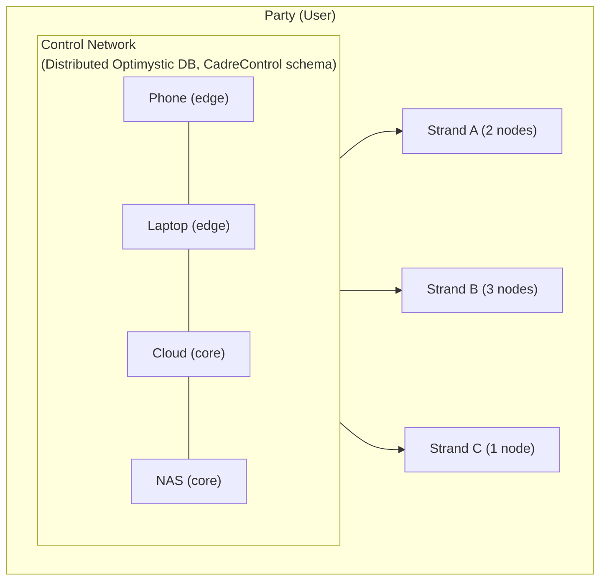
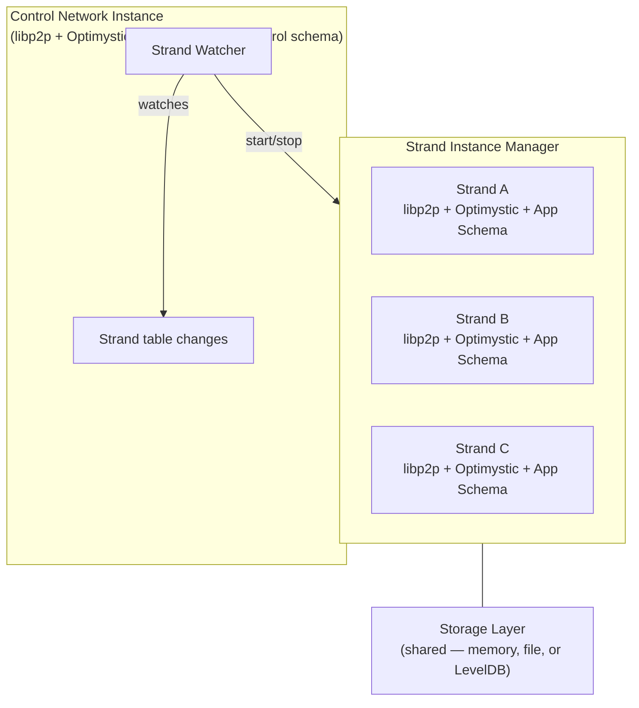
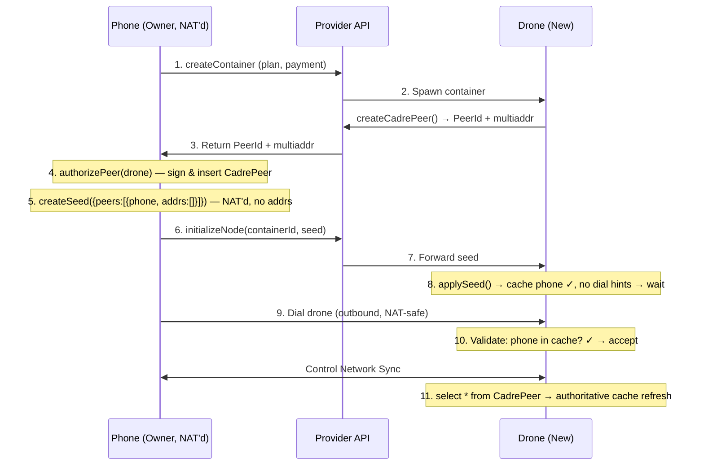
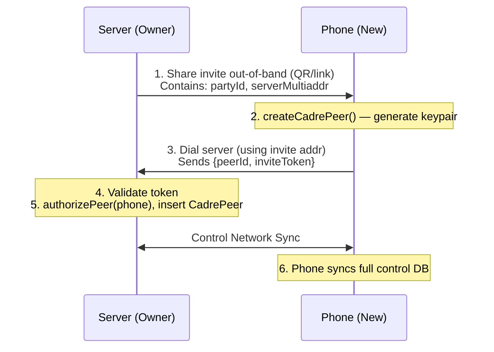
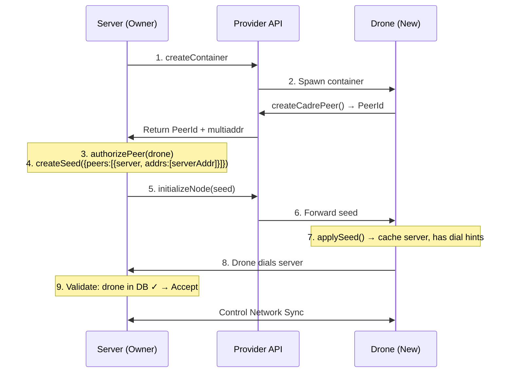
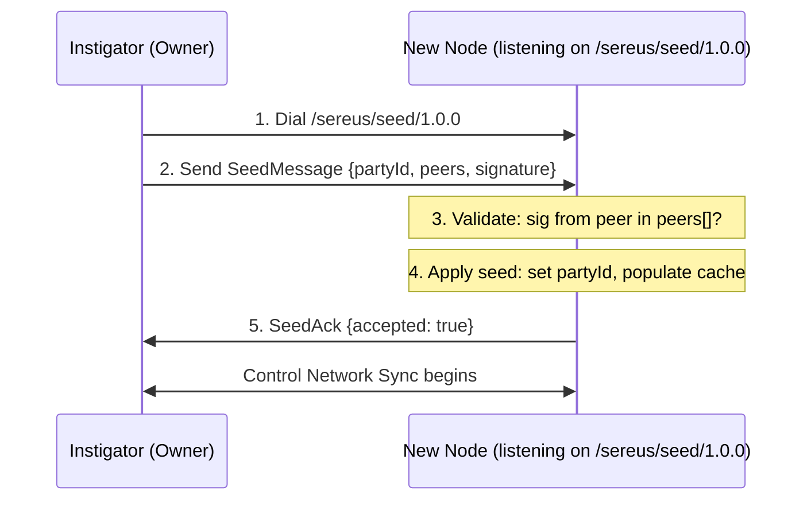
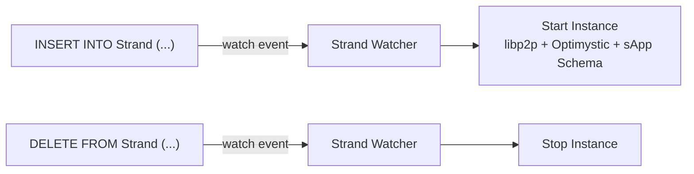
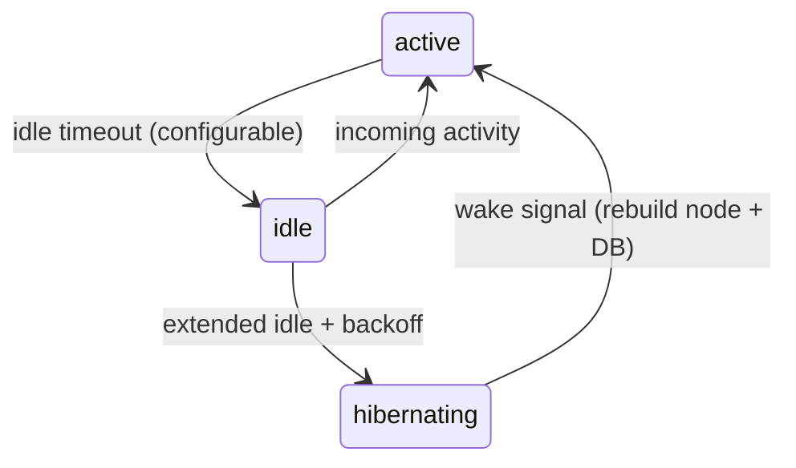
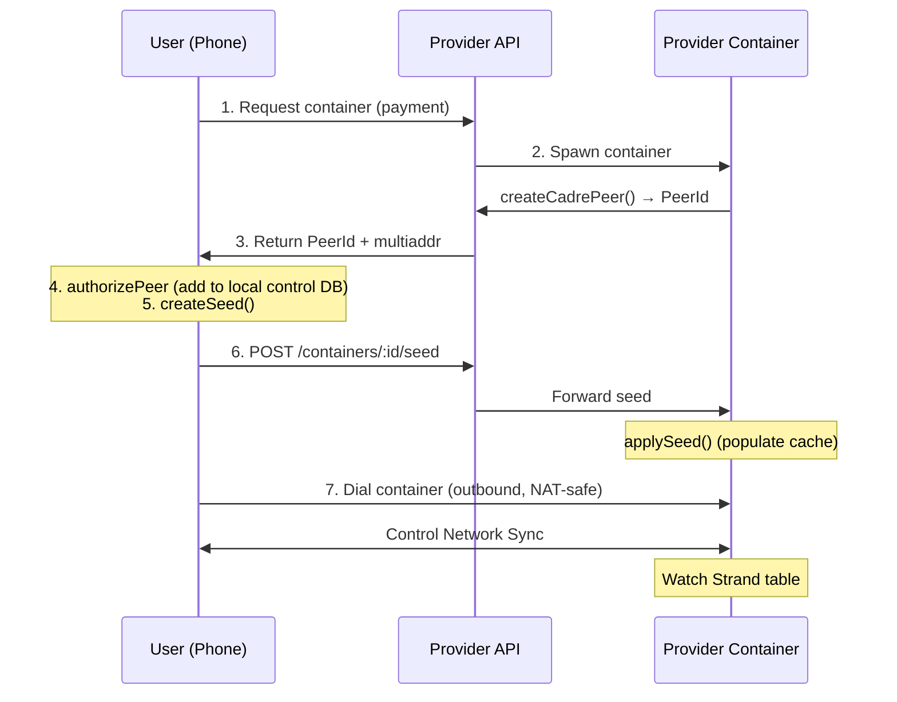
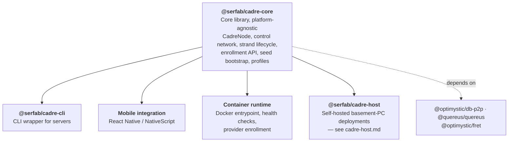

# Sereus Cadre Architecture

This document describes the architecture of the Sereus Cadre system—the infrastructure that enables parties to control sets of nodes participating in distributed strand networks.

## Overview

A **cadre** is a party's personal cluster of nodes that collectively represent their presence across strands. Cadre nodes range from always-on cloud servers with terabytes of storage to intermittently-connected mobile devices. The cadre system provides:

- **Unified control**: A single control network through which a party manages all their nodes
- **Strand participation**: Automatic lifecycle management for joining, syncing, and leaving strand networks
- **Flexible deployment**: Support for self-hosted nodes (see [@serfab/cadre-host](cadre-host.md) for basement-PC deployments), provider-hosted containers, and mobile devices
- **Key-based authorization**: Cryptographic owner delegation without central servers



## Core Components

### Control Network

The control network is a private Optimystic network involving only the party's own cadre nodes. It uses the `CadreControl` schema to maintain:

| Table | Purpose |
|-------|---------|
| `OwnerKey` | Keys authorized to make control changes. Add/remove only (rotation is add-then-remove), each authorized by a signature from an owner that existed **before** the transaction — so no key can seat itself and no pair can seat each other — and the table can never be emptied. Details in the constraint comments in `schemas/control.qsql` |
| `ValidationKey` | Keys that can validate strand formation disclosures. Add/remove only (rotation is add-then-remove); both writes need an owner signature bound to the row, over distinct add/remove digests, and a removal must retire the row's stamp into `Revocation` in the same transaction |
| `Strand` | List of strands the party participates in. Add/remove only, same owner-signed add/remove rule as `ValidationKey`. Adding may instead be authorized by a redeemed formation invitation (no signature); removing may **not** — an invitation authorizes forming a strand, never destroying one, and a closed strand's row carries the party's `MemberPrivateKey` for that network |
| `CadrePeer` | Registry of nodes in the cadre |
| `DeviceToken` | Self-published FCM/APNs push token per mobile peer (for push-wake of a suspended app) |
| `FormationInvite` | Open invitations to form strands with this party |
| `FormationUsage` | Audit log of formation invite consumption |
| `Revocation` | Append-only retirement record for the one-off `StampId` nonces of removed `OwnerKey` / `CadrePeer` / `ValidationKey` / `Strand` rows. Removing a row without retiring its stamp would leave the add-approval signature (never expires, and for `CadrePeer` stored on the replicated row) able to re-seat the row verbatim. Details in the constraint comments in `schemas/control.qsql` |

#### Network scoping (current implementation)

Cadre uses `@optimystic/db-p2p` to create libp2p+Optimystic nodes. In that implementation, **libp2p service protocols are namespaced by** `networkName` via:

- `protocolPrefix = /optimystic/${networkName}`
- control network uses `networkName = control-${partyId}`

Cadre-specific protocols are separate and live under `/sereus/*` (e.g. seed delivery uses `/sereus/seed/1.0.0`; control-network push-wake uses `/sereus/strand-wake/1.0.0`, see [Strand Hibernation → Wake Mechanisms](#strand-hibernation); on-demand strand-address resolution uses `/sereus/strand-addr/1.0.0`, see [Strand-Address Resolution](#strand-address-resolution)).

#### Replication cluster size

Optimystic replicates each block to a group of nodes it calls a **cluster**. How many nodes that group should have is an embedder-supplied number — `CadreNodeConfig.clusterSize` (`DEFAULT_CLUSTER_SIZE`, currently **2**). Cadre passes the same value to the control network and to every strand network it starts; nothing so far justifies two separate knobs, and a second knob is a second chance for the two sides to disagree.

Every path that creates a libp2p node routes through `resolveClusterSize` (defined in `@serfab/quereus-plugin-sereus`, re-exported by `@serfab/cadre-core`), which applies the default and rejects a value below 2 or a non-integer. That includes the SQL plugin's own `connectToStrand` / `connectToStrandBrowser`, whose `StrandConnectionOptions.clusterSize` defaults to the same number: leaving the option unset is *not* neutral, because Optimystic's own fallback is **10**, which gates every write on any party smaller than ten nodes. The option is ignored when a caller injects an already-built libp2p node (cadre-core's `StrandDatabase` does), since the node carries the value it was constructed with.

Two rules matter operationally:

- **Every node in a party must use the same value.** Optimystic's cluster member treats the number as an admission gate: a member refuses to vote on a write when the coordinator's declared peer set is smaller than the member's own configured size and the member has no confident network-size estimate. A commit needs a super-majority (unanimity at two nodes), so a single refusal fails the write. Under-configuring is safe — a node admits any cohort at or above its own number — so when in doubt the value should be too small rather than too large.
- **It is frozen when the libp2p node is created**, not re-read as the cadre grows. Changing it takes effect on the next restart. This is also why the number is *not* derived from the live `CadrePeer` count: the control libp2p node is created before the `ControlDatabase` that holds those rows exists, and membership is eventually consistent, so per-node derivation would reintroduce exactly the divergence the gate punishes.

Two is Optimystic's own `minAbsoluteClusterSize` and the smallest value that reaches the cluster path at all — a lone node writes to local storage without forming a cluster. The cost of a small value is replication breadth (blocks land on two nodes rather than three), not correctness. Raise it only for a cadre that reliably runs that many nodes, and set the same value on every node.

### Strand Networks

Each strand is an independent Optimystic network with its own:
- Network namespace: `networkName = strand-${strandId}` (libp2p services are scoped under `/optimystic/strand-${strandId}` in `@optimystic/db-p2p`)
- Member list (for closed strands)
- Application schema
- Peer cohort (union of all member cadres)

**Strand membership schema.** Every strand applies the `Strand` membership/RBAC schema (`schemas/strand.qsql` — `Header`, `Invite`, `ConsumedInvite`, `Member`, `MemberPeer`, `Manager`) automatically, alongside the sApp DDL under `declare schema App { ... }`. The cadre-core `StrandDatabase` and the `@serfab/quereus-plugin-sereus` connectors (`connectToStrand` / `connectToStrandBrowser`) share **one** composition — `composeStrand` — so plugin registration, node wiring, the warm-restart catalog hydrate, and schema apply all live in a single place. `StrandDatabase` owns only the `Database` lifecycle and delegates the rest to `connectToStrand` with its injected libp2p node. Immediately after the catalog hydrate, `composeStrand` applies the `Strand` schema unconditionally (every strand has membership semantics) and then the sApp schema if one was supplied; the membership schema ships as an embedded `STRAND_SCHEMA` constant (kept byte-equivalent to `schemas/strand.qsql`) so it works on filesystem-less platforms, mirroring cadre-core's `CONTROL_SCHEMA`. This makes the membership tables present and their `verify()`-gated constraints active on every strand. It does **not** populate them: inserting the `Header` row and bootstrapping the founding `Manager`/`Member` and invite/peer flows is tracked by the lifecycle ticket `strand-membership-lifecycle-population`, so the change is additive and does not gate sApp (`App.*`) reads or writes.

### Cadre Node

A cadre node is a running instance of the `@serfab/cadre-core` library. Each node:

1. **Connects to the control network** using its PeerId and authorized bootstrap addresses
2. **Watches the `Strand` table** for changes (reactive pattern - which is a TODO for Optimystic so we'll have to poll for now)
3. **Starts/stops strand instances** as rows are added/removed
4. **Publishes a signed peer-address record** to its own `CadrePeer` row (`CadreNode.registerSelf`): its current dialable/relay multiaddrs (signaling `/p2p-circuit` first), an ed25519 `PublicKey` whose libp2p identity *is* its PeerId, a monotonic `UpdatedAt` freshness stamp, and a self-`Sig` over those fields. It re-publishes on relay-reservation/address change and on a TTL heartbeat. Any member can then **resolve** another member's current signaling address from its PeerId alone via `CadreNode.resolvePeerAddrs(peerId)` — which re-verifies the signature, checks the `PublicKey↔PeerId` binding and freshness, and applies a pluggable trust gate — so a NAT-to-NAT WebRTC dial can be negotiated without copy/paste.
5. **Publishes a signed device push token** to its own `DeviceToken` row (`CadreNode.registerDeviceToken(platform, token)`), modeled on the `CadrePeer` record: an FCM/APNs `Token`, a monotonic `UpdatedAt`, and a self-`Sig` verified at resolve time against the `CadrePeer.PublicKey` bound to the same PeerId. Because a control-network libp2p dial cannot reach an OS-suspended phone, a server peer instead **resolves** the phone's token via `CadreNode.resolveDeviceToken(peerId)` (membership + binding + self-sig + freshness gated, returning `null` on any failure) and delivers a push-wake over the platform push channel. `clearDeviceToken()` removes the row on logout/invalidation. The first `DeviceToken` row, like `CadrePeer`, is owner-signed (insert/delete are owner-gated); a member self-updates its own token thereafter. The push *sender* (server fan-out) and the RN registration call are downstream of this registry.



## Node Profiles

Cadre nodes operate in one of two profiles, distinguished by their storage role:

> **Designed, not yet implemented:** The concentric storage-ring model described in this section (Ring Zulu participation beyond the on/off hint, Rings 0–3, keyspace partitioning, and capacity quotas) describes the **intended design**. The current implementation is the `arachnode-stub.ts` no-op stub (exported from `@serfab/cadre-core` but not yet wired into the runtime path). The only wired effect of profile selection today is the FRET `edge`/`core` choice plus a single Ring Zulu enable flag passed as a hint to the libp2p node (`strand-instance-manager.ts:202,210`). Treat the table and ring prose below as design reference. Tracked by `tickets/backlog/later/5-ring-zulu-storage-rings.md`.

| Profile | Arachnode | Typical Deployment | Ring Participation |
|---------|-----------|--------------------|--------------------|
| **Transaction** | Disabled | Mobile devices, intermittent connectivity | Transaction verification via FRET only |
| **Storage** | Enabled (Ring Zulu + Storage Rings) | Servers, NAS, always-on nodes | Full block storage with capacity quotas |

In the intended design, transaction-profile nodes skip Arachnode initialization entirely (no StorageMonitor, RingSelector, or RestorationCoordinator) for a lighter cold start, while storage-profile nodes initialize the full Arachnode subsystem including Ring Zulu and concentric storage rings. _Those Arachnode components do not exist yet_ — see the callout above. Currently profile selection only sets the FRET `edge`/`core` profile and the Ring Zulu enable hint.

### Strand Filtering

Mobile nodes typically run as part of a specific application and should not participate in all strands. The configuration includes an optional **strand filter**:

| Filter Mode | Behavior |
|-------------|----------|
| `all` | Participate in all strands in the control network (default for servers) |
| `sAppId:<id>` | Only participate in strands matching the specified sAppId |
| `strandId:<id>` | Only participate in a single specific strand |
| `none` | Control network only, no strand participation |

This allows a mobile app to embed a cadre node that only participates in the app's strand while the user's server nodes handle the full portfolio.

- **Ring Zulu (Transaction)**: Storage-profile nodes participate — transaction verification, ephemeral caching, forward to storage rings
- **Ring 3** (8 partitions) → **Ring 2** (4 partitions) → **Ring 1** (2 partitions) → **Ring 0** (full keyspace): Concentric storage rings. Storage-profile nodes join the appropriate ring based on capacity.

## Enrollment and Bootstrap

Adding a new node to a cadre involves a "cold start" problem: the new node needs control network data to validate connections, but can't get that data without first connecting. The **control network seed** solves this by pre-populating the new node's cache with enough authorization data to establish the first connection.

### The Cold Start Problem

When a new node joins a cadre:

1. **New node has empty control DB** — no `CadrePeer` entries, can't validate anyone
2. **Existing nodes enforce authorization in the DB layer** — CadreControl constraints reject unauthorized control writes; there is not yet a libp2p connection-gating layer
3. **NAT complicates dialing** — phones behind NAT can't receive incoming connections

The seed provides the minimal state needed to break this chicken-and-egg cycle.

### Control Network Seed

A seed contains everything a new node needs to join the control network:

```typescript
interface ControlNetworkSeed {
  // Identity - which control network to join
  partyId: string;

  // Authorization cache entries for peer validation
  peers: SeedPeer[];

  // Signature over { partyId, peers }
  signature: string;

  // ed25519 public key (base64url) used to verify `signature`
  signerKey: string;
}

interface SeedPeer {
  peerId: string;           // libp2p peer ID
  multiaddrs: string[];     // Dial hints (may be empty if NAT'd)
  isOwner: boolean;     // Hint: an owner-hosting peer to prefer dialing
  publicKey?: string;       // ed25519 public key (base64url) — set on owner peers (derived from the OwnerKey table, not used to gate the seed's own signerKey)
}
```

`SeedPeer` is the **cold-start projection** of a `CadrePeer` row: a seed pre-populates the peerstore so an unconnected node can make its first dials. Once connected, the authoritative, replicated form of the same mapping is the `CadrePeer` row itself, which is a signed **`PeerAddressRecord`**:

```typescript
interface PeerAddressRecord {
  peerId: string;       // libp2p peer ID (base58btc) — the CadrePeer row key
  publicKey: string;    // ed25519 (base64url) whose libp2p identity IS peerId
  addrs: string[];      // current dialable multiaddrs, signaling (/p2p-circuit) first
  updatedAt: number;    // epoch ms — strictly increasing freshness stamp per peer
  sig: string;          // ed25519 self-signature over (peerId, addrs, updatedAt)
}
```

The peer self-publishes and self-signs this record (the `CadreControl.CadrePeer` schema enforces the self-signature, monotonic `UpdatedAt`, and immutable `PeerId`/`PublicKey` on update); a resolver re-verifies it. Unlike a `SeedPeer` dial hint, a `PeerAddressRecord` is freshness-stamped and individually trust-checkable, so `resolvePeerAddrs` never hands back a stale relay reservation. The **owner node self-registers its own `CadrePeer` row at startup** (`registerSelf`, wired into `cadre start --owner` right after seed-bootstrap init), so every seed it mints already carries the owner's own dialable address as an owner peer — otherwise the seed would omit the owner (and thus any address for a receiver to dial it) until the TTL heartbeat first published the row. Trust in a seed rests on its `signerKey` being a known/pinned owner, not on the owner peer being present (see `SeedTrustPolicy`); self-registration furnishes the dial target, it does not pass a gate. The background heartbeat keeps the row fresh thereafter. A FRET-backed, coordinate-keyed liveness store remains future work (`tickets/backlog/fret-backed-peer-record-liveness.md`).

> **Convergence prerequisites and current status.** The replicated `CadrePeer` form described above replicates in the wiring, a party's control nodes now auto-connect, and a write made while alone now re-replicates on cohort growth — only the **delete-while-alone** path remains an open durability gap:
>
> - **The control tables are network-backed.** ✅ `ControlDatabase.initialize()` now makes `optimystic` the default vtab (`setDefaultVtabName('optimystic')` + `setDefaultVtabArgs({ transactor: 'network', … })`) and hydrates the catalog before applying `CONTROL_SCHEMA` — exactly as `connectToStrand` does for strand tables. The `declare schema CadreControl` tables (no per-table `using optimystic(...)`) therefore route to the Optimystic **network transactor**, so a control write replicates peer-to-peer (verified by `control-db-two-node-convergence.integration.ts`: a `CadrePeer` row written on A is observed on a connected B in ~1s). This required closing a transaction-semantics gap in the Optimystic vtab: a deferred `CHECK` referencing `committed.<Table>` (the `FormationUsage.Monotonic` anti-replay) now reads the pre-transaction snapshot via Quereus's `_readCommitted` flag, and the vtab now enforces secondary `unique` constraints (the single-use `StampId` / `MemberPrivateKey` anti-replay columns) — both landed in the `../optimystic` workspace under `control-db-network-backed`.
> - **The cohort auto-connects.** ✅ Each node runs an in-node `reconcileControlCohort` routine (`CadreNode`, wired into the post-start background work + a `.unref()`'d ~15s cadence + `self:peer:update`): it reads its known siblings (`listMembers`), classifies the owner members as a publicly-dialable **backbone** (always dialed), fills the remainder up to a bounded out-degree (`NetworkConfig.controlCohort.targetDegree`, default 6, deterministic peerId order), skips already-connected peers, and dials the rest best-effort via `resolvePeerAddrs` (signed `CadrePeer` record) with a libp2p peerStore cold-start fallback. This is what makes a party's control nodes form the FRET cohort without the test-only manual `dial()` the convergence scenario uses — proven by `control-cohort-auto-convergence.integration.ts` (B converges with zero manual control dials). Cold start is still brokered by the existing seed/`bootstrapNodes`/relay paths (the routine consumes that first connection, then maintains+extends the cohort from converged rows) — with the retry described in the next bullet when that first connection never lands. WebRTC/DCUtR upgrade-to-direct for sustained relay-only edge↔edge links remains future transport work (`rn-webrtc-transport`).
> - **Cold-start bootstrap retries.** ✅ `SeedBootstrapService.applySeed` dials the seed's owner peers exactly **once**, best-effort. When that dial fails (owner momentarily down, relay reservation not yet up, NAT traversal lost the race) the joining node has no connection *and* an empty `CadrePeer` table, so the sibling-enumerating pass above has nothing to work from — before `cold-start-control-redial` such a node was stranded permanently. `reconcileControlCohort` now takes a **cold-start branch** whenever it finds zero siblings: it re-dials the owner-flagged peers of every seed the node has applied, retained by `CadreNode` in its own map (`controlBootstrapPeers`, keyed peerId → the seed's multiaddrs) rather than read out of the shared libp2p peerStore, so the retry set is exactly what an owner-signed, trust-anchored seed nominated. Both seed intake paths feed it — the `CadreNode.applySeed` wrapper (which may run on a throwaway service) and the inbound `/sereus/seed/1.0.0` handler via `onSeedApplied`. Retries are **unbounded and unbacked-off**, at the reconcile cadence: the branch is gated by "no siblings yet", so it stops the instant the node is in the party, and a stranded node must keep trying. `ApplySeedResult` now reports `ownerDialsAttempted` / `ownerDialsFailed` so a caller can distinguish "seeded and connected" from "seeded and stranded" without overloading `success` (which still means "the seed was accepted"). The retry set excludes **self** (`createSeed` projects every `CadrePeer` row, so an owner applying a later seed finds itself in the owner list) and every address is **bound to the peer id it was retained under** before dialing — an address naming a different peer is dropped, one naming none has `/p2p/<id>` encapsulated — so a retry authenticates the peer it aims at rather than whoever answers. Proven by `control-cohort-cold-start-retry.integration.ts` (A refuses B's seed dial, vouches B afterwards, B re-dials itself back in and converges). **Open hole:** `controlBootstrapPeers` is in-memory, so a node that is seeded, fails to connect, and then restarts loses its retry targets and is stranded again — tracked in `tickets/backlog/bug-seed-bootstrap-addrs-lost-on-restart.md`.
> - **Write-while-alone durability (inserts/updates).** ✅ A write made while a node is alone (its block's cluster ≤1) commits **local-only** (no broadcast). `CadreNode` now detects this — the pragmatic proxy is `controlNode.getConnections().length === 0`, a sound lower bound for "alone" (the precise signal would be the block's `getClusterSize`, noted as a future tightening) — queues the affected row, and **re-issues it on the 0→≥1 control-connection growth edge** (a `connection:open` listener; single-flight drain). Self rows re-publish via the idempotent `registerSelf`/`registerDeviceToken` refresh; an owner's other-peer membership rows are re-touched via an owner-signed `UpdatedAt` bump (`SeedBootstrapService.reauthorizePeer`, the owner branch of `CadrePeer.AuthorizedUpdate`). On the first growth after start, an owner also reconstructs the queue by re-touching every `Sig`-null membership row it may have authored (covering writes from before this process started — `Sig`-bearing rows are the owning peer's to republish and are skipped). Re-touch is safe to over-apply (monotonic `UpdatedAt`; the schema rejects a replayed older record). Proven by `control-write-while-alone-convergence.integration.ts` (a `CadrePeer` row and a `DeviceToken` both written while alone converge to a connected reader). Landed in `control-write-ensure-replicated`.
> - **Delete-while-alone durability (open, security-relevant).** A `removePeer` (or `clearDeviceToken`, or the owner-signed `ControlDatabase.deleteStrand` / `deleteValidationKey`) that commits while alone physically removes the row locally, so it **cannot** be re-issued the way an insert/update can — a re-issued `delete … where PeerId = X` matches nothing once the row is gone, so the removal does not propagate, and a revoked peer may persist as a member elsewhere. The commit-alone is **logged loudly** and a best-effort re-issue is attempted (it only helps if the row is somehow still present), but full durability needs a schema **tombstone** (soft delete that IS re-issuable + reconstructable across restart) — tracked in `tickets/backlog/control-delete-while-alone-tombstone.md`. The `Revocation` row every guarded delete now writes alongside it (`removePeer`, `deleteStrand`, `deleteValidationKey`) is exactly such a re-issuable insert, and readers already drop a `CadrePeer` row whose stamp it retires (`listAuthorizedMembers`) — but it is **not** yet queued by the write-while-alone re-issue path, so a removal that commits alone still does not propagate. Wiring it in is the cheapest lever that ticket has.
>
> Reads are **pull-on-read**: `resolvePeerAddrs`/`isMember` do a single read with no wait, so callers converge by **polling/refresh** (the "periodic refresh until reactivity" below).

The seed is **cache pre-population**, not a separate database. After applying the seed, the node's normal query mechanisms (`select * from CadrePeer`) fetch authoritative state from peers, naturally merging with the seed data.

### Unified Node Behavior

After applying a seed, a node follows a simple unified algorithm regardless of network topology:

1. Populate peerstore with peers + multiaddrs from seed
2. Attempt outbound dials (best effort) — prefer peers flagged `isOwner` first
3. Once connected: begin control network sync (Optimystic), refresh via `select * from CadrePeer`
4. Periodic refresh (until reactivity): re-query CadrePeer, update local cache

The node doesn't need to know who will dial whom — it tries everything and accepts whatever works first.

### Enrollment Flow: Phone Adds Provider Drone

The most common case: a user on a NAT'd phone adds a provider-hosted node.



Key points:
- Phone is NAT'd → seed has no multiaddrs for phone → drone waits
- Phone dials drone (outbound from phone's perspective) → NAT-safe
- Drone validates phone against seed cache → connection accepted
- Normal sync populates authoritative state

### Enrollment Flow: Server Adds Phone

When a server (public IP) adds a phone to its cadre:



No seed needed — server is dialable, so phone just connects and syncs.

### Enrollment Flow: Server Adds Drone

When a server adds another provider-hosted node:



Seed includes `bootstrapAddrs` because server IS dialable. Drone initiates connection to server.

### When Is a Seed Needed?

| Instigator | Adding | Seed Needed? | Who Dials Whom? |
|------------|--------|--------------|-----------------|
| Phone (NAT) | Drone (public) | **Yes** — drone needs phone's CadrePeer in cache | Phone → Drone |
| Phone (NAT) | Phone (NAT) | **Yes** — both need each other; use relay addrs | Both → Relay |
| Server (public) | Phone (NAT) | **No** — phone can dial server directly | Phone → Server |
| Server (public) | Drone (public) | **Yes** — includes `multiaddrs` so drone can dial | Drone → Server |

The key asymmetry:
- **Instigator has public IP**: Seed includes `multiaddrs`, new node dials in
- **Instigator is NAT'd**: Seed has no `multiaddrs`, instigator dials out after seed is applied

### Seed Delivery Protocol

Seeds can be delivered through multiple mechanisms. For direct delivery when the new node is dialable, we define a libp2p protocol:

**Protocol ID**: `/sereus/seed/1.0.0`



**Message Types**:

```typescript
// Instigator → New Node
interface SeedMessage {
  partyId: string;                    // Control network to join
  peers: SeedPeer[];                  // Authorization cache entries
  signature: string;                  // Signed by an owner key
  signerKey: string;                  // Owner ed25519 public key (base64url)
}

// New Node → Instigator
interface SeedAckMessage {
  accepted: boolean;
  reason?: string;                    // Present if accepted=false
}
```

**Validation**:
- The `signature` is an ed25519 signature over `digest([canonicalJson({partyId, peers})], 'sha256')` — a canonical (recursively key-sorted, `undefined`-dropped, whitespace-free) serialization shared with cadre-host's update-manifest signing. Both signer and verifier route through the same `canonicalSeedPayload` builder so the signed bytes are independent of key insertion order
- New node verifies `signature` using `signerKey` (ed25519)
- `signerKey` must clear a **trust anchor that does not come from the seed body** — a signature only proves the seed is internally consistent, and both `signerKey` and the seed's own `isOwner` peer flags are attacker-supplied, so a forged self-asserting seed must not be able to vouch for itself. The receiver evaluates a `SeedTrustPolicy` against its *own* node-local trusted-owner anchor (`TrustedOwnerStore`, below) — **not** the replicated `CadreControl.OwnerKey` table — in priority order:
  - **Anchored** (default, `anchoredTrustPolicy`): the signer is trusted iff its key is in the receiver's node-local anchor (established out of band: genesis, invite pin, operator pin).
  - **Pinned out-of-band**: owner keys delivered outside the seed — carried by `CadreInvite.ownerKeys`, or pinned by operator config — let a not-yet-anchored invitee accept its first seed. A key accepted this way is persisted into the anchor, so later seeds from that owner need no pin.
  - **TOFU (opt-in)**: an interactive confirmation callback invoked on first sight of an unknown signer key; off by default. A confirmed key is likewise persisted into the anchor (as an `operator` pin), so the prompt is not repeated.
  - **Secure default**: a node with an empty anchor, no pinned keys, and no TOFU confirmation **rejects** the seed — including one signed by a key sitting in its replicated `OwnerKey` table.
- Owner identity is sourced from the `OwnerKey` table, **not** from the libp2p `peerId`. An Ed25519 PeerId embeds its public key, so each peer's ed25519 key is derived from its `PeerId` and a peer is marked `isOwner` iff that derived key is in `OwnerKey` — making multi-owner cadres representable and decoupling owner status from the transport identity.
- **Node-local trusted-owner anchor** (`TrustedOwnerStore`, `trusted-owner-store.ts`): the replicated `OwnerKey` table itself cannot ultimately anchor trust — a node whose *local* copy is still empty satisfies the table's genesis branch (which tests the pre-transaction owner count) and can seat its own key, and that row replicates into every peer's table. The table's authorization rules close escalation against an *already-populated* copy — a key that holds no owner row cannot enroll itself, a pair cannot enroll each other, and no owner row can be removed or re-pointed without a pre-existing owner's signature — but they cannot close the empty-copy genesis path, which is precisely why the anchor exists. Each node therefore also keeps a NON-replicated, per-party record of owner keys established out of band: founding genesis (`initializeSeedBootstrap` anchors the founder's own key), the invite's pinned `ownerKeys` at enrollment (`CadreNode.trustOwnerKeys` / `CadreNodeConfig.trustedOwners.pinnedKeys`), or operator pins (cadre-cli `--pin-owner-key` / `CADRE_OWNER_KEYS`). File-backed next to the identity key on Node hosts (`@serfab/cadre-core/trusted-owner-store-file`, same `node:fs` isolation as `key-store-file`), in-memory elsewhere. Two consumers now rest on this anchor, both fail-closed: the authorized-membership predicate (`CadreNode.isAuthorizedMember` — the wake and strand-addr gate), where a `CadrePeer` row counts only when its persisted voucher (`VouchOwner`/`VouchSig`) verifies against an anchored key; and seed trust, whose `SeedTrustContext.knownOwnerKeys` is the anchor's contents. Invites hand out the anchor's keys — and only those — as their pinned `ownerKeys`, for the same reason: the invitee anchors whatever arrives, so a replicated-only key must not ride an invite into a new node's anchor. An issuer with no anchor mints an invite with no `ownerKeys` rather than falling back to the table. The replicated `OwnerKey` table remains the replication mechanism and the source of the `isOwner` dial hint in seeds, **not** a trust anchor.
- **Control-network inbound connection gate** (`membership-connection-gater.ts`, defense-in-depth): the control node composes a membership gater onto any configured `network.connectionGater` — at the encrypted-connection checkpoint (authenticated PeerId known, no protocol negotiated yet) it refuses an inbound peer that is positively NOT an authorized member, so a known outsider is never even in the conversation with the control protocols. A libp2p gater decides per connection, not per protocol, so the policy admits whenever a legitimate stranger interaction could be riding the connection and lets the per-stream gates decide: an un-enrolled node (empty anchor or empty authorized set — a brand-new node must accept its seed, and the rows that authorize siblings arrive by replication over these very connections), an open enrollment window (`CadreNode.createInvite` opens one for the invite's validity; `openEnrollmentWindow` serves out-of-band flows), an **outstanding open invitation** (cross-party formation is stranger-facing by design), and the configured bootstrap/relay peers. The formation exemption is keyed on *expectation* of a stranger, not capability to serve one: it holds only while at least one unexpired, not-fully-consumed invitation is outstanding — a token this process minted or published, or a still-redeemable `FormationInvite` row the usage recorder can see (`StrandSolicitationService.hasOutstandingInvitation`). Merely registering the formation responder does **not** disarm the gate, so an app that registers eagerly at bring-up (`reference-app-rn`) and an initiator's `formStrand` both keep it live; the in-memory half of the answer dies with the process, so after a restart only persisted invites still hold it open. The stranger-open protocol allowlist — `/sereus/seed/1.0.0` and `/sereus/formation/1.0.0`, each carrying its own in-protocol trust check — is defined once in that module. Every ambiguous or failing state admits (fail-open) because the per-stream gates and read-time voucher predicate are the fail-closed layers; outbound dials are never gated; strand cohort nodes never get this gater (their peers are legitimately cross-party).
- **Per-stream control-DB gate** (`CadreNode.authorizeInboundControlStream`, the fail-closed layer behind the connection gate): every inbound stream on the four Optimystic control-DB protocols (`/optimystic/control-<party>/{repo,cluster,sync,block-transfer}`) is judged through `@optimystic/db-p2p`'s `authorizeInboundStream` seam, which on deny aborts the stream *before any frame is decoded* — the remote observes only a stream reset, and the connection survives. The predicate is deliberately synchronous and in-memory: it consults the **materialized** authorized-peer snapshot (refreshed on membership writes and on each control-cohort reconcile pass), never a live control-DB read, because serving such a read would itself require admitting the sibling's stream the read is deciding — mutual denial deadlock. It shares the connection gate's unconditional admissions (node not fully up, absent/empty trusted-owner anchor, configured bootstrap infra, empty snapshot — the replication cold start) but has **no stranger carve-outs**: during an enrollment window a stranger's *connection* is admitted so seed delivery can ride it, yet its repo streams are still refused — exactly the hole a connection-level decision cannot close. Consequence of the snapshot: a member added while a node was down is admitted by that node only after its next reconcile refresh — bounded staleness by design. The refresh rides the `CadreNode` membership wrappers (`authorizePeer`, `removePeer`, `addDrone`, `acceptPhone`, `addPhoneWithRelay`, `applySeed`, `registerSelf`) and the inbound seed handler's `onSeedApplied` callback (a wire-delivered seed writes its rows inside `SeedBootstrapService`, below those wrappers), so a caller that writes a `CadrePeer` row *below* them — straight through `getSeedBootstrapService()` — leaves this node judging against a snapshot that predates its own write and denying the peer it just vouched for until the next reconcile; such a caller must follow the write with `CadreNode.refreshMembershipGate()`. Proven end-to-end in `integration-tests` scenario `control-stream-authz` (member's raw pend/commit succeeds; an enrollment-window outsider's identical pend is refused with its connection intact and nothing written).
- A seed carries only peer-address hints (`peers[]`); warm-cache prepopulation with signed Optimystic log entries is deferred (see backlog `seed-warm-cache-prepopulation`)
- **Receiver hardening (within-membership DoS):** even a membership-gated peer could misbehave, so the inbound handler bounds two resources. Each stream read runs under `seedReadTimeoutMs` (default 10s) — a peer that opens a stream and never half-closes its write end is aborted rather than awaited forever — and concurrent inbound seed streams are capped by `maxConcurrentSeeds` (default 100), over which a non-accepting ack is returned without applying a seed. The cap is per-service, not per-remote-peer. The shared read/frame primitives (`control-stream.ts`, also used by push-wake) own the timeout-and-abort logic.

**Alternative Delivery Mechanisms**:

| Mechanism | When Used | Notes |
|-----------|-----------|-------|
| Direct protocol | New node is dialable | Instigator dials, sends seed directly |
| Provider API | Provider-hosted node | `POST /containers/:id/seed` via HTTPS |
| QR code / deep link | Mobile onboarding | Seed encoded in URL, opened by app |
| Environment variable | Container startup | `CADRE_SEED` contains base64-encoded seed |

All mechanisms deliver the same `SeedMessage` payload; only the transport differs.

### Simple API

From the **instigator's** perspective:

```typescript
// 1. Authorize the new peer
await cadreNode.authorizePeer(newNodePeerId, newNodeMultiaddrs);

// 2. Generate seed for the new peer
const seed = await cadreNode.createSeed();
// Includes: partyId, all authorized peers, our multiaddrs if dialable

// 3. Deliver seed (choose based on context)

// Option A: Direct protocol (if new node is dialable)
await cadreNode.deliverSeed(newNodeMultiaddr, seed);

// Option B: Via provider API
await provider.initializeNode(containerId, seed);

// Option C: Encode for out-of-band delivery
const encodedSeed = cadreNode.encodeSeed(seed);  // base64
// Share via QR, link, etc.

// 4. If we're NAT'd and new node can't dial us, we dial them
if (!weHavePublicIp) {
  await cadreNode.connectToPeer(newNodeMultiaddr);
}
```

From the **new node's** perspective:

```typescript
// 1. Receive seed (one of these, depending on delivery mechanism)

// Option A: Listen for direct delivery
cadreNode.on('seed', async (seed) => {
  await cadreNode.applySeed(seed);
});

// Option B: From environment (container startup)
const seed = process.env.CADRE_SEED
  ? decodeSeed(process.env.CADRE_SEED)
  : null;
if (seed) {
  await cadreNode.applySeed(seed);
}

// 2. Start node - automatic connection handling
await cadreNode.start();
// Node now:
// - Accepts connections from peers in cache
// - Dials any peers with known multiaddrs
// - Syncs once connected
```

### Helper Functions for Common Scenarios

The Seed Bootstrap API includes helper functions for common enrollment patterns:

**Server/Phone adds Drone (via provider API)**:
```typescript
// Owner receives drone info from provider API
const droneInfo = await provider.createContainer(plan);

// One call: authorize + create seed
const { seed, encodedSeed } = await cadreNode.addDrone({
  dronePeerId: droneInfo.peerId,
  droneMultiaddrs: droneInfo.multiaddrs
});

// Send seed to provider for drone initialization
await provider.initializeNode(droneInfo.containerId, encodedSeed);
```

The same `addDrone` helper backs the [cadre-host node-donation flow](cadre-host.md#node-donation-the-primary-role) (step 3): the requester calls it against a node donated by a home host instead of a cloud provider, and delivers the resulting `encodedSeed` over the host's `/grants` surface.

**Server invites Phone (QR/link flow)**:
```typescript
// Server creates invite
const { invite, encodedInvite } = await serverNode.createInvite(
  'secret-token',  // Optional token
  3600000          // Expires in 1 hour
);
// Share encodedInvite via QR code or link

// Phone receives invite and dials
const invite = phoneNode.decodeInvite(encodedInvite);
await phoneNode.dialInvite(invite);
// Phone is now connected, sends join request with token

// Server accepts phone
await serverNode.acceptPhone(
  { phonePeerId: phonePeerId, token: 'secret-token' },
  invite
);
```

**Phone adds Phone (NAT-to-NAT via relay)**:
```typescript
// Owner phone adds new phone with relay support
const { seed, encodedSeed } = await ownerPhone.addPhoneWithRelay(newPhonePeerId);
// Seed includes relay addresses for the new phone to dial through

// Share encodedSeed out-of-band
// New phone applies seed and connects via relay
```

## Strand Lifecycle

### Reactive Strand Management

Cadre nodes watch the control network's `Strand` table for changes. When a strand is added, each node:

1. Creates a new libp2p node via `@optimystic/db-p2p` with `networkName = strand-${strandId}` (protocols scoped under `/optimystic/strand-${strandId}`)
2. Loads the strand's sApp schema via declarative schema
3. Bootstraps into the strand's cohort
4. Begins participating in transactions



### Strand Mode: Bootstrap vs Networked

Each strand instance is started in one of two modes (`StrandMode`), which selects the default transactor wired into the optimystic plugin:

| Mode | Default Transactor | When Used |
|------|--------------------|-----------|
| `networked` (default) | `network` — issues transactions through the strand's libp2p cohort | Multi-peer participation; the normal strand lifecycle |
| `bootstrap` | `local` — executes transactions against host-local raw storage with no peer round trips | Solo-node startup (e.g. first-launch, single-device cadre) where the cohort isn't reachable yet but the strand still needs to apply schema and accept DML |

In `bootstrap` mode the same `IRawStorage` instance handed to `createLibp2pNode` is also passed to the optimystic plugin via `rawStorageFactory`, so DML executed through the local transactor lands on the host's persistent backend (e.g. file system on Node, MMKV on React Native) instead of an in-memory store. Sharing the single instance — rather than constructing a second `IRawStorage` over the same id/prefix — keeps the libp2p and database read paths consistent and avoids cache divergence. The mode is fixed for the lifetime of a `StrandDatabase`; transitioning requires restarting the strand.

When a strand is launched without an explicit mode — the control-discovered (`handleStrandAdded`) path, or an `addStrand` caller that omits it — `CadreNode` auto-selects the mode from `CadrePeer` membership in the control network: `bootstrap` when no peer rows other than self exist (solo cold-start), `networked` once the cohort has other members. Membership presence drives the mode even when a peer's strand addrs are not yet known, so a cohort with unresolvable peers still comes up `networked` (`deriveCohortMembers` in `strand-cohort.ts`).

The strand node's `bootstrapNodes` discovery list, however, is **not** taken from `CadrePeer.Multiaddr` — that field carries each node's *control*-network address, and a strand runs as its own libp2p instance on a separate port, so dialing a control address reaches the wrong instance and never joins the strand mesh. Instead `CadreNode.resolveCohortSeed(strandId)` resolves strand-network addresses **on demand** over the control mesh (see [Strand-Address Resolution](#strand-address-resolution)). Because the control network is single-party, this bootstraps **this party's own co-cadre nodes** onto a strand; cross-party strand discovery is a separate mechanism (strand formation / `MemberPeer`). When no connected sibling yet runs the strand the seed is empty and the strand starts and waits — self-healing on the next resume/check-in pass, which re-runs the resolution.

### Strand-Address Resolution

A strand is its own libp2p network on a separate port, so a node needs a sibling's **strand-network** multiaddr to seed the strand mesh — but the only address a `CadrePeer` row stores is the sibling's **control**-network address. Strand addresses are therefore resolved on demand with a native control-network RPC, `STRAND_ADDR_PROTOCOL = /sereus/strand-addr/1.0.0` (`strand-addr-protocol.ts`), modeled directly on the push-wake protocol (4-byte length-prefixed JSON frames, one request → one response per stream, shared `control-stream.ts` primitives).

- **Request/response.** `StrandAddrRequest { strandId }` → `StrandAddrResponse { strandId, multiaddrs }`. The receiver (`StrandAddrService`, registered by `CadreNode.start` alongside the wake service) gates every request on `CadrePeer` membership — the same **v1 authorization** as wake: the control network already restricts membership to this party's cadre peers, so a non-member is refused with an empty list and no further signature is required. It then returns `getStrandMultiaddrs(strandId)`: the strand instance's live, signaling-first multiaddrs, or `[]` when the strand has no live node (hibernating / quiescing / never participated). Membership is not unconditional trust, so the receiver bounds a misbehaving own-cadre node exactly as wake/seed do — a per-read `readTimeoutMs` (default 10s, abort-on-timeout) and a `maxConcurrent` cap (default 100) — both via `control-stream.ts`.
- **Client union.** `CadreNode.resolveCohortSeed(strandId)` reads `CadrePeer` membership (`deriveCohortMembers`), keeps the peerIds it already holds an open control connection to (they can answer now, and dialing by peerId reuses the live connection), and calls `collectStrandAddrs`, which RPCs each concurrently and returns the **deduplicated, signaling-first union** of their answers — best-effort, so a failed/timed-out/empty sibling is skipped, never fatal. Self is excluded. A NAT'd sibling reachable only via relay is dialed over its circuit-relay (`/p2p-circuit`) connection (`runOnLimitedConnection: true`); the returned strand multiaddr must itself be dialable on the strand network (deep per-strand NAT relay reachability is tracked separately).
- **Asymmetric bootstrap.** The first node up runs the strand solo (empty seed → `bootstrap` mode) and *answers* the RPC for it (`getStrandMultiaddrs` checks only for a live node, not the mode); a later sibling RPCs it, gets its live strand address, and dials in. When no connected sibling runs the strand yet, the seed is empty and the strand waits — self-healing because the hibernation resume / check-in path re-runs `resolveCohortSeed` and re-applies a fresh seed.

### Strand Formation

When forming a new strand with another party, a native cadre-core formation transport (`strand-formation-protocol.ts`, protocol id `/sereus/formation/1.0.0`) negotiates provisioning. It mirrors the non-deprecated seed-bootstrap service (length-prefixed JSON frames over libp2p streams) and replaces the deprecated `strand-proto`. The `StrandFormationManager` drives it from the `cadre-core` interfaces, carrying the caller's **real** invitation token + `StrandFormationDisclosure` and **both** parties' real cadre peer addresses end-to-end:

- **`StrandFormationManager`**: Responder side wires the inbound `FormationListener` to `DisclosureValidator` (identity), `FormationUsageRecorder` (token), and `StrandProvisioner` (provisioning); initiator side validates the responder's result via `FormationResponseValidator`. `ControlFormationUsageRecorder` (`control-formation-recorder.ts`) is the DB-backed `FormationUsageRecorder`. It follows the **provision-then-record** model: the host pre-creates the (closed) strand owner-signed and mints a `FormationInvite` **bound to it** via the invite's `StrandId` column (signed into the row-bound authorization). When an invitee redeems a bound invite, the recorder resolves that pre-existing host strand (`resolveStrand`) and writes exactly **one** `FormationUsage` consent row against it (record-only — no new `Strand` insert), returning the host strand id **and its `MemberPrivateKey`** (the closed-strand read-gating secret) back through the protocol for delivery to the validated invitee. A bound invite whose named host strand has **not yet converged** on this responder (`resolveStrand` → `missing`) is rejected cleanly — no usage row, no disclosure — instead of recording consent against a non-existent strand (which would fail the deferred `FormationUsage.StrandExists` CHECK at commit and drop the result frame). An unbound invite (`StrandId` null) takes the responder-provisions path: a DB-backed recorder mints a fresh open strand **and** records its one `FormationUsage` consent row **atomically** (`provisionAndRecord` → `ControlDatabase.redeemInvitation`), so the unbound redemption is single-use exactly like the bound path; only when no DB recorder is wired does it fall back to the `StrandProvisioner` (or a structural placeholder), which carry no single-use accounting.
- **`StrandSolicitationService.registerResponder(node)`**: Registers the libp2p node to handle incoming formation requests
- **`StrandSolicitationService.formStrand(invitation, disclosure, node)`**: Initiates strand formation over the real protocol
- **`CadreNode` high-level API**: `createOpenInvitation()`, `formStrand()`, `encodeInvitation()`, `decodeInvitation()`

Cadre-disclosure timing is enforced: the responder reveals its own party id + cadre addresses — and, for a bound (closed) strand, that strand's membership key — only after the token and disclosure validate; a rejection discloses none of them. The initiator's `FormationResponseValidator` (built-in structural default) rejects a responder that omits its disclosed identity/cadre or returns an empty/non-responder-created strand.

```mermaid
sequenceDiagram
    participant A as Party A (Responder)
    participant B as Party B (Initiator)
    Note over A: Strand pre-created; FormationInvite<br/>bound to it (StrandId) created
    Note over B: Receives invitation out-of-band
    B->>A: formStrand(token, disclosure)
    Note over A: Validate token, validate identity,<br/>resolve bound strand, record FormationUsage
    A->>B: Response with strand info + membership key
    Note over A,B: Both add to Strand table →<br/>triggers node participation
```

### Strand Membership Bootstrap

Three independent consent/RBAC layers coexist; do not conflate them:

1. **Control / cadre layer** (`CadreControl.*` in the shared control DB): `Strand`, `FormationInvite`/`FormationUsage`, `OwnerKey`, `CadrePeer`. Governs which cadre operates a strand and cadre-operator consent to *form* it. The control-layer `Strand.MemberPrivateKey` is the closed-strand read-gating secret; the `MemberKeyClosedOnly` CHECK enforces that it is null on an open strand (`Type='o'`), so only a closed strand (`Type='c'`) may carry one. It is stored **unencrypted** and replicated to every node of the party by design — see [Closed-strand member keys — accepted residual risk](#closed-strand-member-keys--accepted-residual-risk).
2. **Strand RBAC layer** (`Strand.*` inside each strand DB, applied from `schemas/strand.qsql` by `composeStrand`): the authoritative per-strand membership/RBAC — `Header`, `Invite`/`ConsumedInvite`, `Member`, `MemberPeer`, `Manager`.
3. **sApp layer** (`App.*`): application-data RBAC declared by the sApp schema, gated by its own `verify()`-bound CHECK constraints.

`composeStrand` only *applies* the layer-2 schema; the first runtime *writer* is the **founder bootstrap** (`strand-membership-writer.ts`). The **founder** — the party that provisioned and published the strand (the responder in formation, the creator in host/solo paths; the same party that calls `CadreNode.publishStrand`) — runs a one-time bootstrap at bring-up. A **joiner** writes nothing and receives these rows via Optimystic sync.

- **Plumbing**: an explicit `founder?: boolean` flows `CadreNode.addStrand(StrandConfig)` → `launchStrand` → `StrandInstanceManager.startStrand` → `buildStrandRuntime` → `StrandDatabase`. The bootstrap runs in `StrandDatabase.initialize()` *after* `connectToStrand` returns (schema is applied by then), gated on `founder === true`. The control-discovered join path never sets `founder`, so a discovering peer only syncs. A throw during bootstrap propagates out of `initialize()` so `buildStrandRuntime`'s rollback tears the half-built strand down.
- **Open strand (`Type='o'`)**: insert `Header` only — `Member`/`Manager`/`Invite` are `OnlyClosed`.
- **Closed strand (`Type='c'`)**: insert `Header(Type='c')`, then the founding `Member`, then the founding `Manager`, in that order (the deferred `OnlyClosed` checks on Member/Manager see the committed closed `Header`). The founding `Member.Key` and `Manager.MemberKey` are *derived from* the control-layer `MemberPrivateKey` via the **key bridge** (`strandMemberKeyPair`): the base64-protobuf libp2p ed25519 key is decoded and run through `ed25519KeyPairFromLibp2p`, yielding a base64url `{ privateKeyB64, publicKeyB64 }` whose `publicKeyB64` is the founding member/manager key. The first-row inserts use the schema's bootstrap branch, so they need **no** signature. That branch is narrow: `Member.Authorized` waives the signature only while `count(Member) <= 1`, and `Manager.Authorized` only on an **insert** (`old.MemberKey is null`) in the founding state — at most one `Manager`, at most one `Member`, and that `Member` row is this manager. Header→Member→Manager order is therefore load-bearing, not merely conventional: a Manager-first seeding path is rejected at commit.
- **Idempotency**: every write is insert-if-absent (guarded by a `select count(1) from Strand.<T>`), so a founder restart / re-`addStrand` / `resumeStrand` is a no-op and never double-inserts or trips `InsertOnly`.
- **Signing idiom (for the later signed flows)**: `schemas/strand.qsql` verifies a **single digest over a `'|'`-joined payload** (`verify(digest(payload), signature, pubkey, 'ed25519')`), distinct from the control layer's domain-tagged multi-field `buildAuthorizationMessage` digest (every control-plane approval leads with a `('CadreControl.<Table>', '<action>')` pair so an approval signed for one table/action cannot satisfy another). `signStrandPayload(payload, privateKeyB64)` is the matching signer (hash the payload to raw bytes, ed25519-sign those bytes) and `verifyStrandPayload(payload, signature, pubkey)` its off-engine verifier; the invite/peer/rotation flows reuse them. `Header.Engine`/`EngineVersion` are pinned constants (`STRAND_ENGINE` = `quereus`) — a real engine-selection seam is future work.

#### Invite → join handshake (closed strands)

After the founder bootstrap, a non-founding party becomes a `Member` of a closed strand through the signed invite handshake, all in `strand-membership-writer.ts`:

- **`issueInvite(db, { managerKeyPair, expiration? })`** — a manager mints a fresh, single-use invite. A new ed25519 invite keypair is generated; its **public** key becomes `Invite.Key` (base64url, so the engine's `verify()` consumes it directly), and the payload `Key || '|' || coalesce(Expiration,'')` is signed **twice**: once with the manager key (→ `ManagerSignature`, proving a manager issued it — `Invite.InviteValid` requires a matching `Manager` row) and once with the invite private key (→ `InviteSignature`, proving the issuer actually holds the invite secret). The invite **private** seed is returned to be handed to the invitee out-of-band (in production via the formation/seed channel) and is never persisted in the strand. An optional `Expiration` (epoch-ms) is canonicalized through the shared `canonicalDatetime` helper (a `select datetime(?)` round-trip) so the signed segment byte-matches the `datetime`-coerced column the deferred CHECK sees — a hand-rolled ISO string would not verify.
- **`consumeInvite(db, { inviteKey, invitePrivateKey, memberKey, nowMs? })`** — the invitee redeems the invite to seat its `Member` row. `Member.Authorized`'s invite branch needs a `ConsumedInvite` row, while `ConsumedInvite`'s `MemberExists`/`MemberValid` need the `Member` row — a circular dependency resolved by inserting **both in one explicit transaction** (`beginTransaction`/`commit`) so the deferred (subquery-bearing) checks see both rows at commit. This mirrors `ControlDatabase.redeemInvitation` (Strand + FormationUsage in one txn). The `ConsumedInvite` insert carries an `InviteSignature` over `InviteKey || '|' || MemberKey`, proving possession of the invite private key; the `Member` insert needs no member signature (its admission **is** the matching `ConsumedInvite`). **Expiry is enforced** by the deferred `ConsumedInvite.NotExpired` check (`I.Expiration is null or I.Expiration > context.Now`): the writer supplies `context.Now` as a `canonicalDatetime`-canonicalised string (the same transform `issueInvite` uses for `Expiration`, so both sides of the lexical `>` are byte-identical canonical datetimes — intentionally **not** the ISO `Now` the control layer passes), pinned via the optional `nowMs` in tests. A null `Expiration` never expires; an at-or-past expiry rolls the whole transaction back, leaving neither row.
- **`addMemberByManager(db, { managerKeyPair, memberKey })`** — the sibling direct-admit branch of `Member.Authorized`: a manager signs `digest(new.Key)` and seats a member with no invite involved (for a party already trusted out-of-band).

Once the founder exists, every admit runs past the schema's `count(Member) <= 1` bootstrap branch, so these paths genuinely exercise signature verification rather than the count shortcut.

**Single-use layering.** The per-strand member join is single-use via `ConsumedInvite`'s primary key (`InviteKey`) — a distinct layer from the control network's `FormationUsage` single-use, which gates strand *formation* (cadre-operator consent), not member join. The optimystic vtab transactor enforces primary-key uniqueness on `INSERT` (a duplicate-PK insert is rejected with `UNIQUE constraint failed: ConsumedInvite.InviteKey`, not silently overwritten), so a replayed invite is rejected: the second consume rolls back whole, leaving the first consumer's `ConsumedInvite` row and admitting no second `Member`. Pinned by `cadre-core/test/strand-membership-invite.spec.ts` → *a double consume of the same invite is rejected*.

#### EnrollmentService strand-DB backing

`EnrollmentService` (`enrollment.ts`) exposes the Member Registration API (`registerMember`, `validateMemberRegistration`) over pluggable `MemberVerifier` + `MemberRegistry` seams. `strand-member-registry.ts` provides the concrete strand-`Database`-backed implementations that turn those seams into real `Strand.*` writes:

- **`StrandMemberVerifier`** — `verifyMember` checks the joiner's self-proof over `memberRegistrationPayload` (`strandId || '|' || memberKey`, binding the proof to the strand) via `verifyStrandPayload`; `isAuthorizedToJoin` returns true when a `ConsumedInvite` already bears the member key or the strand has at least one outstanding **unexpired** `Invite` (expired invites are filtered with the same canonical-`Now` comparison the on-engine `NotExpired` gate uses, so the pre-flight matches enforcement; a "door is open" pre-flight — the binding/single-use/cryptographic/expiry gates are all enforced by the deferred `Strand.*` constraints at write time).
- **`StrandMemberRegistry`** — admits the member through the writer primitives, selected by a `StrandAdmission`: `{ mode: 'invite', inviteKey, invitePrivateKey }` → `consumeInvite` (the invitee-side flow), or `{ mode: 'manager', managerKeyPair }` → `addMemberByManager` (the manager-side flow). `isMemberRegistered` is a `select count(1) from Strand.Member where Key=?`. Supplied `peerIds` are **not** yet written as `MemberPeer` rows — that signed peer path is the next ticket; a non-empty `peerIds` is logged and the member is still seated.

This makes `EnrollmentService.registerMember` perform the actual per-strand join handshake against the strand's tables rather than returning "MemberRegistry not configured". Each registry/verifier instance is scoped to one strand's connected `Database`.

#### MemberPeer registration + manager rotation

The remaining two founder-reachable writers in `strand-membership-writer.ts` let a member bind its own nodes and let admins rotate the RBAC set:

- **`registerMemberPeer(db, { memberKeyPair, peerId })`** — a member records which network node (`PeerId`) acts on its behalf. The member **self-signs** `MemberKey || '|' || PeerId` with its own key; `MemberPeer.Authorized` verifies that signature against `coalesce(new.MemberKey, old.MemberKey)` — i.e. the member key itself — so a peer can only be registered by the very member it belongs to (no manager is involved). A deferred `MemberExists` additionally requires the `Member` row to already exist, so a peer for a non-member is rejected at commit. The write is **insert-if-absent** so a re-register on restart is a no-op (a restart-safe re-register should succeed quietly rather than throw the platform's duplicate-PK rejection); a member may register multiple **distinct** `PeerId`s (multi-device), each its own row. The existence guard deliberately does **not** seek the composite PK `(MemberKey, PeerId)`: an equality on both key columns is reported as fully handled by the optimystic module and served as a point lookup, which is not reliably served on a networked strand (a miss re-inserts a duplicate). It instead filters on the **leading** key column only — a partial PK match the module declines to handle, so the SQL engine applies it over a scan — and re-compares both columns in JavaScript, leaving correctness dependent only on the scan returning a superset of matching rows. Peer **deletion** is still out of scope: the schema's `MemberExists` reads `new.MemberKey`, which is null on `DELETE`, so a `MemberPeer` delete is rejected by the schema regardless of signer — fixing it needs `coalesce(new.MemberKey, old.MemberKey)` in `MemberExists` (mirroring `Authorized`), same shape as the fix already applied to `Manager.Authorized`; no `removeMemberPeer` writer exists yet.
- **`addManager(db, { byManagerKeyPair, newManagerKey })`** — an existing manager promotes a member to `Manager`. Every `Manager` row carries a `Generation` (the founder is seated at 0), and the promotion branch of `Manager.Authorized` accepts only an authorizer of **strictly smaller** generation, verifying `digest(new.MemberKey || '|' || new.Generation)` against a `Manager` row matching `context.ManagerKey`. The writer reads the authorizer's own generation, seats the new manager at that value + 1 (the schema enforces only the strict ordering, not adjacency), and signs `` `${newManagerKey}|${generation}` `` — the generation is inside the signed payload, so a captured promotion is pinned to the generation it was issued for. When the authorizer has no `Manager` row at all, the writer falls back to generation 1 and issues the insert anyway, deliberately letting the **schema** be the rejector. The strict ordering is what closes same-transaction takeover: the deferred check runs against the **post-insert** row set, so sibling rows inserted in the same transaction are visible as "existing" managers — but the minimum-generation row of any inserted set cannot find an authorizer among its siblings, so that authorizer must pre-date the transaction. This subsumes the self-promotion exclusion (`A.MemberKey <> new.MemberKey`, kept for local clarity) and kills mutual pairs and rings of any length. Generation is lineage, **not** privilege — all managers have identical powers. (The `Manager` table has **no** `MemberExists` constraint, so a manager key need not also be a `Member` row — tracked as `debt-strand-manager-must-be-member`.)
- **`removeManager(db, { byManagerKeyPair, targetManagerKey })`** — delete a `Manager` row, either an **admin** removing a different manager (the removal branch) or a manager **resigning itself** (former-manager self branch). Both delete-side branches sign the same payload — `digest(old.MemberKey = targetManagerKey)`, the bare target key with **no** generation — so one context construction serves both, and the caller selects the case purely by which keypair it passes (a different manager vs. the target's own). The removal branch deliberately carries no generation condition: deletes are safe once inserts are, and a generation gate would wrongly block a later-generation manager removing an earlier-generation one. Because the insert payload now also carries the generation, an "add X" signature no longer doubles as a "remove X" signature — a partial narrowing (not closure) of `bug-strand-manager-authority-antireplay`.

**Manager-removal hazards.** The optimystic bootstrap-mode transactor now evaluates deferred (subquery-bearing) `CHECK` constraints on `DELETE` as well as `INSERT` (`optimystic-deferred-check-not-enforced-on-delete`, backlog, landed), so `Manager.Authorized` — deferred — is enforced on delete: a signer that is neither an existing manager nor the target itself is rejected, pinned by a passing (no longer KNOWN GAP) test in `strand-membership-peer-rotation.spec.ts`. The old bootstrap-bypass hazard is **closed**: `Manager.Authorized`'s bootstrap branch is now gated to inserts (`old.MemberKey is null`) at `Generation = 0`, so a delete that drops the count toward 1 is authorized like any other, and a new deferred `Manager.MinOneManager` (`check on delete`, `count(Manager) >= 1`) rejects any delete that would leave the strand with zero managers. The same-transaction **mutual-promotion takeover is also closed** by the `Generation` ordering (see `addManager` above): two keys that sign each other's promotion — or any longer vouching ring — cannot all sit strictly above their authorizers, so at least one row fails and the whole transaction (including any founder-evicting deletes riding in it) rolls back; pinned by the `Manager.Generation ordering` suite in `strand-membership-peer-rotation.spec.ts`. `Manager` also carries `NoUpdate` — rows are insert+delete only, so a resignation signature (which proves only that `old.MemberKey` consented) can never be reused to re-point the row at an attacker-chosen key. A sole manager hands off **add-then-resign**; a same-transaction delete-and-replace is rejected. ⚠️ **Still open:** `MinOneManager` counts only rows visible to one transaction, so concurrent removals on partitioned nodes can still converge to zero. Invariants and remaining gaps are stated in plain terms in [`docs/strands.md` → Who May Administer a Closed Strand](strands.md#who-may-administer-a-closed-strand).

#### End-to-end coverage

Beyond the per-writer component specs (`cadre-core/test/strand-*`), the closed-strand membership lifecycle is exercised end-to-end across **two real `CadreNode`s** over libp2p in `integration-tests/.../strand-membership-closed-strand-e2e.integration.ts`. Both nodes attach the same directly-constructed closed `StrandRow` (`Type='c'`, `MemberPrivateKey` minted via `generateStrandMemberKey`) in `networked` mode with a manual strand-level dial; the founder (`founder:true`) bootstraps `Header`/`Member`/`Manager` while the joiner (`founder:false`) writes nothing on bring-up. The scenario then drives — and asserts accept **and** reject for — invite issue/consume, `registerMemberPeer`, `addManager`, and a final `App.Items` signed write by the newly-admitted member (tying the layer-2 `Strand.Member` admission to layer-3 sApp RBAC: the same key that joined the strand signs the sApp write). The writer-driven accept/reject cases run against the **founder's** strand DB (the authoritative DB where bootstrap seated the constraint-backing rows) and are the gating deliverable; cross-node replication of the founder's `Strand.*` bootstrap rows to the joiner is observed best-effort (and, in practice, observed reliably). Two networked-transactor quirks surfaced. A full **composite-PK point lookup** (`MemberPeer where MemberKey = ? and PeerId = ?`) is not reliably served: the scenario reads the singleton row directly rather than seeking it, and `registerMemberPeer`'s existence guard no longer issues such a lookup at all (see above), so the scenario now also asserts that a **re-register of the same `(MemberKey, PeerId)` is a quiet no-op on a networked strand** — the case that used to duplicate. ⚠️ That assertion is written but has **not yet executed**: the scenario currently fails at strand bring-up on the blocked `control-db-convergence-optimystic-p2p` issue (see `tickets/.pre-existing-known.md`), so the no-op is presently pinned only by the bootstrap-mode component specs; re-run this scenario once that issue clears. The second quirk: rejected writes assert only `throws` (no post-state rollback), per the deferred-constraint-rollback gap — so any count assertion must precede the first rejected write in the scenario.

### Strand Hibernation

A party may participate in many strands (potentially hundreds), but most are inactive at any given time. Maintaining live libp2p connections for all strands wastes resources. The hibernation system manages strand instance lifecycle based on activity:

**Strand States:**

| State | Description | Strand-network resources |
|-------|-------------|--------------------------|
| `active` | Actively transacting, recent activity | Full libp2p node + `StrandDatabase` running |
| `idle` | No recent activity (lightweight status flag) | Still fully running — node + DB retained. Connection trimming while idle is a planned refinement, not yet implemented |
| `hibernating` | Long-term inactive | **Released** — libp2p node stopped, `StrandDatabase` closed, zero strand-network connections/transports/DB handles. Instance identity + metadata retained for rehydration |

**Activity-Based Transitions:**



**Idle vs. Hibernating Behavior:**
- `idle` is currently a lightweight status flag: the strand keeps its libp2p node and `StrandDatabase` fully running. Trimming connections while idle ("minimal connections") is a planned refinement, not yet implemented.
- `hibernating` releases the strand's resources: `CadreNode.handleStrandHibernate` quiesces the strand via `StrandInstanceManager.quiesceStrand` (stops the libp2p node, closes the `StrandDatabase`), so it holds no open strand-network connections, transports, or DB handles. The instance record — strand id, sApp info, member key, latency hint — is retained so the strand can be rehydrated.
- Waking a hibernating strand rebuilds it: `handleStrandWake` re-resolves the cohort discovery seed and mode (a strand may have grown `bootstrap → networked` since launch) and calls `StrandInstanceManager.resumeStrand`, which reconstructs the libp2p node + `StrandDatabase`.

**Wake Mechanisms:**
1. **Local wake** (implemented): application activity (`recordStrandActivity`) on a hibernating strand, or an explicit `wakeStrand()` call, rehydrates it. Overlapping wake triggers are coalesced by `HibernationManager` so only one runtime is rebuilt.
2. **Check-in wake** (implemented): while hibernating, a self-rescheduling check-in timer fires on an **exponential backoff** — the base `checkInInterval` multiplied by `checkInBackoffFactor` after each idle check-in, capped at the per-hint `checkInMaxInterval` (the concrete "minutes → hours → days" ceiling). Each tick invokes `CadreNode.handleStrandCheckIn`, which **resumes** the strand, holds it live for a bounded window (`checkInWindowMs`) so its strand network can reach cohort peers and the app can drive reads, then **re-hibernates** if nothing surfaced (escalating the next delay) or stays `active` if activity landed (backoff resets on the next hibernation). The manager awaits each check-in before scheduling the next, so a slow check-in never overlaps. Because Optimystic syncs **pull-on-read** and exposes no cheap repo-level "pull pending" hook (`IRepo` is get/pend/commit/cancel only), the check-in realizes "query the cohort for pending activity" as this resume-as-reachability cycle — using machinery that exists and never reporting a false "synced" — rather than a bespoke strand head/version probe. A lighter same-cadre control-network pre-check that avoids a full resume is a future optimization (see backlog).
3. **Push wake** (implemented): another cadre peer — e.g. an always-on server that participates in a strand and sees new activity — signals a hibernating peer over the **control network** (the only network a hibernating peer keeps connected) to bring a strand online. The transport is a native libp2p request/response protocol on the control node, `WAKE_PROTOCOL = /sereus/strand-wake/1.0.0` (`strand-wake-protocol.ts`), modeled on the seed protocol: 4-byte length-prefixed JSON frames, one request → one ack per stream. The request is `WakeRequest { strandId, reason? }` and the reply `WakeAck { accepted, status?, reason? }`. The receiver (`StrandWakeService`, registered by `CadreNode.start`) gates every request on **authorized** membership (`CadreNode.isAuthorizedMember(remotePeerId)`): the sender's `CadrePeer` row must carry a voucher (`VouchOwner`/`VouchSig`) that verifies against an owner key in the receiver's node-local trusted-owner anchor — a replicated address row alone is NOT membership, so an outsider that self-genesises an owner key and publishes its own rows still cannot wake a sleeping node. No further signature is carried on the wake itself: the voucher-anchored membership is the authorization, and a wake is low-risk (it only causes the receiver to come online for a strand it already participates in). On a valid wake the receiver routes through the same wake path as a local wake (`wakeStrand → resumeStrand`), so resume coalescing prevents a push-wake racing a concurrent check-in. Membership is not unconditional trust, so the receiver also bounds a misbehaving own-cadre node the same way seed delivery does: each inbound read runs under `readTimeoutMs` (default 10s, abort-on-timeout) and concurrent inbound streams are capped by `maxConcurrent` (default 100, over which a non-accepting ack is returned without invoking the wake path) — see the seed protocol's *receiver hardening* note; both share `control-stream.ts`. The sender API is `CadreNode.pushWake(targetPeerId, strandId, reason?)`, which resolves the target's signed control-network address from its `CadrePeer` record (`resolvePeerAddrs`, signaling/relay first so NAT'd peers are reachable via their circuit-relay address) and dials the protocol. **Who** triggers push-wake automatically (a server fanning wakes to hibernating peers on activity) and the **direct-dial-then-platform-push** fallback are owned by the server fan-out (`push-fanout.ts`, implemented — see mechanism 5). The **mobile FCM/APNs receive** half (a suspended phone cannot keep the control network up, so its wake arrives over the platform push channel) has shipped — see mechanism 5.
4. **Imperative lifecycle** (implemented, platform-agnostic): for a mobile `BackgroundRunner` that drives lifecycle from OS app-state and push events rather than the internal timers, `CadreNode` exposes imperative entry points onto the same state machine. `hibernateStrand(strandId)` / `hibernateAll()` force-hibernate now — bypassing `idleTimeout + hibernateTimeout` on background entry — by cancelling the strand's pending idle/hibernate **and** check-in timers (so no stray timer resurrects a strand the runner means to keep down) and running the standard `onHibernate` path; realtime strands are skipped. `serviceWake(strandId, opts?)` runs the check-in cycle (wake → bounded `checkInWindowMs` window → re-hibernate-if-idle) on demand for a push-delivered wake, coalescing per-strand and sharing one runtime build with a racing push-wake via `HibernationManager` wake coalescing, and returning a branchable `ServiceWakeResult` rather than throwing. `running` / `controlConnected` getters give headless callers a synchronous readiness snapshot (the pollable form of the `control:connected`/`control:disconnected` events). The RN runner that consumes these — an `AppState`-driven `BackgroundRunner` (`packages/reference-app-rn/src/background-runner.ts`) that force-hibernates on background entry, drops to a hibernating state on the real `control:disconnected` edge, and runs an epoch-guarded, bounded resume (surfacing `resuming`/`degraded` to the UI) on foreground return — has shipped.
5. **Mobile push-wake receive + server fan-out** (implemented): a suspended app keeps no network up, so a wake for a hibernating phone arrives over the platform push channel (FCM on Android, APNs on iOS) rather than the control network. The server's fan-out (*who* to wake and *when* — `PushFanoutService`, `push-fanout.ts`) decides the wake and resolves the target phone's token via `DeviceToken` (`resolveDeviceToken`) and hands a **data-only** message `{ type:'strand-wake', strandId, reason }` to the platform-push **sender** (implemented): a `PushNotifier` (interface in `packages/cadre-core/src/push-notifier.ts`, built by the credential- and transport-injected `createPushNotifier` router in `push-node.ts`) that delivers over **FCM HTTP v1** (`push-notifier-fcm.ts`: cached OAuth2 access token from an RS256 service-account JWT, `POST …/v1/projects/{projectId}/messages:send`, high-priority `data` message) or **APNs HTTP/2** (`push-notifier-apns.ts`: cached ES256 provider JWT, `POST /3/device/{token}`, `apns-push-type: background`, `apns-priority: 5`, `content-available`), returning failures as values and mapping a permanently-invalid token (FCM 404 `UNREGISTERED`/400-on-token, APNs 410 `Unregistered`/400 `BadDeviceToken`) to `unregistered: true` so the fan-out can expire the stale row. Credentials are **provisioned per spawned node end-to-end**: `cadre-host` resolves FCM/APNs secrets from its secret store (re-read on every node respawn — no raw key persisted) and `cadre-provider` resolves them per tenant from config, each writing the raw-`PushCredentials` `push` block into that node's config (host → `cadre.json`; provider → the `CADRE_PUSH` env var); `cadre-cli` — the Node host — reads those credentials and constructs the `PushNotifier` from `@serfab/cadre-core/push-node`, injecting the instance into `CadreNodeConfig.push.notifier` so `CadreNode.start` builds the fan-out. Push is opt-in (no creds ⇒ no block ⇒ no fan-out), private keys are never logged, and per-tenant credentials are isolated (one tenant's creds never reach another tenant's node); **on-device validation** (real token, correct bundle id, sandbox-vs-production match) and the Firebase/Apple credential creation itself remain human/infra prerequisites. The FCM/APNs modules are Node-only (`node:crypto`/`node:http2`) and stay out of the RN/browser bundle because they (and the `createPushNotifier` router) live behind the `@serfab/cadre-core/push-node` subpath, and the cross-platform `cadre-core` entry re-exports only the `PushNotifier` *interface* — a Node host builds a notifier from that subpath and injects the instance into `config.push.notifier`. The shared payload contract now lives in cadre-core (`strand-wake-payload.ts`: `STRAND_WAKE_TYPE` + `StrandWakePayload`), imported by both the sender and the RN receiver. On the phone, an `expo-notifications` background notification task (registered via `expo-task-manager` in `index.js`, native wiring in `push-wake-native.ts`) parses the payload and — while backgrounded — ensures the node is up, awaits a bounded control connection, then drives one `serviceWake(strandId, { windowMs })` cycle and lets the strand re-hibernate. A push that arrives while foregrounded routes instead to a plain `wakeStrand` + `recordStrandActivity` (the user is viewing the strand; the AppState `BackgroundRunner` owns lifecycle). Token lifecycle: on node start the phone calls `getDevicePushTokenAsync`, maps `ios→apns`/`android→fcm`, and publishes via `registerDeviceToken` (re-published on rotation via `addPushTokenListener`, cleared via `clearDeviceToken` on logout). iOS silent push is **best-effort** — APNs coalesces/drops background pushes under low-power — and Android Doze defers data messages without a battery-optimization opt-out, so the check-in wake (mechanism 2) remains the backstop; the library choice (Expo first-party modules over bare-RN headless JS / `notifee`), App Store review notes, FGS-vs-data-message tradeoff, and the human prerequisites (`google-services.json`, paid APNs creds, on-device validation) are documented in the ticket review handoff.

   **Fan-out trigger + policy** (`PushFanoutService`, `push-fanout.ts`): `CadreNode.start` constructs the service only when `config.push` is present (the `PushNotifier` is **injected** — the Node host builds it from the `@serfab/cadre-core/push-node` subpath and passes the instance in `config.push.notifier`, so the Node-only `node:http2`/`node:crypto` modules never enter a cross-platform node's graph); without `config.push` the node behaves exactly as before. The **v1 trigger is explicit**: `CadreNode.notifyStrandActivity(strandId, reason?)` is the imperative seam an always-on host/relay/sApp calls when it observes activity, and `recordStrandActivity` additionally drives it — so whatever already pulls-on-read on the server's strand also fans out, no new contract. (A *passive* Optimystic-level detector — fan-out with zero application involvement — is **deferred**: `IRepo` exposes no commit/block-received hook, the same constraint behind the blind check-in resume; it is an enhancement over the explicit trigger, not a correctness gap.) On `notify(strandId)` the service: gates on participation (`getStrand` undefined ⇒ no-op), debounces per strand (`debounceMs`, default 10 s) and coalesces concurrent triggers into one in-flight pass, enumerates `listMembers()` excluding self, skips any peer within the per-`(peer,strand)` cooldown (`cooldownMs`, default 5 min — the anti-spam guarantee), then **wakes each survivor direct-first**: `pushWake` (a *resolved* `WakeAck` — even `accepted:false` — means the control path reached the peer, so **no** platform push, avoiding a double-wake) and, only on a dial/transport **rejection** (the phone is suspended), falls back to `resolveDeviceToken` → `notifier.send`. An `unregistered` send marks the token dead (skipping its next resolve→send) and calls `CadreNode.expireDeviceToken(peerId)` — an owner node deletes the `DeviceToken` row, a non-owner node logs that a re-registration is needed. The cooldown/debounce/dead-token state is **in-memory and acceptably lossy** (a restart at worst re-sends one duplicate, and `serviceWake` is idempotent); **cross-strand coalescing** into a single push is **not** done in v1 (each strand-wake names its own `strandId`); both are documented limits. The whole path is best-effort and never throws to the trigger — the check-in wake (mechanism 2) is the backstop for any dropped push.

**sApp Latency Hints:**

Applications can provide latency hints in the strand header that influence hibernation behavior:

The check-in column shows the **base** interval (first check-in after hibernating) and the **cap** the exponential backoff escalates toward:

| Hint | Idle Timeout | Check-in (base → cap) | Use Case |
|------|--------------|-----------------------|----------|
| `realtime` | Never hibernate | N/A | Messaging, live collaboration |
| `interactive` | 5 minutes | 30 seconds → ~1 hour | Active apps, transactions |
| `background` | 1 minute | 5 minutes → ~6 hours | Social feeds, notifications |
| `archive` | 10 seconds | 1 hour → ~3 days | Rarely accessed data |

## Network Isolation

Each strand operates as a completely isolated libp2p network. This isolation is achieved through:

1. **Network name scoping**: Each strand uses `networkName = strand-${strandId}` which results in protocol prefix `/optimystic/strand-${strandId}` for libp2p services (identify, cluster, repo, sync) within `@optimystic/db-p2p`
2. **Separate libp2p node**: Each strand instance runs its own libp2p node with independent connection management
3. **Independent DHT**: Each strand's FRET overlay is scoped to its `networkName`
4. **Separate storage namespace**: Each strand's Optimystic data is partitioned by strand ID

- **Control Network** (`/optimystic/control-<party-id>`): peers = only this party's cadre nodes; data = CadreControl schema
- **Strand Network A** (`/optimystic/strand-<uuid-a>`): peers = Cohort A (Party 1, 2, 3); data = sApp A schema
- **Strand Network B** (`/optimystic/strand-<uuid-b>`): peers = Cohort B (Party 1, 4); data = sApp B schema
- ... and so on for each strand

No cross-network communication. Each network has its own connection pool, gossipsub mesh, FRET routing table, and cluster coordination.

## Provider Integration

Cloud providers can host cadre nodes on behalf of users. The provider never has access to user keys—nodes generate their own libp2p identity and are authorized via signed messages.

> **`@serfab/cadre-host` is a second implementation of this same donate-a-node contract.** Where a cloud provider hosts nodes in Docker containers, [`@serfab/cadre-host`](cadre-host.md#node-donation-the-primary-role) hosts them as OS-managed child processes on a home machine and donates them to the cadres of the operator's trust circle. It implements the same `Orchestrator` interface and the same provision → peer-info → seed → terminate flow shown below — it is a sibling **donor**, **not** a cadre founder. As with a provider, the recipient's device is the authority and the host never holds owner keys.

### Provider Flow



Provider only sees: container ID, network traffic, opaque seed. Provider never has: owner keys, strand data.

### Relay Integration

For NAT'd nodes to be reachable, they include circuit relay addresses in seeds:

```typescript
// Phone gets its relay-routed address
const relayAddr = await cadreNode.getRelayAddress();
// e.g., /dns4/relay.provider.com/tcp/4001/p2p/<relay>/p2p-circuit/p2p/<phone>

// Include in seed when adding another NAT'd node
const seed = await cadreNode.createSeed();
// seed.peers[0].multiaddrs = [relayAddr]
```

When both nodes are NAT'd (e.g., phone adding another phone), the seed includes relay addresses so the new node can dial through the relay:

```mermaid
sequenceDiagram
    participant P1 as Phone 1 (Owner)
    participant R as Relay
    participant P2 as Phone 2 (New)
    Note over P1: Seed includes relay addr:<br/>/dns4/.../p2p-circuit/p2p/&lt;phone1&gt;
    P1-->>R: Connected to relay
    P2->>R: Dial relay (from seed addr)
    R->>P1: Circuit relay connection
    P1<<->>P2: Control Network Sync
```

Once multiple nodes with public IPs exist in the cadre, the control network becomes more resilient and less dependent on relays.

## Deployment Configurations

### Minimal (Single Phone)

- **Phone** as sole cadre node: transaction-only profile, connectivity via relay when behind NAT, participates in all strands (limited by battery/connectivity)
- Limitations: no redundancy (phone offline = party unreachable), no archival storage, relay-dependent for inbound connectivity

### Standard (Phone + Cloud Node)

- **Phone** (transaction-only, has owner keys) ↔ **Cloud Node** (storage profile, always online, public IP, archival storage)
- Benefits: redundancy (either can serve control network), storage capacity for strand data, cloud node as bootstrap for new nodes/peers

### Enterprise (Multi-Node Mixed)

- **Phone + Laptop** (transaction-only) · **Cloud ×3** (storage/backup) · **On-prem NAS ×2** (primary storage)
- High availability (multiple always-on nodes), geo-distributed storage, key material secured on mobile, scales to many strands

## Package Structure

The cadre system is implemented across several packages:



## Key Data Structures

### CadreNode Configuration

```typescript
interface CadreNodeConfig {
  // Node identity (see "Node Key Material & the KeyStore Seam" below).
  privateKey?: PrivateKey;        // Direct keypair injection (legacy path)
  keyStore?: KeyStore;            // Pluggable secure store; mutually exclusive with privateKey
  identityKeyId?: string;         // Slot id in keyStore (default 'cadre/identity')

  // Control network connection
  controlNetwork: {
    partyId: string;              // UUID of the party/control network
    bootstrapNodes: string[];     // Multiaddrs to join control network
  };

  // Node profile
  profile: 'transaction' | 'storage';

  // Strand filtering (which strands to participate in)
  strandFilter?:
    | { mode: 'all' }                           // All strands (default for servers)
    | { mode: 'sAppId'; sAppId: string }        // Only strands for specific app
    | { mode: 'strandId'; strandId: string }    // Single specific strand
    | { mode: 'none' };                         // Control network only

  // Storage configuration (only for storage profile)
  // Uses the provider pattern for cross-platform support (Node.js, React Native, etc.)
  storage?: {
    provider: IRawStorage | ((strandId: string) => IRawStorage);  // Storage instance or factory
    quotaBytes?: number;          // Maximum storage to use
  };

  // Network configuration
  network: {
    listenAddrs?: string[];       // Addresses to listen on
    announceAddrs?: string[];     // Addresses to advertise
    relayAddrs?: string[];        // Relay servers to connect through
    enableRelay?: boolean;        // Enable circuit relay (default: true for storage profile)
    transports?: Libp2pTransports; // Custom libp2p transports (default: TCP + relay)
  };

  // Hibernation configuration
  hibernation?: {
    enabled: boolean;             // Whether to hibernate idle strands
    defaultLatencyHint?: 'realtime' | 'interactive' | 'background' | 'archive';
  };
}
```

### Node Key Material & the KeyStore Seam

A cadre node holds two sensitive keys at rest: the libp2p **peer/node identity**
key, and the **owner** signing key. In the single-key reference model the
owner key is *derived from* the identity key (`ed25519KeyPairFromLibp2p` —
libp2p's 64-byte Ed25519 raw key carries the 32-byte seed the crypto plugin
treats as the owner private key), so the node's PeerId and its owner key
are one keypair. Protecting the identity therefore protects the owner key.

`@serfab/cadre-core` stores key material behind a backend-agnostic **`KeyStore`**
interface (`key-store.ts`), so a platform-secure backend (iOS Keychain / Android
Keystore) can be plugged in without cadre-core taking any platform dependency.
The canonical stored form is the libp2p **protobuf bytes** of the private key.

```typescript
interface KeyStore {
  get(keyId: KeyId): Promise<Uint8Array | undefined>; // undefined = empty slot (NOT an error)
  set(keyId: KeyId, keyMaterial: Uint8Array): Promise<void>;
  delete(keyId: KeyId): Promise<void>;                // idempotent
  list(): Promise<KeyId[]>;                            // keyIds only — never material
}
```

Key contract points:

- **`get` returns `undefined` for a missing slot** and only *throws* on
  access-denied / backend failure (`KeyStoreAccessError`, carrying the `keyId`
  but never material). This distinction lets the load-or-create path generate a
  fresh key on a genuinely empty slot while refusing to clobber an existing but
  currently-unreadable key (e.g. a cancelled biometric prompt) — avoiding silent
  identity loss.
- Reference backends ship for non-mobile nodes and tests: **`InMemoryKeyStore`**
  (exported from the package root, dependency-free) and **`FileKeyStore`**
  (one file per slot, best-effort `0o600`). `FileKeyStore.set` is crash-atomic —
  it writes a sibling temp file, fsyncs it, then atomically renames it over the
  slot, so a crash mid-write leaves either the complete old bytes or the complete
  new bytes, never a torn/unloadable slot. `FileKeyStore` imports `node:fs` and
  is therefore exported from the subpath `@serfab/cadre-core/key-store-file` so
  the cross-platform default entry never pulls a Node-only edge into RN/browser
  bundlers.

**Identity resolution order** (performed once early in `CadreNode.start()`, before
any libp2p/network bring-up, into a private resolved field):

1. Both `keyStore` and `privateKey` set → configuration error (fail closed).
2. `keyStore` set → `get(identityKeyId ?? 'cadre/identity')`:
   - bytes present → `privateKeyFromProtobuf(bytes)` (corrupt bytes surface an
     error rather than regenerating);
   - empty → `generateKeyPair('Ed25519')`, persist `privateKeyToProtobuf(key)`,
     then use it;
   - `get` rejects → propagate (do **not** generate — that would orphan the key).
3. `privateKey` set → use it (legacy behavior).
4. Neither → libp2p generates an ephemeral key (legacy behavior).

Owner genesis stays **app-controlled**: cadre-core resolves and protects the
identity, then exposes the derived owner pair via
`CadreNode.getIdentityOwnerKey()` (available after `start()`); the hosting app
drives `ensureOwnerKey(pub)` + `initializeSeedBootstrap(priv)` itself rather
than cadre-core silently running genesis. A future separate-owner slot
(`ownerKeyId`) is anticipated but not yet built.

#### Mobile secure backend (`SecureStoreKeyStore`)

The React Native reference app (`reference-app-rn`) backs the seam with
**`expo-secure-store`** (`src/secure-key-store.ts`): iOS **Keychain**
(`kSecClassGenericPassword`) and Android **Keystore**-encrypted SharedPreferences.
The phone node's identity (and the owner key derived from it) therefore lives
in the platform enclave rather than the plaintext LevelDB the app used before.
`cadre-phone.ts` constructs the store and passes it as `keyStore` — cadre-core's
load-or-create path does the rest. Bridging details the backend handles:

- **Bytes ↔ text.** SecureStore stores strings; material is base64-encoded on
  `set`, decoded on `get` (lossless for the protobuf bytes).
- **KeyId → SecureStore key.** SecureStore keys allow only `[A-Za-z0-9._-]`, so a
  logical keyId (e.g. `cadre/identity`) is base64url-encoded under a `sereus.ks.`
  prefix — deterministic and collision-free.
- **`list()` via index.** Neither enclave can enumerate keys, so a reserved
  `sereus.ks.__index` entry holds a JSON array of logical keyIds. Material is
  written before the index (a crash leaves an orphaned-but-readable slot, never an
  index entry pointing at missing material); index writes are serialized.
- **Access vs absence.** A thrown `getItemAsync` (e.g. a cancelled biometric
  prompt) surfaces as `KeyStoreAccessError`; a `null` return becomes `undefined`.
  Only `undefined` triggers regeneration, so a transient access failure never
  orphans the real identity. For a **gated** slot (`requireAuthentication: true`) a
  `null` read is additionally disambiguated via the unauthenticated `sereus.ks.__index`
  marker — keyId present in the index ⇒ was-written-but-now-unreadable ⇒
  `KeyStoreAccessError` (fail-closed); absent ⇒ genuinely empty ⇒ `undefined`. For
  an ungated slot (today's default) `null` always means `undefined`, unchanged.

**Gating.** The identity slot defaults to **no `requireAuthentication`** (the node
must come up headless / in the background — push-wake and the background runner —
and a biometric-set change would invalidate a gated entry). iOS accessibility is
`AFTER_FIRST_UNLOCK` so the slot is readable while locked after first unlock.
Biometric gating remains *available* (`requireAuthentication: true` +
`SecureStore.canUseBiometricAuthentication()`), but enabling it additionally
requires an `NSFaceIDUsageDescription` string in `app.json` and is **unsupported
under Expo Go**.

**One-time migration.** On upgrade, if the secure slot is empty and the old
plaintext LevelDB identity DB (`sereus-peer-identity`) holds a key, the app lifts
it into the enclave once (then clears the plaintext copy), so the device keeps its
PeerId/owner across the upgrade. A failed legacy read falls through to fresh
generation (logged, never logging key material).

**Reinstall & recovery behavior:**

| Platform | After app uninstall/reinstall |
| --- | --- |
| **iOS** | Keychain items **persist** by default → identity/owner survive; the node resumes with the same PeerId. |
| **Android** | Uninstall wipes the app's SharedPreferences → the Keystore-encrypted entries are **lost**; the node generates a new identity on reinstall. |

- **Biometric invalidation.** Entries written with `requireAuthentication: true`
  are invalidated when the device's biometric set changes (new fingerprint /
  re-enrolled Face ID). Per Expo's API, a subsequent read then resolves `null`
  (indistinguishable, at the entry level, from an empty slot) rather than throwing.
  The unauthenticated `__index`-marker guard now makes an invalidated gated slot
  **fail closed** (`KeyStoreAccessError`, no silent regeneration over the real
  identity), so biometric gating is safe to enable once an `NSFaceIDUsageDescription`
  string is present in `app.json`. The identity slot nonetheless stays ungated by
  default because it must come up headless / push-woken (no prompt available).
- **Recovery.** A node that has lost its enclave entries (Android reinstall,
  biometric invalidation, device loss) does **not** recover the old key. It
  re-enrolls from another cadre node via the existing invite/seed flow
  (`applySeed` with the inviting cadre's owner keys pinned — see
  [Enrollment and Bootstrap](#enrollment-and-bootstrap)), receiving a fresh
  identity. The settings screen surfaces the node's **owner
  public key** (base64url) precisely so it can be shared for that (re-)pairing.

#### Closed-strand member keys — accepted residual risk

The KeyStore seam above covers the **node identity** (and the owner key derived
from it). It deliberately does **not** cover the closed-strand
`Strand.MemberPrivateKey`, which stays **plaintext in the control database**
(`control-schema.ts`, `schemas/control.qsql`; minted by `generateStrandMemberKey`,
delivered to the initiator in `FormationProvisionResult.memberPrivateKey`).

This is a recorded threat-model decision (2026-07), not an oversight:

- **Why plaintext.** The control DB is an Optimystic database replicated to *all
  of a party's own cadre nodes*. That replication is what makes cadre nodes
  **fungible** for closed strands — any node holds the member key, so any node can
  serve or participate in the strand, including nodes added to the cadre after the
  strand exists. There is no cadre-wide shared-secret infrastructure today; the
  `KeyStore` seam and its RN secure-store backend are strictly **per-device**.
- **Residual risk accepted.** A stolen/rooted device exposes the member private
  keys of every closed strand in that party's control DB, granting the attacker
  read access to those strands as that member.
- **Why acceptable for now.** The exposure is bounded by the same app-storage
  boundary (mobile LevelDB) that already holds the rest of the control DB's strand
  data, so protecting only this column is partial hardening. The
  higher-value, hard-to-rotate keys (peer identity + derived owner/authority) are
  already enclave-protected. Member keys are per-strand, intentionally replicated,
  and rotatable by re-forming the strand.
- **What would change the call.** Any hardening that preserves fungibility
  (envelope-encrypting the column under a per-cadre key held in each node's
  enclave) first requires **cadre-wide secret distribution** — provisioning one
  key into every node's enclave, including late joiners — which does not exist and
  has no second consumer yet. Revisit when either a second consumer appears for
  cadre-wide secrets, or the threat model changes (e.g. shipping to devices where
  app-storage compromise is expected). Alternatives that bind a strand to one
  device's enclave were rejected: they break node fungibility.

See [`docs/strands.md`](strands.md#closed-strand-member-key-handling) for the
same decision in strand terms.

### Strand Instance State

```typescript
interface StrandInstance {
  strandId: string;
  status: 'starting' | 'active' | 'idle' | 'hibernating' | 'stopping' | 'stopped' | 'error';

  // App information (from strand header, verified by signature)
  sAppInfo: {
    Id: string;                // Public key of app author
    Version: string;
    Schema: string;            // The declarative schema DDL
    Signature: string;         // Author's signature over schema
  };

  // Runtime components (only when active/idle)
  libp2pNode?: Libp2p;
  database?: Database;

  // Membership info (for closed strands)
  memberKey?: string;
  memberPrivateKey?: string;

  // Activity tracking
  connectedPeers: number;
  lastActivity: Date;
  nextCheckIn?: Date;             // For idle/hibernating strands

  // Latency hint (from app or override)
  latencyHint: 'realtime' | 'interactive' | 'background' | 'archive';
}
```

### Cross-Platform Storage Setup

The storage provider pattern decouples cadre-core from any specific storage backend, enabling the same code to run on Node.js servers, React Native mobile apps, and in test environments.

#### Node.js (Servers, CLI)

```typescript
import { CadreNode } from '@serfab/cadre-core';
import { FileRawStorage } from '@optimystic/db-p2p-storage-fs';

const node = new CadreNode({
  // ...
  storage: {
    provider: (strandId) => new FileRawStorage(`/data/sereus/${strandId}`),
    quotaBytes: 10 * 1024 * 1024 * 1024  // 10 GB
  }
});
```

#### React Native (Mobile)

```typescript
import { CadreNode } from '@serfab/cadre-core';
import { RNRawStorage } from '@optimystic/db-p2p-storage-rn';
import { webSockets } from '@libp2p/websockets';
import { circuitRelayTransport } from '@libp2p/circuit-relay-v2';

const node = new CadreNode({
  // ...
  profile: 'transaction',
  strandFilter: { mode: 'sAppId', sAppId: 'com.example.myapp' },
  storage: {
    provider: (strandId) => new RNRawStorage(strandId)
  },
  network: {
    transports: [webSockets(), circuitRelayTransport()],
    listenAddrs: []  // RN nodes typically cannot listen
  }
});
```

#### In-Memory (Testing)

```typescript
import { CadreNode } from '@serfab/cadre-core';
import { MemoryRawStorage } from '@optimystic/db-p2p';

const node = new CadreNode({
  // ...
  storage: {
    provider: () => new MemoryRawStorage()
  }
});
```

#### Available Storage Implementations

| Package | Environment | Class | Description |
|---------|-------------|-------|-------------|
| `@optimystic/db-p2p` | All | `MemoryRawStorage` | In-memory, for testing only |
| `@optimystic/db-p2p-storage-fs` | Node.js | `FileRawStorage` | File system persistence |
| `@optimystic/db-p2p-storage-rn` | React Native | `LevelDBRawStorage` | LevelDB-backed persistence |
| `@optimystic/db-p2p-storage-web` | Browser | `IndexedDBRawStorage` | IndexedDB persistence |

The `provider` field accepts either an `IRawStorage` instance (shared across all strands) or a factory function `(strandId: string) => IRawStorage` (recommended—creates isolated storage per strand). The factory pattern ensures each strand's data is partitioned, simplifying cleanup and preventing cross-strand interference.

### React Native Polyfills

React Native (Hermes engine) requires polyfills for several Web/Node.js APIs that libp2p, multiformats, and Optimystic depend on. These must be loaded before any library code in the app entry point. The full polyfill inventory — including global API shims (crypto, structuredClone, EventTarget via `event-target-polyfill`, Promise.withResolvers, etc.) and Metro module aliases for Node.js built-ins (os, crypto, stream, buffer, net/tls empty stubs) — is documented in:

- [Reference App: Polyfills](reference-app-rn.md#polyfills) — working implementations in `packages/reference-app-rn/polyfills/`
- [@optimystic/db-p2p README: React Native](https://github.com/gotchoices/optimystic/blob/master/packages/db-p2p/README.md#react-native) — polyfill checklist for any RN consumer of db-p2p

### Reference apps (cadre on edge platforms)

Three reference apps exercise the **same** cadre/strand stack on edge platforms —
each brings up a `CadreNode` (transaction profile), joins its control network, and
runs a chat sApp strand, on a different JS runtime. They are cadre references, not
transport-only demos:

| App | Platform | Storage | Coverage |
|-----|----------|---------|----------|
| `packages/reference-app-rn` | React Native / Hermes (phone) | `LevelDBRawStorage` | control network + open chat strand; seed apply; WebSocket/relay transports; Maestro e2e (drone fixture + sidecar) |
| `packages/reference-app-ns` | NativeScript / V8 (Android) · JSC (iOS) | SQLite (`db-p2p-storage-ns`) | control network + open chat strand; seed apply; WebSocket/relay transports; **reuses the RN Maestro e2e** (only the app id differs) |
| `packages/reference-app-web` | Browser | `IndexedDBRawStorage` | control network + **signed** open chat strand (schema-signature gate); solo owner self-genesis; **consent/invitation strand formation** (closed strands) + `CadreControl` authorization-gate ("RBAC") observability; WebSocket/relay/WebRTC transports |

The browser app ([reference-app-web/README.md](../packages/reference-app-web/README.md))
drives the full **consent/invitation formation path** end-to-end — it is the
first reference to call `createOpenInvitation` / `encodeInvitation` (responder)
and `decodeInvitation` / `formStrand` + closed-strand `addStrand` (initiator) —
and surfaces the `CadreControl` authorization gates (owner keys, formation
invites/usage, strand membership type + member-key presence) on its Diagnostics
page, including a live owner-gate probe that shows an unauthorized control
write being rejected. Becoming **dialable** for formation requires a circuit-relay
reservation (resolved from a runtime relay manifest, like the ICE manifest); a
tab with no relay configured stays solo and surfaces a clear "not dialable" error
rather than failing silently. Live two-party cross-cohort convergence (a message
written in one tab converging to the other through a shared closed strand) needs a
relay fixture + a dialable second cadre and is the reference's remaining deferred
e2e tier. Its polyfill surface
is much smaller than RN — modern browsers provide `crypto.subtle`, `EventTarget`,
`ReadableStream`, etc. natively, so only `os`/`net`/`tls`/`stream`/`buffer` need
Vite aliases (never a `crypto` shim). cadre-core pulls in `@optimystic/db-p2p`'s
main entry (which statically imports `@libp2p/tcp`), but supplying an explicit
browser transports array means `tcp()` is never instantiated, so no TCP transport
reaches the bundle's runtime.

The NativeScript app ([reference-app-ns.md](reference-app-ns.md)) is the RN app's
functional twin on a **third JS engine** — V8 (Android) / JSC (iOS) — proving the
stack is not Hermes-specific. Its polyfill surface sits between RN and the browser:
NS 8.8+ provides `crypto.getRandomValues`/`randomUUID`/`subtle.generateKey` and
`TextEncoder` natively (unlike Hermes), but still needs `crypto.subtle.digest`,
`TextDecoder`, `structuredClone`, web streams, `Promise.withResolvers`, timer
`.ref()/.unref()`, `Buffer`, `CustomEvent`, and `Intl.PluralRules` shims, plus a
webpack resolver that mirrors RN's Metro config (`react-native`/`browser`
conditions → db-p2p `rn.js`, the `@libp2p/crypto` browser rewrite, and `node:`
stripping). Its automated e2e **reuses** the RN drone fixture, HTTP sidecar, and
Maestro flows verbatim (only `MAESTRO_APP_ID` changes); the one NS-specific risk —
whether Maestro's `id:` matcher resolves NS `automationText` (Android
`contentDescription` / iOS `accessibilityIdentifier`) — is verified out-of-band via
Maestro Studio, with Appium as the documented fallback.

## References

### Internal Documentation

- [Arachnode Architecture](arachnode.md) - Storage ring system (planned)
- [Strand Management](strands.md) - Strand concepts and negotiation
- [Bootstrap Protocol](strand-proto.md) - Formation protocol details
- [API Specification](api.md) - Cadre peer authorization API
- [Cadre Consistency Model](cadre-consistency.md) - Design exploration: async Right-is-Right + transactional Sync for the control network

### Schemas

- `schemas/control.qsql` - CadreControl schema for control network
- `schemas/strand.qsql` - Strand schema for membership management

### Existing Implementations

- `@gotchoices/optimystic/packages/db-p2p` - libp2p node creation with Optimystic integration
- `packages/strand-proto` - Bootstrap session management (**deprecated**; the formation transport is now native in `cadre-core`'s `strand-formation-protocol.ts`)
- `packages/cadre-core` - Core cadre node library
- `packages/cadre-cli` - CLI wrapper for cadre nodes
- `packages/cadre-provider` - Reference provider service for hosting cadre nodes
- `ops/docker/libp2p-infra` - Container infrastructure for relay/bootstrap nodes

---

## Implementation Status

### `@serfab/cadre-core` (Complete)

- **CadreNode**: Main entry point with `start()`/`stop()` lifecycle, event emission, control network management
- **StrandWatcher**: Poll-based monitoring of `Strand` table with configurable filters (`all`, `sAppId`, `strandId`, `none`)
- **StrandInstanceManager**: Per-strand libp2p node creation with isolated storage paths, sApp schema application, and ed25519 schema signature verification on strand start
- **Schema Verification**: `signSchema()`, `verifySchema()`, `assertSchemaSignature()` — ed25519 signature verification of sApp schemas gating strand join. **Enforced by default (fail-closed)**: the `requireSignedSchemas` node policy defaults to `true`, so an unsigned schema is rejected (`'missing signature'`, distinct from `'invalid signature'`) before any libp2p node or schema DDL is brought up. The policy may be relaxed only by explicit opt-out (`requireSignedSchemas: false`) for dev/test with unsigned demo schemas (e.g. `reference-app-rn`).
- **EnrollmentService**: `createCadrePeer()` for Ed25519 keypair generation
- **KeyStore seam**: backend-agnostic `KeyStore` interface (`get`/`set`/`delete`/`list`, `KeyStoreAccessError`) with `InMemoryKeyStore` (root export) and `FileKeyStore` (subpath `@serfab/cadre-core/key-store-file`) reference backends. `CadreNode` resolves its identity through it (`keyStore` + `identityKeyId`, mutually exclusive with `privateKey`) and exposes the derived owner pair via `getIdentityOwnerKey()` — see [Node Key Material & the KeyStore Seam](#node-key-material--the-keystore-seam). The platform-secure (`expo-secure-store`) mobile backend lands in a dependent ticket.
- **Seed Bootstrap API**: `createSeed()`, `applySeed()`, `deliverSeed()`, `encodeSeed()`/`decodeSeed()`, helper functions (`addDrone`, `createInvite`, `acceptPhone`, `addPhoneWithRelay`)
- **Member Registration API**: `registerMember()`, `validateMemberRegistration()` with pluggable verifier/registry interfaces
- **Strand Solicitation API**: `createOpenInvitation()`, `formStrand()`, `validateStrandFormation()` with full `strand-proto` SessionManager integration via `StrandFormationManager`
- **Hibernation**: Activity-based lifecycle with latency hints (`realtime`, `interactive`, `background`, `archive`), configurable timeouts, exponential backoff check-in
- **Profile Configuration**: Transaction vs storage mode selects the FRET profile (`edge`/`core`) and toggles the Ring Zulu hint passed to the libp2p node (`strand-instance-manager.ts:202,210`). _The concentric storage-ring / keyspace-partitioning / capacity-quota subsystem is **not implemented** — `arachnode-stub.ts` is a no-op stub (exported but currently unused). See [Node Profiles](#node-profiles) and `tickets/backlog/later/5-ring-zulu-storage-rings.md`._

### `@serfab/cadre-cli` (Complete)

- CLI commands: `cadre start`, `cadre status`, `cadre enroll`, `cadre strands`
  - `cadre status` reads **live runtime** from the running node's health `/status` endpoint (`--health-host`/`--health-port`, env `CADRE_HEALTH_PORT`): it reports the live `running`/`peerId`/`multiaddrs`/strand counts when a node answers, clearly distinguished from the static "Configuration" summary. A missing config is non-fatal (the live query still runs); when no node is reachable it says so (and exits non-zero, code `3`) rather than asserting `running: false`.
  - `cadre enroll register` is an **offline signature verification** — it checks that the supplied owner signature is valid over the enrollment vouch digest `digest('Cadre.Enrollment', 'vouch', peerId)` (via `verifyPeerAuthorization` — domain-tagged, so an enrollment vouch cannot double as any table approval) and does **not** contact the control network or register the peer. Membership is granted by the running owner node (`cadre start --owner`), which self-registers and authorizes peers.
- YAML/JSON config with environment variable overrides
- Systemd service file with security hardening, graceful shutdown

### Container Runtime (Complete)

- Docker image based on node:22-alpine with entrypoint script
- Health check endpoints (`/health`, `/ready`, `/status`)
- Provider integration: enrollment token, status reporting, metrics, seed delivery
- Docker Compose template with volume and network configuration

### `@serfab/cadre-provider` (Complete)

- Provider API: container CRUD, billing plans/status, seed delivery, peer info
- Billing integration: usage metering, Stripe-ready hooks, quota enforcement
- Orchestration: Docker orchestrator, mock orchestrator, pluggable interface

### `@serfab/cadre-host` (Founder role complete; donor `DonationService` landed, `/grants` routes in progress)

Self-hosted cadre node manager for basement-PC deployments — sibling of `@serfab/cadre-provider` (multi-tenant Docker hosting). Its primary role is **node donor**: a second `Orchestrator` implementation of the same donate-a-node contract as the provider (see [Provider Integration](#provider-integration)), hosting nodes as OS-managed child processes and donating them to the cadres of the operator's trust circle — the recipient's device stays the authority, and the host holds no owner keys. Running the host's *own* personal cadre — the **founder** role, with an owner node + trust circle + NAT — is opt-in (`ownCadre.enabled`, default off). See [cadre-host.md](cadre-host.md) for persona, package boundary, and security posture.

- **CLI** (`cadre-host`): `install`, `start`, `status`, `uninstall`, `ui`; `grant issue|list|revoke` (node-donor); `invite`, `trust list|revoke`, `nat status|test|ddns|settings` (opt-in founder).
- **Node donation (donor role, primary)**: a **grant-token** gate (`GrantService` / `GrantStore` / loopback `/grants-admin` / `cadre-host grant`) authorizes who may request a node, long-lived and reusable up to a quota. The orchestrator pins the requester's owner public key into the spawned child (`createContainer` → `CADRE_OWNER_KEYS` → cold-start pinned-key trust policy) so it trusts the requester-signed seed, and the `donations.json` store persists the host-only `seedToken`. The `DonationService` lifecycle (provision → peer → seed → terminate) has landed and is proven end-to-end against two real `cadre-cli` children (`cadre-host-node-donation.integration.ts`); the grantee-facing `/grants` HTTP routes that expose it and the `bin/host.ts` wiring are still being added. The request surface is loopback-only in v1 (per-donated-node WAN reachability deferred to `backlog/feat-cadre-host-wan-grant-reachability`).
- **Installer**: interactive + `--non-interactive` wizard, Ed25519 identity generation (mode 600), `host.config.json` / `nat.json` seeding, per-platform service-host registration (`systemd --user` on Linux, `LaunchAgent` on macOS, NSSM-managed `CadreHost` on Windows), best-effort browser open and first enrollment invite.
- **HostProcessOrchestrator**: spawns cadre nodes as native child processes with PID-liveness, port allocator (health/metrics/p2p/admin), state store, and log rotation; survives orchestrator restart (children stay running, are re-adopted). Owns the **owner-node lifecycle** — `ensureOwnerNode`/`restartOwnerNode` spawn the admin's owner node (`cadre-cli start --owner --admin-port <p> --identity-protobuf …`) and expose its loopback admin endpoint.
- **Owner-node delegation**: the manager holds no in-process `CadreNode`; `OwnerNodeClient` (an HTTP client of the node's `127.0.0.1:<adminPort>` admin channel) backs both the trust-circle and NAT `CadreNodeLike` shapes and pushes NAT-resolved invite addresses. Unreachable-node failures map to `node_unavailable` (→ 503). This keeps the manager out of the control network entirely (control-plane separation).
- **Trust-circle auth**: Ed25519-signed invite tokens with TTL, persistent store, revoke, list members (over the admin channel; degrades to the local labels file when the node is down); mounted at `/auth/*`.
- **NAT layer**: UPnP/NAT-PMP port mapping, external-IP probe, reachability tests, DuckDNS DDNS provider with updater, secrets via keytar (with file-store fallback); pushes invite addresses to the owner node on change; mounted at `/nat/*`.
- **Local UI server**: Fastify on `127.0.0.1:<uiPort>` (loopback only) with Origin/Host guard against DNS-rebind, SSE event bus at `/api/events`, settings store, `/api/status`, `/api/nodes/:id/{logs,stop,start,restart}`, `/api/settings`; serves the Svelte 5 SPA from `dist/ui/`.
- **Update service**: notify-by-default with opt-in auto-apply, signed manifest fetch from `releases.serfab.io/cadre-host/latest.json`, Ed25519 signature verification, npm-channel apply with service-host restart; `/update/*` routes.

### Testing

- **`@serfab/cadre-core`**: unit tests for CadreNode, StrandWatcher, StrandInstanceManager, EnrollmentService, StrandSolicitationService, schema verification, types. Integration tests for seed bootstrap and strand formation protocol.
- **`@serfab/cadre-host`**: 281 unit + smoke tests across orchestrator, installer (including service-host stubs per platform), trust-circle, NAT (UPnP, reachability, DDNS, secrets), update service, and local-UI server routes / origin-guard / SSE bus.
- **`packages/integration-tests`**: real-libp2p scenarios for basic connectivity, strand creation, multi-party sync/workflows, seed bootstrap, deliver-seed cross-network, enrollment e2e, strand-formation e2e, websocket chat, convergence stress. Cadre-host scenarios (`cadre-host-*.integration.ts`) boot a real `Installer` + `createLocalUiServer` against an ephemeral loopback port via the `createTestCadreHost` harness in `src/harness/test-cadre-host.ts` and drive bootstrap, origin guard, SSE delivery, orchestrator lifecycle, trust-circle (against a real `CadreNode`), and update-notify (against a loopback signed-manifest fixture). Because every scenario runs *compiled* cadre output (a spawned `cadre-cli` child, or an in-process import of `@serfab/cadre-host`/`@serfab/cadre-core` from `dist`), the suite's vitest `globalSetup` (`src/global-setup.ts`) first asserts each of those packages' `dist` is newer than its `src` — see "Testing / CI" in [`docs/STATUS.md`](STATUS.md).

