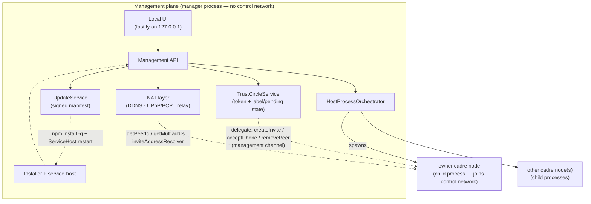

# @serfab/cadre-host

`@serfab/cadre-host` is a self-hosted manager for running cadre nodes on a single always-on machine — the basement PC, the closet NAS, the family server in a spare bedroom. Its primary job is to **donate nodes to other people's cadres**: someone you trust keeps their own device as the authority for their cadre, and this host contributes always-on capacity by running extra nodes that join *their* cadre. That is the same donate-a-node model `@serfab/cadre-provider` implements for paying tenants with Docker — only here the nodes are OS-managed child processes, and the recipients are your trust circle rather than customers. cadre-host is a sibling of `@serfab/cadre-provider`, not a mode of it, and ships its own orchestrator, donation layer, authentication, installer, NAT layer, and local management UI.

This document describes the persona, the package boundary, and the deployment model. Sibling tickets (`cadre-host-process-orchestrator`, `cadre-host-trust-circle`, `cadre-host-nat`, `cadre-host-installer`, `cadre-host-local-ui`) implement the named subsystems.

## Who it's for

The self-host persona is a technically curious, non-operator user who runs one always-on box and wants to **contribute nodes to the cadres of people they trust** — family, friends, a hobby group — without paying a provider and without learning Docker. Optionally, and secondarily, they may also run *their own* personal cadre on the same box (an opt-in described below). They have:

- One always-on machine (desktop, laptop in a dock, mini-PC, NAS). It is *not* a server in the operations sense — no monitoring stack, no firewall they understand, no spare hands at 3am.
- A small number of people they trust completely — the people they'll hand a grant token to so those people's cadres can request nodes here. The trust boundary is social, not cryptographic — these are people who could call them on the phone.
- A residential internet connection: probably NAT, possibly CGNAT, occasionally dynamic IP.
- A willingness to install one app and answer a few setup questions, but no patience for ongoing maintenance.

This persona is the opposite of `@serfab/cadre-provider`'s persona, which is a multi-tenant hosting service with API keys, billing, customer isolation, and Docker. The two packages share the same donate-a-node lifecycle but diverge in nearly every operational concern — and where the provider donates to paying strangers, cadre-host donates to a small social trust circle for free.

## Package boundary

`@serfab/cadre-host` depends on `@serfab/cadre-provider` only for:

- The `Orchestrator` interface and its request/result/stats types — cadre-host implements its own `HostProcessOrchestrator` that spawns cadre nodes as child processes (no Docker).
- Container lifecycle types (`ContainerStatus`, `ContainerResources`) — reused as-is for status and resource accounting, even though "container" here means "managed child process."

Everything else is bespoke to cadre-host:

| Concern | cadre-provider | cadre-host |
|---|---|---|
| Orchestration | Docker | Native child processes |
| Auth | API keys, JWT | Trust-circle peer identity (libp2p) |
| Tenancy | Multi-tenant with customer isolation | Single household / trust circle |
| Storage | Per-customer billing-aware quotas | Shared volumes on the host filesystem |
| Install | Operator runs Docker | One-shot installer + service-host integration |
| UI | None (API only) | Localhost web UI |
| NAT | Operator's problem | First-class DDNS + UPnP/PCP + relay fallback |

The shared types are too thin to warrant a third package (no `@serfab/cadre-orchestration-core`). If sibling tickets discover a real shared concern, it can be hoisted then.

## Deployment model

One host machine runs the `cadre-host` service. That service is a **management plane only** — a loopback REST/UI control surface. It does **not** itself join any cadre control network and holds no in-process `CadreNode`. Instead it *spawns cadre nodes as child processes* and drives them over a local management channel, exactly as `@serfab/cadre-provider` spawns Docker drones and drives them over its REST API (see [architecture.md § Provider Integration](architecture.md#provider-integration)). The household admin manages everything through a localhost web UI; friends and family connect to the cadre over libp2p from their phones, laptops, etc.

### Two roles: donor and founder

cadre-host can play two independent roles. They are separate; a host can do either, both, or (usefully) just the first:

- **Node donor (primary, always on).** The host contributes capacity to *other people's* cadres. A friend or family member holding a **grant token** asks the host to spawn a cadre node that joins *their* cadre; the node pins the *requester's* owner key and never runs a host genesis. This is the default reason to run cadre-host, and it needs **no** owner node of the host's own. The grant lifecycle lives in the donation layer (`grant`/donation tickets); the loopback admin surface is `/grants-admin`.
- **Founder (opt-in).** The host *also* runs its **own** personal cadre on this machine — the historical "single household owner node" described below. This spawns the host-owned owner node, and only then are the trust-circle (`/auth/*`) and NAT (`/nat/*`) surfaces active.

The founder role is gated by the install-time flag **`ownCadre.enabled`** in `host.config.json` (default **false**). The installer wizard asks *"Also run your own personal cadre on this machine?"* (default no); `cadre-host install --own-cadre` sets it non-interactively. It is a structural field, not editable through `/api/settings` — change it in `host.config.json` and restart (see [Write-whitelist](#write-whitelist-for-apisettings)).

Consequences when `ownCadre.enabled` is **false** (donor-only, the common case):

- `cadre-host start` brings up the orchestrator, the donation grant layer, and the loopback management server — but spawns **no** owner node.
- `/auth/*` and `/nat/*` are left unmounted and **404** (there is no host cadre to have a trust circle or a NAT-mapped owner node for). Donor nodes are loopback-only in v1; per-donated-node WAN reachability is future work (`backlog/feat-cadre-host-wan-grant-reachability`).
- `installId` still identifies the install, but is used as a cadre **party id** only when the founder role is enabled — a pure-donor host never uses it as a party id.

Toggling the flag on later spawns the owner node on the next `start` (genesis is idempotent). Toggling it off later leaves the owner node's workdir + control-DB storage on disk, just unspawned — its data persists; nothing is deleted.

The **[Node donation](#node-donation-the-primary-role)** section immediately below describes that primary donor role end to end. The founder-specific sections follow it and are clearly marked.

### Node donation (the primary role)

This is the default reason to run cadre-host: contribute always-on nodes to cadres owned by people you trust. It is the exact model `@serfab/cadre-provider` implements for Docker tenants (see [architecture.md § Provider Integration](architecture.md#provider-integration)), with two differences — the nodes are OS-managed child processes instead of containers, and the recipients are your trust circle (gated by a grant token) rather than paying customers. The requester's device stays the cadre authority throughout; **this host never holds the requester's authority key.**

#### Grant tokens (who may ask)

Before anyone can request a node, the host admin issues that person a **grant token** — a high-entropy base64url secret, handed over out-of-band (QR / copy-paste), that the requester presents as `Authorization: Bearer <grant-token>` on every donation request. A grant is long-lived and reusable up to a per-grantee node cap (`maxNodes`), unlike a trust-circle invite (one-time). Issuing / validating / revoking a grant are pure local store operations (`grants.json`) — no node round-trip.

- **Admin surface**: `/grants-admin` (loopback, no bearer — same-machine admin, matching the local-UI "no login" posture) and the `cadre-host grant issue|list|revoke` CLI. This is distinct from the grantee-facing `/grants` surface below, which *does* carry the bearer gate.
- A revoked or expired grant is denied; the live-node tally (this grant's donations in a non-terminal status) is checked against `maxNodes` at provision time.

#### The donate-a-node lifecycle

The requester is an external cadre **authority** — typically a phone — that already owns a cadre and holds its own owner keypair. The host contributes capacity only:

```
requester (authority/phone)              cadre-host (donor)                donated node (child process)
───────────────────────────             ──────────────────                ───────────────────────────
1. POST /grants                ────────▶ validate grant + quota
   { partyId, bootstrapNodes,            orchestrator.createContainer(…):  ── spawn: pin requester's
     ownerKeys, profile? }               pin ownerKeys, join partyId          owner key, join partyId
                               ◀──────── { id }  (seedToken stays host-side)   via bootstrapNodes
2. GET /grants/:id/peer        ────────▶ node /status → peerId + multiaddrs
                               ◀──────── { peerId, multiaddrs }
3. requester: addDrone({ dronePeerId, droneMultiaddrs }) → { encodedSeed }   (signed with the
                                                                              requester's authority key)
4. PUT /grants/:id/seed        ────────▶ present host-side seedToken to node POST /seed
   { seed: encodedSeed }                 node.applySeed (trusts the pinned owner key)
                               ◀──────── { peersAdded }                     ── node dials requester's
                                                                              cadre, syncs into partyId
5. DELETE /grants/:id          ────────▶ orchestrator stop + remove
```

Two rules make this safe:

- **The requester's owner key is pinned as a cold-start trust anchor.** A freshly spawned node defaults to a trust policy that rejects *every* seed, because its node-local trusted-owner anchor is empty — and nothing in replicated control state can ever fill it, so waiting for the control DB to sync would never help. So the provision request carries the requester's owner *public* key(s) (`ownerKeys`), and the orchestrator threads them into the child via `CADRE_OWNER_KEYS`, which `cadre-cli start` both seeds the anchor from and turns into a pinned-key trust policy. Without this the node rejects the phone-signed seed at step 4 — "the node accepts the seed" is the check that proves the pinning is wired correctly.
- **The `seedToken` never leaves the host.** The host↔node bearer that gates the node's own `POST /seed` is minted host-side and persisted in the donation record (so a host restart in the request→seed gap can still present the seed). It is stripped from every wire view returned to the requester — exactly as the provider redacts it.

The host **never** receives the requester's authority private key: the seed is signed on the requester's device (step 3), and only its signed, public form transits the host (step 4). This is the same trust boundary as [architecture.md § Provider Integration](architecture.md#provider-integration) — "the provider never has access to user keys."

#### Status of the donation surface

Landed: the grant-token layer (`GrantService` / `GrantStore` / `/grants-admin` / `cadre-host grant`), the orchestrator's pinned-owner-key wiring (`createContainer` → `CADRE_OWNER_KEYS`), the `donations.json` store plus donation types, the **`DonationService`** that drives the lifecycle above (`provision` / `getPeer` / `applySeed` / `terminate` / `get` / `list`, exported from `@serfab/cadre-host`), the grantee-facing **`/grants` provisioning surface** (`POST /grants`, `GET /grants/:id/peer`, `PUT /grants/:id/seed`, `DELETE /grants/:id`), the `bin/host.ts` wiring that mounts it and runs the stale-`awaiting_seed` reap sweep, and the `DonationService` / `/grants`-route unit tests — all proven end-to-end against two real `cadre-cli` children by `cadre-host-node-donation.integration.ts`. Reachability (a friend's phone reaching the host across a home NAT) is the one remaining piece — see below.

#### Reachability (loopback-only in v1)

The `/grants` surface mounts on the **loopback** management server, same as the trust-circle and NAT surfaces. It is fully exercisable same-machine (and by same-machine tests), but a friend's phone on the far side of a home NAT cannot yet reach it. Making the donation request cross the internet to a residential box — and giving each donated node its own NAT/relay mapping so the requester's cadre can dial it — is deferred to [`backlog/feat-cadre-host-wan-grant-reachability`](../tickets/backlog/feat-cadre-host-wan-grant-reachability.md). **Do not read "donation works" as "WAN reachability works."**

### Control-plane separation (load-bearing principle)

There are two distinct planes, and conflating them is the mistake this section exists to prevent:

- **Management plane** — how you talk *to* cadre-host: the loopback HTTP API + Svelte UI (and the `cadre-host` CLI, which is a thin HTTP client of that same API). This is *not* a cadre control network. It carries no owner keys on the wire and grants no cadre membership; it is same-machine admin access (see [Security posture](#security-posture)).
- **Cadre control network** — the party's private Optimystic network (`CadreControl` schema) that only *cadre nodes* join. Owner operations (mint invite, `authorizePeer`, `removePeer`, report multiaddrs) happen **inside a cadre node**, never inside the manager process.

Whether cadre-host holds any owner identity **at all** depends on the role:

- **Donated nodes (the primary role):** the host holds **no** authority key. A donated node pins the *requester's* owner public key and joins the *requester's* control network — the requester's device is the cadre authority, and the host is exactly like a provider, which "never has access to user keys" (see [architecture.md § Provider Integration](architecture.md#provider-integration)).
- **The own-cadre owner node (opt-in founder role):** here, and only here, one of the cadre nodes the manager spawns — the admin's **owner node** — carries the admin's own identity, and the manager delegates owner operations to it over the management channel. This is the historical "the host holds the admin's owner identity" case; it is now the exception, not the rule.

Either way the consequence is **not** that the *manager* joins any control network — only the spawned cadre nodes do.

The remaining sections of this document — the single-owner-node topology just below, the node admin channel, the [trust circle](#trust-circle), and [NAT/DDNS](#nat-and-ddns) — describe the opt-in **founder** role and apply only when `ownCadre.enabled` is true.

**Topology: a single household owner node.** cadre-host spawns exactly one cadre node — the admin's **owner node**, which founds/joins the party's control network and carries the host identity. Trust-circle members are *not* separate hosted nodes; they are `CadrePeer` rows (devices that dial in over libp2p), consistent with architecture.md's definition of a cadre as a single party's nodes sharing one control network. (Additional non-owner nodes can still be spawned via the orchestrator for scaling, but the manager only spawns and delegates to the one owner node.)

```mermaid
graph TD
    subgraph Host["Host Machine (always-on)"]
        CH["cadre-host service<br/>(management plane — no control network)"]
        AN["owner cadre node<br/>(child process — joins control network)"]
        CH -->|spawns + delegates over loopback admin channel| AN
        UI["Local UI<br/>http://localhost:8765"] -.-> CH
    end
    Admin["Household admin<br/>(browser)"] --> UI
    AlicePhone["Alice's phone"] -.->|libp2p<br/>(public, via NAT layer)| AN
    BobLaptop["Bob's laptop"] -.->|libp2p| AN
    Carol["Carol's devices"] -.->|libp2p| AN
```

Two external surfaces:

- **Local UI on `http://localhost:<port>`** — admin-only, no auth beyond "you are on the host." Manage trust circle members, view node status, generate invites.
- **Public libp2p surface** — managed by the NAT layer (DDNS, UPnP/PCP, relay fallback). Each cadre node accepts inbound connections from its corresponding member's other devices, plus connections from peers in the strands those members participate in.

The host process itself is not addressable from the public internet. The NAT layer exposes each cadre node, not the manager.

### Node admin channel (management-channel transport)

The management channel between the manager and its owner node is a **loopback HTTP admin surface** exposed by the spawned `cadre-cli start` child, not an in-process `CadreNode`. This is what lets the node carry the owner identity while the manager stays out of the control plane (and survives an orchestrator restart — a `127.0.0.1` port re-attaches where a stdio pipe could not).

An ordinary node becomes the owner node via two `cadre-cli start` flags (no separate entrypoint):

- `--owner` — after `node.start()`, bridges the node's libp2p Ed25519 identity into the base64url owner keypair (`ownerKeyFromLibp2p`), performs an **idempotent genesis** `OwnerKey` insert on a fresh party (skipped when one already exists), and initializes seed-bootstrap so the node can mint invites and authorize peers. It then **self-registers its own `CadrePeer` row** (`await node.registerSelf()`) so seeds include the owner peer from the first invite onward instead of waiting for the TTL heartbeat. The node's peer identity and its owner key are the *same* keypair.
- `--admin-port <port>` (or `CADRE_ADMIN_PORT`) — binds the admin listener on `127.0.0.1:<port>`. It refuses to bind without `CADRE_STARTUP_TOKEN`, which doubles as the `Authorization: Bearer <token>` secret (constant-time compared).

The node is given its identity via the child config's `identity.protobufKeyFile` (the installer's protobuf `identity.key`) or the `--identity-protobuf <path>` flag. Because that path is also where `cadre-cli` puts the node-local trusted-owner anchor (`trusted-owners.<partyId>.json`, see [architecture → Seed Delivery Protocol](architecture.md#seed-delivery-protocol)), `<dataDir>` holds both the node's identity *and* its out-of-band trust — back up and restore them together.

Routes (all under `/admin`, provider-style `{ ok, data }` / `{ ok:false, error:{ code, message } }` envelope; error codes `not_authorized` → 401, `not_ready` → 503, `bad_request` → 400, `internal` → 500):

| Method & path | Purpose |
|---|---|
| `GET /admin/identity` | `{ peerId, partyId }` |
| `GET /admin/multiaddrs` | observed libp2p addrs |
| `GET /admin/members` | `CadrePeer` enumeration — **addressable** surface, includes self (replaces handing a `ControlDatabase` to the manager) |
| `GET /admin/members/:peerId` | membership probe (addressable) |
| `GET /admin/authorized-members` | trust-facing enumeration — **authorized** surface, excludes self (the set the wake / strand-addr gates consult) |
| `GET /admin/authorized-members/:peerId` | authorized-membership probe |
| `POST /admin/invites` | mint a `CadreInvite` → `{ invite, encodedInvite }` |
| `POST /admin/accept-phone` | authorize a redeeming peer |
| `POST /admin/add-drone` | mint a seed authorizing a drone/donated node → `{ seed, encodedSeed }` |
| `DELETE /admin/members/:peerId` | signed `CadrePeer` delete |
| `PUT /admin/invite-addresses` | push NAT-resolved invite addresses (resolver transport) |

`encodeInvite` needs no route: the mint route already returns `encodedInvite`. Invite addresses use a **push** model — the manager `PUT`s NAT-resolved addresses at spawn and on every NAT change; the node holds the latest set and embeds them in subsequent invites, falling back to `libp2pNode.getMultiaddrs()` when none have been pushed. The spawn-time push is a bounded retry awaited inside `NatService.start()` (the freshly spawned node's admin channel may not be bound yet), so the manager's invite-minting API does not come up until the first address set has landed (or the retry budget elapses). Push (host→node) is chosen over a callback so the control-network node never needs to know or dial the manager's address.

This node-side surface is established by `cadre-node-admin-channel`; `cadre-host-delegated-owner-node` (6.7) builds the manager-side adapters that spawn the node and consume these routes, and finalizes the topology reconciliation noted above (single household owner node, members as `CadrePeer` rows).

## Security posture

`cadre-host` is a **trust-circle** system, not a zero-trust one. Two consequences:

1. **Anyone with shell access to the host machine fully controls cadre-host.** This is the same threat model as any desktop application — Spotify, the Steam client, your password manager's desktop app. We do not defend against the household admin's own user account, and we do not pretend to. Disk encryption, OS user accounts, and physical security are the user's responsibility.

2. **Trust-circle members are authenticated cryptographically.** Each member's cadre node has a libp2p peer identity inherited from cadre-core. Joining the circle happens via invite (out-of-band: scan a QR code while sitting on the couch together). No passwords. No API keys. No central account.

The trust-circle invite flow lives in `cadre-host-trust-circle` and reuses the seed bootstrap and invite primitives from cadre-core.

## Trust circle

> **Founder role only.** The trust circle governs membership in the host's *own* personal cadre (`ownCadre.enabled`). It is unrelated to [node donation](#node-donation-the-primary-role): donated nodes join *other people's* cadres and are gated by grant tokens, not trust-circle invites. Everything in this section applies only when the founder role is enabled.

The trust circle is the set of devices (peers) authorised to participate in the host's cadre. Membership is canonical in cadre-core's `CadrePeer` table on the control network; cadre-host layers two pieces of host-local state on top. The trust-circle listing (`TrustCircleService.list()`) shows the *authorized* membership (`GET /admin/authorized-members`), which deliberately excludes the node's own self-published row (a node's own address record isn't something it "authorized"). So the owner node's own device isn't self-registering into that listing for free: at startup, once the owner node is up, cadre-host fetches its peer ID (`OwnerNodeClient.getPeerId()`) and writes a local `self: true` label for it (`"This device"`) if one isn't already recorded — idempotent, best-effort. `list()` splices that labelled self row back into the authorized set it returns, so the owner's own device still appears alongside the devices the admin has added, labelled rather than a bare peer ID:

- **Labels** — human-readable display names (`"Mom's phone"`, `"My laptop"`) assigned by the host admin. Display-only; loss just shows the bare peer ID.
- **Pending invites** — tokens that have been issued but not yet redeemed. Operational state; lives on the issuing node only.

Both live in `<rootDir>/trust-circle.json`, written atomically (write-then-rename). If a future ticket wants cross-device label replication, a new `CadreMemberLabel` table can be added to the control schema; for now labels stay local.

### Lifecycle

Owner operations (steps 1, 3, 4) are **delegated to the host's owner cadre node** over the management channel — the manager generates/validates the token and owns the pending/label state, but the `CadreInvite` mint, `acceptPhone`, and signed `CadrePeer` delete all execute inside the node, against its control-network DB. The manager never opens the control DB itself.

1. **Issue** — `cadre-host invite "Mom's phone"` (or the management API's `POST /auth/invites`) generates a base64url token, asks the owner node to mint a `CadreInvite` carrying the host's dialable addresses, persists a pending row, and prints the encoded invite. Default TTL is 24 h; override with `--ttl 7d`.
2. **Deliver** — the encoded invite is shipped out-of-band (QR code rendered by the local UI, copy/paste, etc.).
3. **Redeem** — the recipient's cadre node dials in via cadre-core's `dialInvite`/`acceptPhone` flow. Cadre-host's `redeemInvite` looks up the pending row, claims an in-memory in-flight slot for the token (which serialises concurrent redeems for the same token), asks the owner node to run `acceptPhone` (which authorizes the peer in `CadrePeer`), and only on success durably consumes the pending row and writes a labelled member row. A transient `node_unavailable` from the owner node leaves the pending row intact so the redeemer can retry once the node is back; an expired invite is reaped on lookup. One-time use is enforced by the post-success durable removal plus the in-flight claim.
4. **Revoke / remove** — `cadre-host trust revoke <token>` deletes a pending invite before it's redeemed; `cadre-host trust revoke <peerId>` removes an authorised member (the owner node deletes the `CadrePeer` row via a signed delete, then the manager drops the local label).

In v1 the management-API surface is localhost-only (`127.0.0.1`), so redemption assumes the recipient is on the same machine as the host or on the LAN reaching it. Cross-WAN redemption via the management API requires a future cadre-host-over-P2P ticket.

## NAT and DDNS

Cadre-host runs on machines that are typically behind NAT. To be dialable from the open internet it composes three layers, each fail-safe and independent:

1. **UPnP / NAT-PMP port mapping.** The default is to punch a forward through the upstream router via `@achingbrain/nat-port-mapper`. If the router refuses or doesn't expose UPnP, port mode flips to `failed` and the user is prompted to either set up a manual port forward or fall back to a relay (next bullet). The mapping is refreshed periodically; lease expiry surfaces as `mappingLeaseExpiresAt` in the status snapshot.
2. **Circuit-relay client (deferred).** When the host is unreachable directly (CGNAT or stubborn router) it will eventually consume a libp2p circuit relay so phones can still dial in. The relay-server side already exists in cadre-core (`network.enableRelay`); the client side that *reserves* through a relay is parked in [`backlog/4-relay-bootstrap-infrastructure`](../tickets/backlog/) and will be wired in once that ticket lands. Until then, hosts behind CGNAT will need either IPv6 or manual port forwarding.
3. **Dynamic DNS.** When a stable hostname is desired, cadre-host pushes the current external IP to a DDNS provider. v1 ships **DuckDNS** only; additional providers (Cloudflare, No-IP, Dynu, …) are filed as backlog work and drop into `nat/ddns/` as one file each plus a registry entry.

### External IP detection

Cadre-host queries its external IP from two independent sources and compares them:

- **Router-side** — the WAN IP that the UPnP/NAT-PMP gateway reports for itself.
- **Public side** — an HTTPS GET to one of `api.ipify.org`, `ifconfig.me`, or `icanhazip.com`, first success wins.

When both succeed and disagree, cadre-host flags `cgnatDetected: true` — the textbook signature of CGNAT, where the router thinks it has a public address that's really private to the carrier. The verdict is informational, not enforced; the heuristic can also misfire on dual-stack networks, sliced VPNs, or flapping IPs.

### Reachability verdict

The `directReachability` field in the status snapshot is best-effort:

| Conditions                                | Verdict        |
|-------------------------------------------|----------------|
| `cgnatDetected: true`                     | `cgnat`        |
| `portMode: auto-upnp` / `auto-natpmp`     | `reachable`    |
| `portMode: failed`                        | `unreachable`  |
| manual config / `upnpEnabled: false`      | `unknown`      |

This is a heuristic, not a real dial-back. A future ticket will enable libp2p's AutoNAT service in `@optimystic/db-p2p`'s `libp2p-node-base.ts` and use its verdict here.

### DuckDNS setup

1. Register a subdomain at <https://www.duckdns.org/>. Note the token shown after sign-in.
2. With cadre-host running, configure the provider:
   ```sh
   cadre-host nat ddns set duckdns --hostname foo.duckdns.org --token <token>
   ```
   The token is sent over loopback to the management API and persisted via the OS keychain (or a 0600 fallback file — see below). The update loop runs immediately and then every five minutes; unchanged IPs are *not* re-pushed (DuckDNS appreciates this).
3. To inspect: `cadre-host nat status` shows the configured hostname, the last update result, and any error.

If you'd rather manage DNS yourself (e.g. via the router's built-in DuckDNS client), tell cadre-host *not* to update the record:

```sh
cadre-host nat ddns external --hostname foo.duckdns.org
```

cadre-host then surfaces the hostname in invites and status but never makes an update request.

### Invite address resolver

The host's NAT layer hooks into cadre-core through the `network.inviteAddressResolver` option on `CadreNodeConfig`. Cadre-core's `SeedBootstrapService.createInvite` consults this resolver first; cadre-host's `NatService.getInviteAddresses()` returns:

- `/dns4/<hostname>/tcp/<externalPort>/p2p/<peerId>` when DDNS is configured and reachability is `reachable`,
- `/ip4/<externalIp>/tcp/<externalPort>/p2p/<peerId>` when only the raw IP is known,
- the libp2p multiaddrs otherwise (including any `/p2p-circuit/` addresses once the relay-client work lands).

### Credential storage

DDNS tokens are stored in the OS keychain via `keytar` (service: `sereus-cadre-host`, account: `ddns:<providerId>:<field>`). When `keytar` is unavailable (missing native build tooling, no DBus secret service on a headless Linux box, etc.) cadre-host falls back to a plain JSON file at `<rootDir>/nat-secrets.json` with mode `0600`. The fallback is logged on every write:

```
[cadre-host] DDNS credentials will be stored UNENCRYPTED at <rootDir>/nat-secrets.json (keytar not installed). Install keytar's native dependencies for OS keychain protection.
```

On Windows POSIX permission bits don't apply, so the file is readable by any account on the same machine — install keytar's native dependency to avoid that.

## Push credentials (FCM/APNs)

To wake a suspended mobile app — one whose OS has frozen its process so a control-network dial can't reach it — the always-on owner/storage node delivers a `strand-wake` data message over the platform push channel (FCM for Android, APNs for iOS). cadre-core's push fan-out (`PushFanoutService` + `PushNotifier`) does the delivery; it is constructed **only when** the spawned node's `cadre.json` carries a `push` block (`CadreNodeConfig.push`). This section covers how cadre-host gets the FCM/APNs credentials into that block. Push is **opt-in**: with no credentials configured, no `push` block is written and the node behaves exactly as before (control-network push-wake only).

### Out-of-agent infra steps (do these first)

Creating the cloud credentials is a one-time human/infra task — cadre-host stores and injects them but cannot mint them:

1. **FCM (Android / Firebase).** In the [Firebase console](https://console.firebase.google.com), create (or open) the project that backs your app, then **Project settings → Service accounts → Generate new private key**. The downloaded JSON contains `project_id`, `client_email`, and `private_key` — the three fields cadre-host needs.
2. **APNs (Apple).** In the [Apple Developer portal](https://developer.apple.com/account), **Certificates, Identifiers & Profiles → Keys → +**, enable **Apple Push Notifications service (APNs)**, and download the `.p8` auth key. Note the **Key ID**, your **Team ID**, and the app's **Bundle ID**. A development/TestFlight build talks to the **sandbox** APNs host; an App Store build talks to **production** — they are separate and a token minted for one is rejected by the other.

### Storing the credentials

Use the `cadre-host push` subcommands (they write directly to the data dir's secret store + `host.config.json`; no running server required):

```
cadre-host push fcm  --project-id <id> --client-email <email> --private-key-file ./fcm-key.pem
cadre-host push apns --key-id <kid> --team-id <team> --bundle-id <bundle> --private-key-file ./AuthKey.p8 [--production]
cadre-host push options [--cooldown-ms <ms>] [--debounce-ms <ms>]
cadre-host push status            # show configured platforms (no secret material)
cadre-host push clear <fcm|apns|all>
```

Secret hygiene mirrors the DDNS-token precedent:

- The **private keys** (and the FCM `project_id` / `client_email`, APNs `key_id` / `team_id`) live in the OS keychain via `keytar` (service `sereus-cadre-host`, accounts `push:fcm` / `push:apns`), or the same `0600` `<rootDir>/nat-secrets.json` fallback when keytar is unavailable. They are **never** written to `host.config.json`.
- The **non-secret** bits — APNs `bundleId`, the sandbox/production toggle, and the `cooldownMs` / `debounceMs` tuning — live in `host.config.json` under `push`.
- Credentials are **re-resolved from the secret store on every node (re-)spawn**, so a key rotation takes effect on the next owner-node restart and nothing raw is ever persisted in the orchestrator's `state.json`. They are never logged — debug lines record only platform presence (`fcm=true apns=false`), not key material.

### Injection into the spawned node

At spawn time `HostProcessOrchestrator` calls its `pushResolver` (wired in `cadre-host start`), which reads the secret store + `host.config.json` and validates the result. The resolved `PushCredentials` are written into the child's `cadre.json` under `push` for the **owner/storage** node (and any managed **storage**-profile node) — a transaction-only node gets no block. A *partial* set (a present platform missing required fields, e.g. an APNs key with no `bundleId`) is rejected: the resolver logs the error and spawns the node **without** push rather than failing the spawn, so the node stays reachable.

> **On-device validation is still a human prerequisite.** Once creds are provisioned, push-wake is end-to-end at the server, but confirming a real device actually wakes (correct bundle id, sandbox-vs-production match for the build under test, a registered `DeviceToken`) must be verified on a physical device — it is out-of-agent.

### Process integration

`NatService` is constructed and owned by the manager process (`cadre-host start`), same pattern as `TrustCircleService`. Its `cadreNode` dependency is a **management-channel adapter to the spawned owner node**, not an in-process libp2p node — `getPeerId()` / `getMultiaddrs()` query the node over that channel. The wiring:

1. Constructs `new NatService({ rootDir, cadreNode })` where `cadreNode` proxies `getPeerId()` and `getMultiaddrs()` to the owner node.
2. Calls `await service.start()` once the owner node is up and reporting addresses.
3. Mounts `createNatHandlers(service)` on Fastify under `/nat/*` (`GET /nat/status`, `POST /nat/test`, `PUT /nat/ddns`, `PUT /nat/settings`).
4. Calls `await service.stop()` on shutdown to release the UPnP lease.
5. Installs `service.getInviteAddresses` as the owner node's `network.inviteAddressResolver` — set in the `CadreNodeConfig` the orchestrator passes when it spawns that node, so cadre-core's `SeedBootstrapService.createInvite` consults the host's NAT-resolved addresses. (Because the resolver lives in the manager while the node runs in a child, this is the one cross-plane hook the realignment ticket must design a transport for — e.g. resolved addresses pushed to the node at spawn/refresh time rather than a synchronous in-process callback.)

## Updates

cadre-host fetches a signed manifest from `https://releases.serfab.io/cadre-host/latest.json` once on `start` and every 24 h thereafter. The manifest is an Ed25519-signed envelope `{ manifest, sig }` where the inner manifest carries `version`, `publishedAt`, an `npm.{ package, tag }` hint, and an optional `minPreviousVersion` step gate. The release public key is embedded in the binary; `CADRE_HOST_UPDATE_DEV_KEY` overrides it for CI / local signing.

**Notify-by-default.** A successfully verified manifest with `version > current` writes an `available` record into `<dataDir>/update-state.json`; the local UI surfaces it as a banner with an explicit "Apply now" action. Auto-apply is opt-in (`updates.autoApply: true` in `host.config.json`, settable from the UI's settings page). Signature failures are recorded as `lastError` so the UI can warn; network failures stay silent.

**Apply flow.** Re-fetch + re-verify the manifest, record `applyInProgress`, run `npm install -g <pkg>@<version>` (5-minute timeout), then ask the platform's `ServiceHost.restart(...)` to pick up the new binary (`systemctl --user restart`, `launchctl kickstart`, or `nssm restart`). On install failure the previous version is reinstalled and the error is surfaced; the still-running old binary continues to serve. Restart failures are non-fatal — the binary swap already succeeded, so the user can restart manually.

`UpdateService` lives in `src/update/` and exposes `createUpdateHandlers(service)` for the local-UI HTTP routes (`GET /update`, `POST /update/apply`, `GET/PUT /update/settings`); `cadre-host start` constructs the service so the daily timer and `update-state.json` are populated regardless of whether the UI has bound its routes yet.

### Release signing & key management

**Two keys, opposite directions — don't conflate them.** cadre-host holds two unrelated Ed25519 keypairs:

| | Release-signing key | Per-install identity key |
| --- | --- | --- |
| Source | `PROD_KEY_BASE64` in `src/update/release-key.ts` | `<dataDir>/identity.key` from `src/installer/identity.ts` |
| Direction | publisher → **every** install | this node → the network / trust-circle |
| Lifecycle | one global keypair; minted **once, offline** by the release operator; public half pinned into every binary at build time | a fresh keypair generated at **install time** on each box, mode 0600, never leaves it |
| Answers | "did this update instruction genuinely come from Serfab?" | "who is this node?" (libp2p peer identity) |

The identity key is install-specific by design; the release key **cannot** be. It is a one-signer/many-verifiers relationship — the publisher signs `latest.json` once and every install must verify against the *same* public key, obtained from somewhere it already trusts (the binary it installed). There is nothing a freshly-minted local key could verify the publisher's signature with, so the public half must be embedded at build time. This section is about that release key.

**Why sign at all, when updates come from npm?** `npm install -g` already guarantees the *bytes* of a named `package@version` (registry TLS, integrity hashes, optional provenance). But the signed manifest decides **which** package and version a node auto-moves to — `manifest.channels.npm.package`, `manifest.version`, and the `minPreviousVersion` step gate all ride inside the signature. Without it, anyone who controls or MITMs the static `releases.serfab.io` host could forge a manifest that redirects `autoApply` nodes to a typosquatted package or force-downgrades them to a known-vulnerable version, and npm would faithfully install whatever it was told. npm authenticates the bytes; the manifest authenticates the *choice*.

Manifests are verified against an Ed25519 public key embedded in source (`PROD_KEY_BASE64` in `src/update/release-key.ts`). Public keys are not secret, so the *public* half is committed; the private half is the release-signing secret and is custodied **offline by the release operator — never committed**. The real public key is embedded (as of the 0.8.1 release); before an operator embeds one the source ships an all-zeros placeholder, and a build/publish guard refuses to ship such a build (see below).

The repo provides the full pipeline; the operator runs a couple of mechanical commands:

1. **Generate the keypair (offline, once).** On a trusted machine, from a checkout:

   ```sh
   node packages/cadre-host/scripts/release-keygen.mjs --write-source
   ```

   This writes the PKCS#8 PEM private key to `./cadre-host-release.key` (mode `0600`, refuses to overwrite) and — with `--write-source` — atomically rewrites `PROD_KEY_BASE64` with the new public key. Omit `--write-source` to print the public key and embed it by hand. **Move the private key to offline custody and never commit it.** Commit the `PROD_KEY_BASE64` change.

2. **Sign `latest.json` (offline, per release).** With the private key present and the package built (`yarn build:server`):

   ```sh
   node packages/cadre-host/scripts/sign-manifest.mjs \
     --key ./cadre-host-release.key \
     --version 0.7.0 --package @serfab/cadre-host --tag latest \
     --published-at 2026-05-15T18:00:00.000Z \
     --out latest.json
   ```

   The signer reuses the exact field-validation the verifier applies (`buildManifest`) and **self-verifies** the signature against the key derived from the private key before emitting, so it can never produce a manifest the client would later reject. Fields may instead come from `--manifest <file.json>`.

3. **Publish `latest.json`.** Upload the signed envelope to the static host so it is served at `https://releases.serfab.io/cadre-host/latest.json`. This is plain static-file hosting — no code in this repo.

4. **Publish the binary.** `scripts/publish-package.js cadre-host` builds then **aborts if the embedded key is still the placeholder** — it reads `PROD_KEY_BASE64` straight from source (the byte string the build compiles verbatim into the binary) and deliberately ignores `CADRE_HOST_UPDATE_DEV_KEY`, since that override never ships and so cannot make a placeholder build safe. This means a real release can never silently ship the dead key. Internal/test publishes that intentionally keep the placeholder set `CADRE_HOST_ALLOW_PLACEHOLDER_KEY=1` to bypass.

**Rotation** is the same loop: re-run keygen (`--write-source`), commit the new public key, re-sign and re-publish `latest.json`, publish a new binary. Clients that already trust the old key will see `signature_invalid` until they upgrade to the binary carrying the new public key — so rotate by shipping the new public key in a release *before* signing manifests with the new private key.

**`CADRE_HOST_UPDATE_DEV_KEY`** overrides the embedded key for **development / CI / staging only** — it lets tests and smoke runs sign with an ephemeral keypair without touching source. It is never the production verification path and must not be set on deployed nodes. The signing tools live under `packages/cadre-host/scripts/` and are intentionally **not** part of the published package (the binary never carries signing code or the private key).

## Local UI server

The local-UI server (`6.5.1-cadre-host-local-ui-server`) is the long-lived HTTP listener launched by `cadre-host start`. The Svelte SPA that consumes it ships in `6.5.2-cadre-host-local-ui-spa`.

### Binding & origin policy

- Bound to **`127.0.0.1`** only — never `0.0.0.0`. The OS firewall does not see this socket from another machine.
- An **origin guard** rejects any request whose `Host` header isn't `127.0.0.1[:port]`, `localhost[:port]`, or IPv6 loopback `[::1][:port]`/`::1[:port]` (case-insensitive), and any request whose `Origin` header (when present) doesn't match one of those origins. This defeats DNS-rebind from a malicious page that resolves its own hostname to `127.0.0.1`.
- **Port collision**: if the configured `uiPort` is in use, the server tries `uiPort+1..uiPort+9`. On total failure it exits non-zero with a clear message naming every port attempted. Re-configure `uiPort` in `host.config.json` and reinstall the service.

### No login

cadre-host is a same-machine management surface. Any local process running as the cadre-host user can already read identity files, mutate the trust circle, install global npm packages, and (with root) restart the service. A web-form password adds no real defence — it would protect the *non-existent* threat model "attacker is on this machine but can't run code as the cadre-host user". Don't add auth here; harden the host OS instead.

### API surface

| Path | Method | Purpose | Errors |
|---|---|---|---|
| `/api/status` | GET | Aggregated dashboard snapshot | — |
| `/api/nodes` | GET | List managed cadre nodes (orchestrator handles) | — |
| `/api/nodes/:id` | GET | One node's detail + stats | 404 unknown |
| `/api/nodes/:id/logs?lines=N` | GET | Tail of `node.log` (default 200, max 2000) | 404 unknown |
| `/api/nodes/:id/stop` | POST | Stop a running node | 404 unknown |
| `/api/nodes/:id/{start,restart}` | POST | Lifecycle stub — v1 has no auto-spawn path (see honest-gap below) | 501 not_implemented |
| `/api/settings` | GET/PUT | `host.config.json` passthrough (PUT is whitelisted) | 400 invalid_setting |
| `/api/events` | GET | Server-Sent Events stream | — |
| `/auth/*` | various | Trust-circle (matches CLI) — `POST /auth/invites`, `GET /auth/trust-circle`, `DELETE /auth/invites/:token`, `DELETE /auth/members/:peerId` | mapped from `TrustCircleError.code` |
| `/nat/*` | various | NAT/DDNS (matches CLI) — `GET /nat/status`, `POST /nat/test`, `GET /nat/providers`, `PUT /nat/ddns`, `PUT /nat/settings` | mapped from `NatError.code` |
| `/update/*` | various | Update flow — `GET /update`, `POST /update/apply`, `GET/PUT /update/settings` | mapped from `UpdateErrorException.code` |
| `/` (any GET) | — | SPA bundle (or placeholder HTML when `dist/ui/` is absent) | — |

Error payloads use the same envelope as cadre-provider: `{ ok: false, error: { code, message } }`. Status mapping is encoded in `src/server/error-handler.ts`.

### Server-Sent Events

`GET /api/events` returns `text/event-stream` and pushes:

| Event | When |
|---|---|
| `node-state-changed` | A managed node transitions running ↔ stopped |
| `trust-circle-changed` | An invite is issued / redeemed / revoked, or a member is removed |
| `connectivity-changed` | NAT settings change, reachability re-tested, server boot |
| `update-available` | A new release version is observed |

A `: heartbeat` comment is sent every 15 s so corporate proxies don't time out idle connections; the wire format also includes a `retry: 5000` hint. Listeners are cleaned up on client disconnect — `bus.listenerCount()` drops back to zero.

### Write-whitelist for `/api/settings`

The SPA's settings page reads the full `host.config.json` (so it can show read-only fields) but only accepts these PUT keys:

| Key | Accepted? | Notes |
|---|---|---|
| `upnpEnabled` | yes | Propagated to `NatService.putSettings` immediately |
| `updates.autoApply` | yes | Propagated to `UpdateService.putSettings` |
| `updates.manifestUrl` | yes | Propagated to `UpdateService.putSettings` (env var still wins) |
| `uiPort`, `libp2pPort`, `dataDir`, `identityPath`, `installId`, `installedAt`, `installerVersion`, `version`, `ownCadre` | **no** | Structural — edit at install time or directly in `host.config.json` and restart. `ownCadre` (the donor/founder role) is install-time only. |

Unknown keys → 400 `invalid_setting`.

### Honest gaps

- `/api/nodes/:id/{start,restart}` are real **for the owner node** (founder role) — they re-spawn it from the persisted `OwnerSpawnConfig`. In donor-only mode there is no owner node, so these no-op gracefully (unknown ids 404; the `owner` id with no saved config returns **501 not_implemented**). Generic per-member node spawn-from-saved-config is out of scope and returns **501 not_implemented**; unknown ids 404. Stop on any running node works.
- **Signed `CadrePeer` delete works end-to-end.** `removeMember` / `DELETE /admin/members/:peerId` reaches the owner node and the node-side delete succeeds. The Quereus deferred-constraint bug it once hit ("No row context found for column PeerId") was fixed upstream (`quereus-cadrepeer-delete-no-row-context`, landed); the cadre-host remove-cycle integration test is now unskipped, and the cross-package `cadre-host-owner-node.integration.ts` scenario exercises the full add→remove cycle against a real cadre-cli child.
- The SPA is shipped by `6.5.2-cadre-host-local-ui-spa`. It ships into `<package>/dist/ui/` and is mounted by the static handler. When `dist/ui/` is absent (e.g. running from a source checkout without `yarn build`), `/` returns a placeholder HTML pointing at the build instructions; the API continues to answer.

## Architecture sketch



The dotted lines from `TC`/`NAT` to the owner node are the **management channel** (local IPC / loopback), *not* the control network — only the spawned cadre nodes (`AN`, `NN`) join control networks. The five named subsystems are each owned by a sibling ticket; this package establishes the surface they plug into. The trust-circle/NAT → owner-node delegation is the subject of the realignment work tracked in `tickets/` (`cadre-host-delegated-owner-node`).

## Status

**v0.x foundation.** This release contains:

- Workspace package skeleton (`packages/cadre-host/`).
- `HostProcessOrchestrator` — runs cadre nodes as native child processes.
- `TrustCircleService` + `TrustCircleStore` — invite issuance/redemption/revocation and the local labels file.
- `NatService` + `NatStore` — UPnP/NAT-PMP port mapping, external-IP detection w/ CGNAT flag, DuckDNS dynamic DNS, secrets storage (keytar + 0600 fallback), and an `inviteAddressResolver` hook into cadre-core's invite flow.
- CLI: `grant issue <label>`, `grant list`, `grant revoke` (the always-on **node-donor** surface, talking to `/grants-admin`); `invite <label>`, `trust list`, `trust revoke`, `nat status`, `nat test`, `nat ddns set`, `nat ddns external`, `nat settings` (the opt-in founder surfaces); `install` / `uninstall` / `status` run the installer (`6.4.1`) — wizard, identity persistence, `host.config.json`, and service-host registration (systemd/launchd/NSSM). `start` loads config + identity, brings up the orchestrator + donation grant layer, and binds the Fastify management server on `127.0.0.1:<uiPort>` (`6.5.1`) — this is the always-on **node-donor** path. **Only when `ownCadre.enabled`** (the opt-in founder role) does it additionally **spawn the host's own owner node as a managed child and delegate owner operations to it over the loopback admin channel** (`6.6`/`6.7`) and bring up the trust-circle / NAT services; otherwise `/auth/*` and `/nat/*` are inactive (see [Two roles: donor and founder](#two-roles-donor-and-founder)). `ui` prints + opens the local-UI URL.
- Owner-node delegation (`6.7`): `OwnerNodeClient` (`src/owner/`) is an HTTP client of the node's loopback admin channel implementing the trust-circle + NAT `CadreNodeLike` shapes plus `pushInviteAddresses`. `TrustCircleService` and `NatService` hold this client instead of an in-process `ControlDatabase`; the manager never joins the control network. Unreachable-node failures surface as `node_unavailable` (→ 503), and trust-circle listing degrades to the local labels file.
- `UpdateService` + `UpdateStateStore` — signed-manifest fetch/verify (Ed25519), `<dataDir>/update-state.json`, `npm install -g` with rollback, and a `ServiceHost.restart(...)` hook for picking up the new binary.
- Local UI server (`6.5.1`) — Fastify on 127.0.0.1 with origin guard, error envelope, SSE bus at `/api/events`, status / nodes / settings routes, and a static SPA mount. See the [Local UI server](#local-ui-server) section above.
- Local UI SPA (`6.5.2`) — Svelte 5 single-page app (Home / Trust Circle / Connectivity / Nodes + per-node detail / Settings) hosted by the same Fastify instance. Built via `yarn workspace @serfab/cadre-host build` into `<package>/dist/ui/`. EventSource-driven live updates; hash-routed so the server needs no SPA-fallback rewrite. ≈ 43 KB gzipped.
- Re-exports of the `Orchestrator` and container lifecycle types from `@serfab/cadre-provider` so consumers have a single import surface.

**Control-plane realignment landed (`6.6`/`6.7`).** The manager spawns the admin's owner cadre node via `HostProcessOrchestrator` and delegates owner/membership/identity operations to it over the node's loopback admin channel (`OwnerNodeClient`). The earlier throwing stubs (`missingCadreNodeStub` / `missingNatNodeStub`) are gone, and the manager holds no in-process `ControlDatabase` — it is purely a management plane (see [Control-plane separation](#control-plane-separation-load-bearing-principle)). The full delegation surface — including the signed `CadrePeer` delete that was once blocked upstream — is now exercised end-to-end against a real cadre-cli child by `integration-tests/src/scenarios/cadre-host-owner-node.integration.ts` (which now stands as the **opt-in own-cadre / founder** scenario).

**Node-donor realignment (in progress).** cadre-host's primary role is now **node donor** — contributing nodes to *external* cadres — with the founder role (its own cadre) demoted to the opt-in `ownCadre.enabled` path (see [Two roles](#two-roles-donor-and-founder) and [Node donation](#node-donation-the-primary-role)). **Landed:** the grant-token layer (`GrantService` / `GrantStore` / `/grants-admin` / `cadre-host grant`) and the orchestrator's pinned-owner-key wiring (`createContainer` → `CADRE_OWNER_KEYS`), plus the `donations.json` store and donation types. **In progress (donation-service):** the grantee-facing `/grants` provisioning routes, the `DonationService` lifecycle (provision → peer → seed → terminate), and the stale-`awaiting_seed` reap sweep. **Deferred:** WAN reachability for the request surface and per-donated-node NAT mapping (`backlog/feat-cadre-host-wan-grant-reachability`) — v1 donation is loopback-only. The cross-package node-donation integration test (a real cadre-cli requester ↔ a donated node) is filed as a follow-up gated on the `/grants` surface.

## See also

- [architecture.md](architecture.md) — overall cadre architecture, control network, and strand lifecycle.
- [@serfab/cadre-provider](../packages/cadre-provider/README.md) — the multi-tenant sibling.
- [@serfab/cadre-core](../packages/cadre-core/README.md) — the underlying cadre node library.
