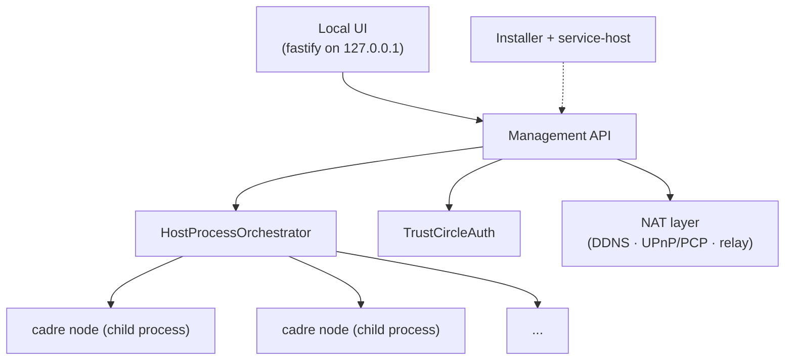

# @serfab/cadre-host

`@serfab/cadre-host` is a self-hosted manager for running cadre nodes on a single always-on machine — the basement PC, the closet NAS, the family server in a spare bedroom. It is a sibling of `@serfab/cadre-provider`, not a mode of it, and ships its own orchestrator, authentication, installer, NAT layer, and local management UI.

This document describes the persona, the package boundary, and the deployment model. Sibling tickets (`cadre-host-process-orchestrator`, `cadre-host-trust-circle`, `cadre-host-nat`, `cadre-host-installer`, `cadre-host-local-ui`) implement the named subsystems.

## Who it's for

The self-host persona is a technically curious, non-operator user who wants a cadre node for themselves and a small trust circle (family, friends, hobby group) without paying a provider and without learning Docker. They have:

- One always-on machine (desktop, laptop in a dock, mini-PC, NAS). It is *not* a server in the operations sense — no monitoring stack, no firewall they understand, no spare hands at 3am.
- A small number of people they trust completely. The trust boundary is social, not cryptographic — these are people who could call them on the phone.
- A residential internet connection: probably NAT, possibly CGNAT, occasionally dynamic IP.
- A willingness to install one app and answer a few setup questions, but no patience for ongoing maintenance.

This persona is the opposite of `@serfab/cadre-provider`'s persona, which is a multi-tenant hosting service with API keys, billing, customer isolation, and Docker. The two packages share the cadre lifecycle model but diverge in nearly every operational concern.

## Package boundary

`@serfab/cadre-host` depends on `@serfab/cadre-provider` only for:

- The `Orchestrator` interface and its request/result/stats types — cadre-host implements its own `HostProcessOrchestrator` that spawns cadre nodes as child processes (no Docker).
- Container lifecycle types (`ContainerStatus`, `ContainerResources`) — reused as-is for status and resource accounting, even though "container" here means "managed child process."

Everything else is bespoke to cadre-host:

| Concern | cadre-provider | cadre-host |
|---|---|---|
| Orchestration | Docker | Native child processes |
| Auth | API keys, JWT | Trust-circle peer identity (libp2p) |
| Tenancy | Multi-tenant with customer isolation | Single household / trust circle |
| Storage | Per-customer billing-aware quotas | Shared volumes on the host filesystem |
| Install | Operator runs Docker | One-shot installer + service-host integration |
| UI | None (API only) | Localhost web UI |
| NAT | Operator's problem | First-class DDNS + UPnP/PCP + relay fallback |

The shared types are too thin to warrant a third package (no `@serfab/cadre-orchestration-core`). If sibling tickets discover a real shared concern, it can be hoisted then.

## Deployment model

One host machine runs the `cadre-host` service. That service manages N cadre nodes as child processes — typically one per member of the trust circle. Friends and family connect to *their* cadre node over libp2p from their phones, laptops, etc. The household admin manages everything through a localhost web UI.

```mermaid
graph TD
    subgraph Host["Host Machine (always-on)"]
        CH["cadre-host service"]
        CH -->|spawns| N1["cadre node (Alice)"]
        CH -->|spawns| N2["cadre node (Bob)"]
        CH -->|spawns| N3["cadre node (Carol)"]
        UI["Local UI<br/>http://localhost:8765"] -.-> CH
    end
    Admin["Household admin<br/>(browser)"] --> UI
    AlicePhone["Alice's phone"] -.->|libp2p<br/>(public, via NAT layer)| N1
    BobLaptop["Bob's laptop"] -.->|libp2p| N2
    Carol["Carol"] -.->|libp2p| N3
```

Two external surfaces:

- **Local UI on `http://localhost:<port>`** — admin-only, no auth beyond "you are on the host." Manage trust circle members, view node status, generate invites.
- **Public libp2p surface** — managed by the NAT layer (DDNS, UPnP/PCP, relay fallback). Each cadre node accepts inbound connections from its corresponding member's other devices, plus connections from peers in the strands those members participate in.

The host process itself is not addressable from the public internet. The NAT layer exposes each cadre node, not the manager.

## Security posture

`cadre-host` is a **trust-circle** system, not a zero-trust one. Two consequences:

1. **Anyone with shell access to the host machine fully controls cadre-host.** This is the same threat model as any desktop application — Spotify, the Steam client, your password manager's desktop app. We do not defend against the household admin's own user account, and we do not pretend to. Disk encryption, OS user accounts, and physical security are the user's responsibility.

2. **Trust-circle members are authenticated cryptographically.** Each member's cadre node has a libp2p peer identity inherited from cadre-core. Joining the circle happens via invite (out-of-band: scan a QR code while sitting on the couch together). No passwords. No API keys. No central account.

The trust-circle invite flow lives in `cadre-host-trust-circle` and reuses the seed bootstrap and invite primitives from cadre-core.

## Trust circle

The trust circle is the set of devices (peers) authorised to participate in the host's cadre. Membership is canonical in cadre-core's `CadrePeer` table on the control network; cadre-host layers two pieces of host-local state on top:

- **Labels** — human-readable display names (`"Mom's phone"`, `"My laptop"`) assigned by the host admin. Display-only; loss just shows the bare peer ID.
- **Pending invites** — tokens that have been issued but not yet redeemed. Operational state; lives on the issuing node only.

Both live in `<rootDir>/trust-circle.json`, written atomically (write-then-rename). If a future ticket wants cross-device label replication, a new `CadreMemberLabel` table can be added to the control schema; for now labels stay local.

### Lifecycle

1. **Issue** — `cadre-host invite "Mom's phone"` (or the management API's `POST /auth/invites`) generates a base64url token, asks cadre-core to mint a `CadreInvite` carrying the host's dialable addresses, persists a pending row, and prints the encoded invite. Default TTL is 24 h; override with `--ttl 7d`.
2. **Deliver** — the encoded invite is shipped out-of-band (QR code rendered by the local UI, copy/paste, etc.).
3. **Redeem** — the recipient's cadre node dials in via cadre-core's `dialInvite`/`acceptPhone` flow. Cadre-host's `redeemInvite` validates the token against the pending row, calls `acceptPhone` (which authorizes the peer in `CadrePeer`), then atomically consumes the pending row and writes a labelled member row. One-time use is enforced by removing the pending row on first redemption.
4. **Revoke / remove** — `cadre-host trust revoke <token>` deletes a pending invite before it's redeemed; `cadre-host trust revoke <peerId>` removes an authorised member (deletes the `CadrePeer` row via a signed delete, then the local label).

In v1 the management-API surface is localhost-only (`127.0.0.1`), so redemption assumes the recipient is on the same machine as the host or on the LAN reaching it. Cross-WAN redemption via the management API requires a future cadre-host-over-P2P ticket.

## Architecture sketch



The five named subsystems are each owned by a sibling ticket. This package establishes the surface they plug into — empty stubs in v0.x foundation, real implementations as each ticket lands.

## Status

**v0.x foundation.** This release contains:

- Workspace package skeleton (`packages/cadre-host/`).
- `HostProcessOrchestrator` — runs cadre nodes as native child processes.
- `TrustCircleService` + `TrustCircleStore` — invite issuance/redemption/revocation and the local labels file.
- CLI: `invite <label>` (real), `trust list`, `trust revoke`; `install`, `start`, `status`, `uninstall` still print "not yet implemented" pending their tickets.
- Re-exports of the `Orchestrator` and container lifecycle types from `@serfab/cadre-provider` so consumers have a single import surface.

The NAT layer, installer, and local UI implementations are forthcoming in the `cadre-host-nat`, `cadre-host-installer`, and `cadre-host-local-ui` tickets. Until those land, `cadre-host` is not yet runnable end-to-end as a service.

## See also

- [architecture.md](architecture.md) — overall cadre architecture, control network, and strand lifecycle.
- [@serfab/cadre-provider](../packages/cadre-provider/README.md) — the multi-tenant sibling.
- [@serfab/cadre-core](../packages/cadre-core/README.md) — the underlying cadre node library.
