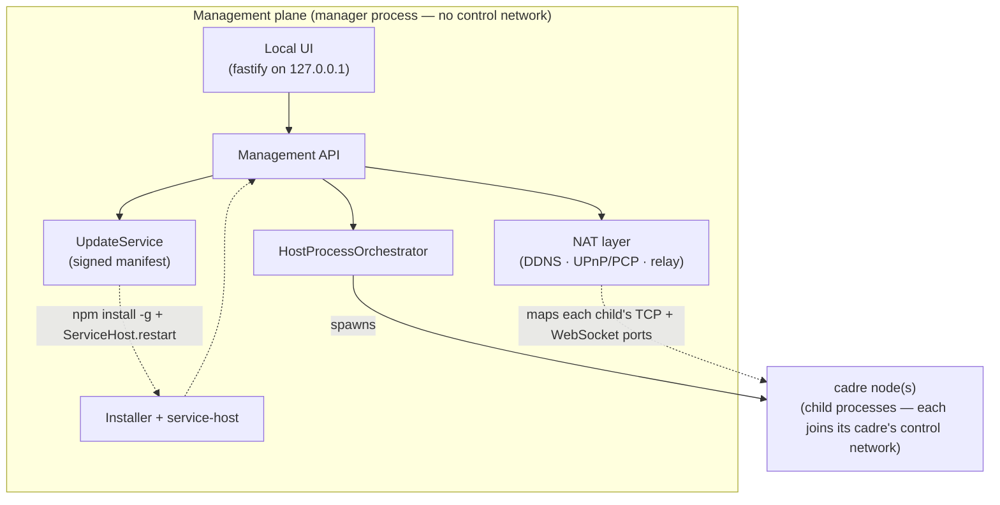

# @serfab/cadre-host

`@serfab/cadre-host` is a self-hosted manager for running cadre nodes on a single always-on machine — the basement PC, the closet NAS, the family server in a spare bedroom. Its primary job is to **donate nodes to other people's cadres**: someone you trust keeps their own device as the authority for their cadre, and this host contributes always-on capacity by running extra nodes that join *their* cadre. That is the same donate-a-node model `@serfab/cadre-provider` implements for paying tenants with Docker — only here the nodes are OS-managed child processes, and the recipients are your trust circle rather than customers. cadre-host is a sibling of `@serfab/cadre-provider`, not a mode of it, and ships its own orchestrator, donation layer (grant tokens), installer, NAT layer, and local management UI.

This document describes the persona, the package boundary, and the deployment model. Sibling tickets (`cadre-host-process-orchestrator`, `cadre-host-nat`, `cadre-host-installer`, `cadre-host-local-ui`) implement the named subsystems.

## Who it's for

The self-host persona is a technically curious, non-operator user who runs one always-on box and wants to **contribute nodes to the cadres of people they trust** — family, friends, a hobby group — without paying a provider and without learning Docker. They have:

- One always-on machine (desktop, laptop in a dock, mini-PC, NAS). It is *not* a server in the operations sense — no monitoring stack, no firewall they understand, no spare hands at 3am.
- A small number of people they trust completely — the people they'll hand a grant token to so those people's cadres can request nodes here. The trust boundary is social, not cryptographic — these are people who could call them on the phone.
- A residential internet connection: probably NAT, possibly CGNAT, occasionally dynamic IP.
- A willingness to install one app and answer a few setup questions, but no patience for ongoing maintenance.

This persona is the opposite of `@serfab/cadre-provider`'s persona, which is a multi-tenant hosting service with API keys, billing, customer isolation, and Docker. The two packages share the same donate-a-node lifecycle but diverge in nearly every operational concern — and where the provider donates to paying strangers, cadre-host donates to a small social trust circle for free.

## Package boundary

`@serfab/cadre-host` depends on `@serfab/cadre-provider` only for:

- The `Orchestrator` interface and its request/result/stats types — cadre-host implements its own `HostProcessOrchestrator` that spawns cadre nodes as child processes (no Docker).
- Container lifecycle types (`ContainerStatus`, `ContainerResources`) — reused as-is for status and resource accounting, even though "container" here means "managed child process."

Everything else is bespoke to cadre-host:

| Concern | cadre-provider | cadre-host |
|---|---|---|
| Orchestration | Docker | Native child processes |
| Auth | API keys, JWT | Peer identity (libp2p), admitted by cadre invitation |
| Tenancy | Multi-tenant with customer isolation | Single household |
| Storage | Per-customer billing-aware quotas | Shared volumes on the host filesystem |
| Install | Operator runs Docker | One-shot installer + service-host integration |
| UI | None (API only) | Localhost web UI |
| NAT | Operator's problem | First-class DDNS + UPnP mapping of every hosted node's ports, with manual forwards; relay fallback not wired yet (see [NAT and DDNS](#nat-and-ddns)) |

The shared types are too thin to warrant a third package (no `@serfab/cadre-orchestration-core`). If sibling tickets discover a real shared concern, it can be hoisted then.

## Deployment model

One host machine runs the `cadre-host` service. That service is a **management plane only** — a loopback REST/UI control surface. It does **not** itself join any cadre control network and holds no in-process `CadreNode`. Instead it *spawns cadre nodes as child processes* and drives them over a local management channel, exactly as `@serfab/cadre-provider` spawns Docker drones and drives them over its REST API (see [architecture.md § Provider Integration](architecture.md#provider-integration)). The household admin manages everything through a localhost web UI; friends and family connect to the cadre over libp2p from their phones, laptops, etc.

### Node donation

This is what cadre-host is for: contribute always-on nodes to cadres owned by people you trust. It is the exact model `@serfab/cadre-provider` implements for Docker tenants (see [architecture.md § Provider Integration](architecture.md#provider-integration)), with two differences — the nodes are OS-managed child processes instead of containers, and the recipients are your trust circle (gated by a grant token) rather than paying customers. The requester's device stays the cadre authority throughout; **this host never holds the requester's authority key.** A `storage`-profile donated node keeps a storage replica of every strand the requester's party publishes, with no quota yet, so its disk use grows with that party's shared data (see [architecture.md → Strand Filtering](architecture.md#strand-filtering)).

#### Grant tokens (who may ask)

Before anyone can request a node, the host admin issues that person a **grant token** — a high-entropy base64url secret, handed over out-of-band (QR / copy-paste), that the requester presents as `Authorization: Bearer <grant-token>` on every donation request. A grant is long-lived and reusable up to a per-grantee node cap (`maxNodes`), unlike a cadre invitation (one use unless minted otherwise). Issuing / validating / revoking a grant are pure local store operations (`grants.json`) — no node round-trip.

- **Admin surface**: `/grants-admin` (loopback, no bearer — same-machine admin, matching the local-UI "no login" posture), with two clients: the `cadre-host grant issue|list|revoke|terminate` CLI and the dashboard's **Grants** page (issue with QR + copy, list with each grant's live nodes and donations, re-show an active grant's token, revoke with or without its nodes). The page keeps tokens off screen until the owner issues a grant or presses *Show token*, and never writes them to browser storage; the CLI's `grant list` prints them. Every successful mutation publishes `grants-changed`, so an open page follows CLI actions. This is distinct from the grantee-facing `/grants` surface below, which *does* carry the bearer gate.
- **Revoking a grant shuts down its nodes.** `cadre-host grant revoke <token>` (`DELETE /grants-admin/:token`) marks the grant revoked and then terminates every donation under it that is not already `terminated` — `error` records included, since a revoked grantee can no longer release them and a give-up keeps their workdir. `--keep-nodes` (`?keepNodes=true`) revokes only. `cadre-host grant terminate <donation-id>` (`DELETE /grants-admin/donations/:id`) ends one donated node whatever its grant's state. These are the host's teardown paths: once a grant is revoked the grantee's own `DELETE /grants/:id` is refused, and `/api/nodes` has no stop (the supervisor would respawn a stopped node), so the local UI's node page offers Terminate instead. The teardown (`DonationService.terminateGrant`) runs on the same per-grant queue as `provision`, and `provision` re-checks the grant inside that queue, so a provision racing the revoke either finishes first and is torn down or is refused as revoked. Revoking again is safe and ends whatever is still running.
- A revoked or expired grant is denied; the live-node tally (this grant's donations in a non-terminal status) is checked against `maxNodes` at provision time.

#### The donate-a-node lifecycle

The requester is an external cadre **authority** — typically a phone — that already owns a cadre and holds its own owner keypair. The host contributes capacity only:

```
requester (authority/phone)              cadre-host (donor)                donated node (child process)
───────────────────────────             ──────────────────                ───────────────────────────
1. POST /grants                ────────▶ validate grant + quota
   { partyId, bootstrapNodes?,           orchestrator.createContainer(…):  ── spawn: pin requester's
     ownerKeys, profile? }               pin ownerKeys, join partyId          owner key, join partyId
                               ◀──────── { id }  (seedToken stays host-side)   via bootstrapNodes, if any
2. GET /grants/:id/peer        ────────▶ node /status → peerId + multiaddrs
                               ◀──────── { peerId, multiaddrs }             ── TCP and /ws addresses
3. requester: addDrone({ dronePeerId, droneMultiaddrs }) → { encodedSeed }   (signed with the
                                                                              requester's authority key)
4. PUT /grants/:id/seed        ────────▶ present host-side seedToken to node POST /seed
   { seed: encodedSeed }                 node.applySeed (trusts the pinned owner key)
                               ◀──────── { peersAdded }                     ── node dials requester's
                                                                              cadre, syncs into partyId
                                                                              (or, with no bootstrapNodes,
                                                                              requester dials node's /ws)
5. DELETE /grants/:id          ────────▶ orchestrator stop + remove
```

**Who dials whom.** A requester that can be dialed — a desktop `cadre-cli` node, say — passes its own addresses as `bootstrapNodes`, and the donated node dials it. A phone cannot be dialed: its node listens on nothing and carries no TCP transport. So `bootstrapNodes` may be left out or empty, in which case the node starts with no bootstrap peers and waits, and the requester dials it at the WebSocket address step 2 reports. A `CadreNode` requester does that without extra code: `addDrone` in step 3 keeps the addresses from step 2 as a durable dial target, and its control-cohort reconcile pass dials from them (see [architecture.md → Phone Adds Provider Drone](architecture.md#enrollment-flow-phone-adds-provider-drone)); calling `reconcileControlCohort()` after step 4 dials at once instead of at the next pass. Every managed node listens on a WebSocket port beside its TCP one for this reason (`childListenAddrs` in `orchestrator/host-process-orchestrator.ts`). The node admits that first inbound connection because it holds no authorized members yet; the requester's party rows, which arrive over it, are what authorize the requester from then on. That cold-start rule is not specific to the requester: until those rows arrive, both the connection gate and the control-database stream gate admit any peer that reaches the node's ports, as on any node whose control database is still empty. So a node whose requester has not dialed yet is open to whoever can reach it, which today means anyone on the host's LAN. [architecture.md → Which Side Dials](architecture.md#which-side-dials-the-add-a-node-flows-compared) compares both directions with the other ways to add a machine to a cadre.

Two rules make this safe:

- **The requester's owner key is pinned as a cold-start trust anchor.** A freshly spawned node defaults to a trust policy that rejects *every* seed, because its node-local trusted-owner anchor is empty — and nothing in replicated control state can ever fill it, so waiting for the control DB to sync would never help. So the provision request carries the requester's owner *public* key(s) (`ownerKeys`), and the orchestrator threads them into the child via `CADRE_OWNER_KEYS`, which `cadre-cli start` both seeds the anchor from and turns into a pinned-key trust policy. Without this the node rejects the phone-signed seed at step 4 — "the node accepts the seed" is the check that proves the pinning is wired correctly.

  `POST /grants` shape-checks each `ownerKeys` entry before anything is provisioned: base64url, decoding to exactly 32 bytes — the same rule the node applies to `CADRE_OWNER_KEYS`. A malformed or blank entry is `400 invalid_request` naming the bad value, and the check runs ahead of the grant validation, so a typo costs the requester no quota slot, no record and no host resources. (Curve membership is not checked — a well-formed key naming the wrong signer still fails at step 4, as any wrong key would.) A **respawn** deliberately skips this check: it replays the keys already on the record, and validating there would make a record written before the check permanently un-respawnable.
- **The `seedToken` never leaves the host.** The host↔node bearer that gates the node's own `POST /seed` is minted host-side and persisted in the donation record (so a host restart in the request→seed gap can still present the seed). It is stripped from every wire view returned to the requester — exactly as the provider redacts it.

The rest of the provision body is checked at the same boundary and for the same reason — every field in it ends up in a child process the requester cannot see, so a field the route does not check is not a `400` but a donated node that fails hours later on someone else's machine. `POST /grants` runs the whole body through one validator (`server/routes/provision-request-validation.ts`) that either yields the typed request or the message to reject with; the route itself holds no per-field checks. The rule with real substance is **`bootstrapNodes`**. The field is optional — absent or `[]` means the requester dials the node itself (see *Who dials whom* above) — but each entry that is given must be a string that parses as a multiaddr, carries a `/p2p/<peerId>` component whose peer id decodes, and names somewhere to reach that peer — anything else is `400 invalid_request` naming the offending entry, with nothing provisioned. Those three clauses are three different node failures the requester would otherwise never be told about: an unparsable address makes libp2p construction throw and the child dies at boot; an address with no `/p2p/` is silently dropped by `@libp2p/bootstrap`, so the node comes up healthy-looking with **zero** bootstrap peers and never reaches the requester's cadre; a truncated peer id — the likeliest typo in a 52-character base58 string — makes `peerIdFromString` throw inside the child; and an address of nothing but peer ids (`/p2p/<peerId>`) survives every filter and then has no transport to dial, so the node holds a bootstrap peer it can never reach. Which transports the child can dial is the embedder's choice and invisible from the boundary, so only the total absence of a location is rejected — a partial address like `/ip4/1.2.3.4/p2p/<peerId>` is left to the child. Reachability is deliberately not checked: an address for a peer that happens to be down is indistinguishable here from one that is up. cadre-provider's `POST /containers` applies the identical per-entry rule (`server/bootstrap-node-validation.ts`) but still requires a non-empty list, since a provider container has no dial-in path yet (`provider-drone-reachable-by-phone`). Keeping the two per-entry rules in step is manual — neither package can see the other's, so each pins its own copy to the same per-entry accept/reject table and each carries a comment pointing at the other.

The host **never** receives the requester's authority private key: the seed is signed on the requester's device (step 3), and only its signed, public form transits the host (step 4). This is the same trust boundary as [architecture.md § Provider Integration](architecture.md#provider-integration) — "the provider never has access to user keys."

#### Strand formation on a hosted node

Every cadre node the host spawns answers strand formation for its party ([architecture.md → Who answers formation](architecture.md#who-answers-formation)). It checks a joiner's token against the party's replicated invitation rows, so an invitation can be redeemed there while the requester's phone is offline, and it needs no owner key to do so: the rows it writes are authorized by the joiner's own consent.

- **Reachability.** A joiner dials only the addresses the invitation carries, and an invitation carries the addresses of the machine that minted it.
- **Closed strands.** An invitation bound to a closed strand also needs that strand running on the answering node, which a `storage`-profile node has; any other node answers `host-strand-unavailable`, which is retryable.

#### Respawn (keeping a donated node up)

A donated node is a child process on someone's home PC — it can crash, get OOM-killed, or die in a reboot. Nothing about the lifecycle above brings it back on its own, so the **`DonationSupervisor`** owns that invariant: *a non-terminal donation is expected to be running.* It supervises every donation record whose status is `awaiting_seed` or `seeded` **and** that already has an orchestrator handle (`dockerId`) — a record still mid-`provision` is left alone, since `provision` itself owns the child until it writes that handle. The supervisor still never touches a `provisioning` record; `error` and `terminated` are terminal and never respawned. But a `provisioning` record can also get stuck with no in-flight `provision` call left to advance it — the host crashed or was killed between writing the row and finishing the spawn — and nothing above reaches that case, so a separate **stuck-`provisioning` reap** (below) handles it.

Three triggers run the same reconcile pass (serialized against each other, so two overlapping passes never double-spawn one id):

- **host startup** — one pass right after the orchestrator initializes, catching every node that died while the host was down;
- **child exit** — the orchestrator's exit event, so a crash is noticed in milliseconds;
- **periodic sweep** — a 1-minute backstop for deaths no exit event covered.

A respawn replays the donation's persisted spawn inputs (`bootstrapNodes`, which is empty for a requester that dials in; pinned `ownerKeys`; `profile`) through `DonationService.respawn`, gets a fresh `dockerId`/`seedToken`, and leaves the record's status untouched — a `seeded` loan is still seeded, an `awaiting_seed` loan still needs the borrower's seed, just against the new endpoint. Attempts back off exponentially — 10s before the first retry, doubling each time, so the wait before the fifth and last attempt is 80s (the code also carries a 5-minute ceiling, which a 5-attempt budget never climbs high enough to hit) — and give up after 5 consecutive attempts. **Every attempt counts, whether its spawn failed or succeeded:** a node that spawns and then dies at once (a crash on boot, a port clash) never makes the spawn call fail, so the supervisor also gives up when a pass finds the node down with 5 attempts already recorded. On give-up the record moves to `error` — outside the store's live statuses, so the grant's quota frees and the borrower can provision a fresh node — and the still-named child is stopped (but not removed, so the workdir and the identity key inside it survive for a later `terminate()` — the grantee's release, `cadre-host grant terminate`, or a grant revoke). A node that stays up for 10 minutes after a respawn has its attempt budget refilled, so the next crash starts from a clean slate rather than inheriting an old crash loop's count. A `terminated` loan is never resurrected, regardless of trigger.

**An address restart is not a crash.** A running node restarted because its public addresses changed ([Public addresses reach the node](#public-addresses-reach-the-node)) goes through `DonationSupervisor.restart`, on the same serialized queue as the passes above. It leaves the attempt count and the record's `updatedAt` alone, so it neither spends the give-up budget nor defers the stale-`awaiting_seed` reap. A restart whose respawn fails leaves the node down, and the next pass takes it over as an ordinary crash, with counting.

**"Running" means the child is alive, not that it has finished starting.** The orchestrator answers from the `ChildProcess` it spawned (no exit seen, pid still alive), which is exact from the moment of spawn. Only a handle re-attached from `state.json` after a host restart falls back to the pid plus the `.startup-token` file, which is what tells the child apart from an unrelated process that inherited its pid — and `cadre-cli start` writes that file as its very first step, before it binds any port. This matters because a donated node can take many seconds to start, and a node read as dead during that time would be re-spawned over itself: the second child dies on the ports the first still holds, but the re-spawn has already rotated the seed token, so the live node refuses every seed. As a second line of defence, a spawn refuses to re-spawn a container whose previous child is still alive (or, for a re-attached handle with a live but unverified pid, whose ports are still bound), before releasing anything; the attempt fails and counts toward the give-up budget above, and the record keeps its old handle and token. A node that refuses the host's seed credential answers `401`, which the node logs and the host reports as `Donated node rejected the host's seed credential (401)` — a host bookkeeping fault, distinct from the node's trust policy rejecting the seed itself.

**A respawned node keeps its addresses.** Its identity key survives in the working directory, so its peer id is unchanged, and the orchestrator hands the re-spawn the very ports the previous handle held rather than the lowest free ones. For a requester the node dials, that is merely tidy. For one that dials the node — a phone, which knows it only by the address `GET /grants/:id/peer` gave it — a moved port would strand a cadre whose only other device is that phone. The ports come from the previous handle as recorded in the orchestrator's `state.json`, so a respawn with no surviving handle (that file lost) gets fresh ports, and such a cadre then cannot find its node again. Every managed node holds four ports from the orchestrator's range (default 10000–20000): health, metrics, TCP and WebSocket.

**A respawn attempt that fails leaves the host exactly as it found it.** Spawning starts by dropping the orchestrator's leftover handle for that node and freeing its ports (which is what stops repeated respawns from leaking ports; the launch then takes those same ports straight back). If the launch then throws, that drop is undone: the previous handle goes back, still owning its ports, so the donation record's `dockerId` still resolves and a later `terminate()` still stops the child and deletes its working directory. If instead the child started but writing the record failed, the record is updated to name the child that actually exists, for the same reason. Either way nothing is left on disk that no id can reach. A *first* provision that fails to launch has no prior handle to restore, so it unwinds the other way: the working directory that spawn brought into existence is deleted again. The test is simply whether the directory was already there when the spawn started — a re-spawn finds one and never touches it, because that directory (identity key, node-local stores) is exactly what makes the node come back as the same peer. The last gap — a host that dies mid-spawn, before any handle exists to unwind — is closed by the stuck-`provisioning` reap and by `terminate`, both of which fall back to reclaiming that directory by container name when the record names no handle.

**An ending that lands mid-operation wins.** This is a rule of the whole donation surface, not just of respawn. Spawning a child takes seconds and presenting a seed takes a network round-trip, and the borrower's `DELETE /grants/:id` (or the stale-`awaiting_seed` reap) can land inside either window. `donations.json` is written a whole row at a time, so any operation that holds a copy of the record across such a wait and then writes that copy back would silently undo the ending — resurrecting a loan the borrower just closed, still counting against the grant's quota. Every long operation therefore **re-reads the record after the wait, decides against what is actually stored, and merges forward only the fields it itself produced**:

- **`respawn`** — if the record is no longer `awaiting_seed`/`seeded`, the spawn is abandoned: the terminal record stands exactly as the ending wrote it, and the brand-new child is stopped **and reclaimed** — reclaimed because the ending's own cleanup already ran against the previous handle, which the in-flight spawn had dropped, so the new child is the only thing still holding that node's ports and workdir. (The one exception is a record that went `error`: both spawns share one workdir, so reclaiming there would delete the identity key the give-up path deliberately keeps — the new child is stopped only, and its ports stay held. That branch is unreachable while the supervisor is the sole caller of `respawn`, since it serializes give-up against respawn.) An abandoned respawn is not a failed attempt — nothing throws, so no attempt is recorded and the backoff/give-up path is never entered.
- **`applySeed`** (step 4 above) — if the record is no longer seedable, the seed result is reported as `abandoned` instead of marking a dead loan `seeded`, and `PUT /grants/:id/seed` answers **409** (or **404** if the row is gone) rather than a 200 that implies a live node. Nothing is cleaned up here: the record named its `dockerId` the whole time, so the ending's own `terminate` already stopped and reclaimed the child.
- **the stale-`awaiting_seed` reap sweep** — it collects its candidates in one pass and then terminates them one at a time, each terminate awaiting a stop and a reclaim, so from the second record on its list is itself a stale copy. It therefore re-reads each record immediately before terminating it and skips one that is no longer a candidate — a borrower's seed landing mid-sweep makes the record `seeded`, and a respawn refreshes the record's timestamp precisely to defer this reap. (Here the *ending* is the stale decision and the ordinary operation is what must win — the same read-await-write hazard, pointing the other way.)
- **`provision`** (step 1 above) — if the record is no longer `provisioning`, the request fails with 409 (or 404) and the just-spawned child is **reclaimed**. This is the one case where the ending cleaned up *nothing*: the record had no `dockerId` yet when the `DELETE` ran, so `terminate` had nothing to stop. A failing spawn is likewise only allowed to mark the record `error` while it is still `provisioning` — a host fault must never overwrite the borrower's own ending, and a deleted row must never be recreated.
- **the stuck-`provisioning` reap sweep** — same shape as the stale-`awaiting_seed` reap: it collects its candidates in one pass, then re-reads each record immediately before writing it `error`, so an in-flight `provisionLocked` call for that same record (still running in this same process) that advances it past `provisioning` in the meantime is not clobbered by the sweep's stale snapshot.

#### Status of the donation surface

Landed: the grant-token layer (`GrantService` / `GrantStore` / `/grants-admin` / `cadre-host grant`), the orchestrator's pinned-owner-key wiring (`createContainer` → `CADRE_OWNER_KEYS`), the `donations.json` store plus donation types, the **`DonationService`** that drives the lifecycle above (`provision` / `getPeer` / `applySeed` / `terminate` / `respawn` / `get` / `list`, exported from `@serfab/cadre-host`), the grantee-facing **`/grants` provisioning surface** (`POST /grants`, `GET /grants/:id/peer`, `PUT /grants/:id/seed`, `DELETE /grants/:id`), the **`DonationSupervisor`** described above (wired into `bin/host.ts` alongside the stale-`awaiting_seed` reap sweep and the stuck-`provisioning` reap sweep), and the `DonationService` / `DonationSupervisor` / `/grants`-route unit tests — all proven end-to-end against two real `cadre-cli` children by `cadre-host-node-donation.integration.ts`.

Both dial directions are now covered end-to-end. The requester in `cadre-host-node-donation.integration.ts` is a TCP-dialable `cadre-cli` node that passes `bootstrapNodes`, so the lent node dials it. The **dial-in** direction — the one node lending exists for, where the requester cannot be dialed at all — is `cadre-host-donation-phone-requester.integration.ts`: an in-process requester in the phone's shape (`listenAddrs: []`, WebSocket and circuit-relay transports, no TCP) provisions over the `/grants` routes with the phone's own client, sending no `bootstrapNodes`, dials the lent node's `/ws` address itself, and holds that connection across a `respawn` (which comes back on the same WebSocket port) and across its own restart, with no second donation request. That scenario is also where a **real respawned child** rejoining the borrower's cadre is proven; the `DonationSupervisor` that drives respawns in production is still exercised only against a fake orchestrator. Reachability across a home NAT is the NAT layer's job — see below.

#### Reachability from outside the home network

The `/grants` request surface mounts on the **loopback** management server, so the request itself has to come from the host's machine or its LAN; making it cross the internet is not done. The nodes it lends are a different matter: the NAT layer maps every hosted node's TCP and WebSocket ports through the router, or records the ports the user forwarded by hand ([NAT and DDNS](#nat-and-ddns)), and each node announces the resulting public addresses ([Public addresses reach the node](#public-addresses-reach-the-node)), so the addresses its cadre stores for it include ones a phone outside the home can dial. Whether those addresses answer is up to the router: the per-node verdict is a heuristic, not a dial-back ([Reachability verdict](#reachability-verdict)), and behind CGNAT no node is reachable until relay support lands. **Do not read "donation works" as "WAN reachability works."**

On the host's own LAN the node half needs nothing further: every managed node listens on its WebSocket port on all interfaces, so a phone on the same network can dial the `/ws` address `GET /grants/:id/peer` reports.

### Control-plane separation (load-bearing principle)

There are two distinct planes, and conflating them is the mistake this section exists to prevent:

- **Management plane** — how you talk *to* cadre-host: the loopback HTTP API + Svelte UI (and the `cadre-host` CLI, which is a thin HTTP client of that same API). This is *not* a cadre control network. It carries no owner keys on the wire and grants no cadre membership; it is same-machine admin access (see [Security posture](#security-posture)).
- **Cadre control network** — the party's private Optimystic network (`CadreControl` schema) that only *cadre nodes* join. Owner operations (mint a cadre invitation, `authorizePeer`, `removePeer`, report multiaddrs) happen **inside a cadre node**, never inside the manager process.

**cadre-host holds no owner key and never founds a cadre.** Owner signing stays on devices people hold (phones, hardware keys), never on a server. Every node the host runs pins the *requester's* owner public key and joins the *requester's* control network — the requester's device is the cadre authority, and the host is exactly like a provider, which "never has access to user keys" (see [architecture.md § Provider Integration](architecture.md#provider-integration)). Nor does the *manager* join any control network — only the spawned cadre nodes do.

Two external surfaces:

- **Local UI on `http://localhost:<port>`** — admin-only, no auth beyond "you are on the host." View node status, connectivity and grants.
- **Public libp2p surface** — managed by the NAT layer (DDNS, UPnP or manual port forwards; a relay fallback is not wired yet). Each cadre node accepts inbound connections from the devices of the cadre it joined, plus connections from peers in that party's strands.

The host process itself is not addressable from the public internet. The NAT layer exposes each cadre node, not the manager.

### Per-node identity and configuration

**Each node has its own identity, in its own workdir.** Every node the orchestrator spawns is written its own `identity.key` in `<rootDir>/<containerId>/` (generated on first spawn, reused on every later one) and launched with `--identity-file` pointing at it; its `cadre.json` is written into that same workdir, so cadre-cli's node-state directory (`ResolvedConfig.nodeStateDir`, which defaults to the directory holding the config file) coincides with its identity. That directory holds the node-local trusted-owner anchor (`trusted-owners.<partyId>.json`, see [architecture → Seed Delivery Protocol](architecture.md#seed-delivery-protocol)) and the node-local bootstrap-peer store (`bootstrap-peers.<partyId>.json`). Two reasons this per-node identity is load-bearing: the requester's cadre approved a specific peer id, so a per-process keypair would make the node a stranger to it after any restart; and without a stable node-state directory a donated node would lose the dial addresses its seed nominated on every restart. Its identity and both stores therefore live inside its workdir — and are destroyed with it when the loan is terminated (`removeContainer` deletes the workdir), which is the containment property the donation flow wants.

**A child's configuration comes only from its own config file and the vars the orchestrator sets for it.** `cadre-cli` treats `CADRE_*` environment variables as config overrides that *beat* the config file, and children would otherwise inherit the manager's whole environment — so one `CADRE_PARTY_ID` (or `CADRE_STORAGE_PATH`, `CADRE_ADMIN_PORT`, …) set on the `cadre-host` process would silently reconfigure every node it spawns. `HostProcessOrchestrator` therefore strips **all** `CADRE_`-prefixed keys from the inherited environment before adding the per-child ones (startup/seed tokens, health/metrics ports, listen addrs, node-state dir, pinned owner keys). Everything else — `PATH`, `NODE_OPTIONS`, proxy/TLS settings — passes through untouched. A new `CADRE_*` var added to `cadre-cli` is covered automatically; there is no list to keep in sync.

## Security posture

`cadre-host` is a household system, not a zero-trust one. Two consequences:

1. **Anyone with shell access to the host machine fully controls cadre-host.** This is the same threat model as any desktop application — Spotify, the Steam client, your password manager's desktop app. We do not defend against the household admin's own user account, and we do not pretend to. Disk encryption, OS user accounts, and physical security are the user's responsibility.

2. **Cadre devices are authenticated cryptographically.** Each device has a libp2p peer identity inherited from cadre-core, and joins a cadre by redeeming an invitation its owner minted (out of band: scan a QR code while sitting on the couch together). No passwords. No API keys. No central account.

## NAT and DDNS

Cadre-host runs on machines that are typically behind NAT. For the nodes it runs to be dialable from the open internet — every node, the donated ones included — it composes three layers, each fail-safe and independent:

1. **Port mapping per hosted node.** `NatService` keeps one mapping table keyed by node id (the donation id) with a route per port: the node's libp2p TCP port and its WebSocket port, the one a phone dials. Health and metrics ports are never mapped. See [Port mapping](#port-mapping) for the rules.
2. **Circuit-relay reservation (not wired).** When the host is unreachable directly (CGNAT or stubborn router), a relay reservation would give its nodes a `/p2p-circuit` address phones can still dial. The pieces exist below cadre-host: cadre-core runs relay servers (`network.enableRelay`) and can reserve on a relay (`network.relayAddrs`), and cadre-cli exposes the reservation as `CADRE_RELAY_ADDRS`. What is missing is in cadre-host itself: host settings have no field for a relay address, and the spawn removes every `CADRE_*` variable from the environment its nodes inherit, then never sets `CADRE_RELAY_ADDRS`. So no node cadre-host runs is reachable through a relay (see [architecture.md → Which nodes can be reached through a relay](architecture.md#which-nodes-can-be-reached-through-a-relay)). Until then, hosts behind CGNAT will need either IPv6 or manual port forwarding.
3. **Dynamic DNS.** When a stable hostname is desired, cadre-host pushes the current external IP to a DDNS provider. v1 ships **DuckDNS** only; additional providers (Cloudflare, No-IP, Dynu, …) are filed as backlog work and drop into `nat/ddns/` as one file each plus a registry entry.

### Port mapping

- **UPnP by default.** The service asks the router (`@achingbrain/nat-port-mapper`) for the same external port as the internal one; the router may grant another, and the port it returns is the one recorded and advertised. NAT-PMP is not implemented (`backlog/feat-cadre-host-nat-pmp-mapping`).
- **Manual wins.** A user who forwarded ports by hand enters them ([Manual port forwarding](#manual-port-forwarding); persisted as `forwards` in `nat.json`); a port with a manual forward is not requested over UPnP, and a port that became manual releases its UPnP mapping.
- **Each mapping fails alone.** A router that refuses one port, or caps the number of mappings, records an error on that port only; every other route is untouched.
- **Leases and renewal.** Leases are one hour, renewed by cadre-host itself every 30 minutes in one pass over every mapping, each renewal isolated; the library's auto-refresh is off so lease expiry and per-port failures stay visible. A renewal that fails keeps the route until the lease runs out, with the error recorded.
- **Which nodes.** The table follows the orchestrator's node list on every state change and on a 1-minute timer: a running node is mapped; a node stopped for longer than 3 minutes (longer than the donation supervisor's whole respawn backoff, so a crash-and-respawn keeps its mapping) is unmapped; a terminated node is unmapped at once and its manual forward deleted.
- **Host shutdown unmaps nothing.** Hosted children keep running across a host restart, so their mappings must outlive the process; they expire within the lease if the host stays down, and the next start re-maps the re-attached nodes (re-mapping the same internal port is idempotent on the router).
- **Turning UPnP off** releases every UPnP route and keeps the manual ones.
- **Strand nodes are not mapped.** The strand nodes inside each child bind OS-assigned ports and are reached through relays by design (`cadre-core/src/strand-network-config.ts`).

### UPnP gateway

Discovery listens 10 s for the first IPv4 gateway to answer the SSDP search; none within that time means UPnP is unavailable (`gateway.found: false` with the reason; manual forwards still work). It runs at start, on a UPnP toggle, on `nat test`, and, while UPnP is on and no router has answered, on the 5-minute probe timer, so a host that boots before its network finds the router without a restart and maps its running nodes at once. The library searches for `InternetGatewayDevice:2` only; a router that implements only version 1 of the UPnP gateway profile reads as not found. Mappings point at the local IPv4 address whose subnet contains the router — not every local address, which would leave stray mappings for VPN and container interfaces — and that address is reported as `gateway.lanAddress`, since it is the one a user forwards to. Two limits of the library: it deletes only mappings this process made, so after a host restart the previous process's mappings expire with their lease rather than being deleted; and its delete names the internal port as the external one, so a mapping the router granted on another external port also expires rather than being deleted.

### External IP detection

Cadre-host queries its external IP from two independent sources and compares them:

- **Router-side** — the WAN IP that the UPnP gateway reports for itself.
- **Public side** — an HTTPS GET to one of `api.ipify.org`, `ifconfig.me`, or `icanhazip.com`, first success wins.

When both succeed and disagree, cadre-host flags `cgnatDetected: true` — the textbook signature of CGNAT, where the router thinks it has a public address that's really private to the carrier. The verdict is informational, not enforced; the heuristic can also misfire on dual-stack networks, sliced VPNs, or flapping IPs. The IP is re-detected every 5 minutes; a detection that finds nothing, or that lost the public probe's answer and has only the router's, keeps the previous result, so one failed probe neither drops every node's public address nor flips the CGNAT flag. Only a public IPv4 is used in addresses.

### Reachability verdict

Each node in the status snapshot (`nodes: NodeReachability[]`, with a `PortRoute` for `tcp` and for `ws`) gets a verdict:

| Conditions | Verdict |
|---|---|
| either port has no route, or the host part is unknown (no DDNS hostname and no public IPv4), or the node's routes are UPnP routes under CGNAT | `unreachable` |
| otherwise, either port forwarded by hand | `manual` |
| otherwise | `mapped` |

An `unreachable` node carries a plain-language `reason` naming the failing port, its internal port, the LAN address and what to do: forward it, or turn UPnP on, or, under CGNAT, whatever else failed the port, that neither UPnP nor a forward will help and a relay is needed (relay support is `backlog/feat-cadre-host-children-reserve-on-a-relay`). The host-level `directReachability` rolls the running nodes up:

| Conditions | Verdict |
|---|---|
| CGNAT detected and no node is reachable through a manual route | `cgnat` |
| no running nodes | `unknown` |
| every running node is `mapped` or `manual` | `reachable` |
| otherwise | `unreachable` |

This is a heuristic, not a real dial-back. A future ticket will enable libp2p's AutoNAT service in `@optimystic/db-p2p`'s `libp2p-node-base.ts` and use its verdict here.

### Manual port forwarding

When the router does not map a node's ports (UPnP is off, no UPnP router answered, or the router refused), the user forwards them on the router by hand and tells cadre-host which external ports they chose. `cadre-host nat status` and the Connectivity page show, for each `unreachable` node, exactly what to forward.

- **Which ports.** Each node needs its libp2p TCP port and its WebSocket port, the one a phone dials (a node from an older build has no WebSocket port). Port numbers differ per node, so the instruction lists only the node's ports that have no route.
- **Forwarded to.** `gateway.lanAddress`, this machine's address on the router's subnet, on the same internal port. With no router found the instruction says "this machine's LAN address", because cadre-host cannot tell which of its local addresses the router sees. The external port is the user's choice; the simplest is the same number as the internal port.
- **Telling cadre-host.** `cadre-host nat forward <nodeId> --tcp <port> --ws <port>` (`--clear-tcp`, `--clear-ws` and `--clear` remove a forward), the "I forwarded these ports" form on the node's entry on the Connectivity page or on its node page, or `PUT /nat/nodes/:nodeId/forward { tcp?, ws? }` with `null` clearing a port. Both clients refuse a port outside 1–65535 before sending; the route refuses it too (`400 invalid_config`), and a node id the host does not run is `404 unknown_node`.
- **The node restarts.** A forward that changes the node's public addresses restarts the node so it announces them, at most once per node per 10 minutes ([Public addresses reach the node](#public-addresses-reach-the-node)). A forward that matches the port the router already granted changes no address and restarts nothing.
- **A forward outlives a respawn.** A node respawned after a crash, a host restart or an address restart keeps its ports ([A respawned node keeps its addresses](#respawn-keeping-a-donated-node-up)), so the router rule still points at it. Terminating a node deletes its forward, since a replacement gets other ports.
- **Not verified.** The verdict trusts the ports it is told: a node with every port forwarded by hand reads `manual` whether or not the router rule exists.
- **Behind CGNAT** a router forward does not help, and both clients say so; the form and the command stay available because the CGNAT check can misfire ([External IP detection](#external-ip-detection)).

### DuckDNS setup

1. Register a subdomain at <https://www.duckdns.org/>. Note the token shown after sign-in.
2. With cadre-host running, configure the provider:
   ```sh
   cadre-host nat ddns set duckdns --hostname foo.duckdns.org --token <token>
   ```
   The token is sent over loopback to the management API and persisted via the OS keychain (or a 0600 fallback file — see below). The update loop runs immediately and then every five minutes; unchanged IPs are *not* re-pushed (DuckDNS appreciates this).
3. To inspect: `cadre-host nat status` shows the configured hostname, the last update result, and any error.

If you'd rather manage DNS yourself (e.g. via the router's built-in DuckDNS client), tell cadre-host *not* to update the record:

```sh
cadre-host nat ddns external --hostname foo.duckdns.org
```

cadre-host then surfaces the hostname in invitations and status but never makes an update request.

### Public addresses per node

`NatService.publicAddressesFor(nodeId, ports)` builds, from cached state, the multiaddrs through which one node is reachable from outside; the same list is `publicAddrs` on the node's status entry:

- The host part is `/dns4/<hostname>` when a DDNS hostname is configured (externally managed included), else `/ip4/<externalIp>` when the detected IP is a public IPv4, else there is none and the list is empty.
- A DDNS hostname must be a DNS name (dot-separated letters, digits and inner hyphens). Settings refuse any other value, and one already in a hand-edited `nat.json` is ignored here, because a single malformed address would stop every hosted node from starting ([Public addresses reach the node](#public-addresses-reach-the-node)).
- A hostname given for a DDNS provider is stored as that provider's full name, so DuckDNS's bare `foo` is stored as `foo.duckdns.org`: the node announces the stored name, which has to resolve on its own.
- One address per port that has a route: `<host>/tcp/<externalPort>` and `<host>/tcp/<externalPort>/ws`, with the external port the router granted or the user entered. No `/p2p/` suffix: the node appends its own.
- Under CGNAT, UPnP routes produce nothing (the router's mapping is on a carrier-private address); manual routes still do, since the user asserted the forward.
- The node's own LAN addresses are not here; libp2p reports those itself.
- A port with no route yet is predicted to land on the identity mapping (external = internal) when UPnP is on and a gateway was found, so a caller at spawn time gets the addresses a brand-new node will most likely have; a port whose mapping attempt failed is not predicted.

[Public addresses reach the node](#public-addresses-reach-the-node) describes how a node gets them.

### Public addresses reach the node

A node learns its public addresses once, at start, and is restarted when they change.

- **At spawn.** The orchestrator asks `publicAddressesFor` for every node it starts and passes the list to the child as `CADRE_APPEND_ANNOUNCE_ADDRS`. libp2p adds those addresses to the ones it reports for its listen addresses, so the node's own `CadrePeer` row and the invitations it mints (cadre-core `collectSelfAddrs`) carry both. The append form is deliberate: `CADRE_ANNOUNCE_ADDRS` would replace the reported set and drop the LAN addresses a phone at home dials. An empty list sets nothing, and a failure computing it starts the node without public addresses rather than not at all.
- **Recorded.** The list is kept on the node's handle as `announcedAddrs`, persisted in the orchestrator's `state.json` and shown in `/api/nodes`, so a node re-attached after a host restart is compared against what it was actually started with.
- **Compared.** After every NAT pass and every settings write, `NatService` compares each running node's `announcedAddrs` with `publicAddressesFor` for it, as sets. They differ when a mapping lands on a port other than the one predicted at spawn, when a mapping fails or comes back, when a forward is set or cleared, when UPnP is toggled, when the DDNS hostname is set or cleared, when the CGNAT flag flips, or when the external IP changes while no DDNS hostname is set.
- **Restarted.** A difference restarts that node, which comes back with the same peer id and ports ([A respawned node keeps its addresses](#respawn-keeping-a-donated-node-up)) and the current addresses. The restart goes through `DonationSupervisor.restart`, which stops and respawns the node on the supervisor's serialized queue without spending its respawn budget. A node that is not running is left to the crash path.
- **Rate-limited.** At most one address restart per node per 10 minutes (`NAT_ADDRESS_RESTART_MIN_INTERVAL_MS`). A difference found inside that window is acted on by the first pass after it (the 1-minute reconcile timer at the latest), so a flapping router costs each node at most one restart per window.
- **Use DDNS.** With a DDNS hostname the addresses name the hostname rather than the IP, so a change of the home's external IP changes no announced address and restarts nothing. Without one, every IP change restarts every node that has a public address.

**Why a restart and not a live update.** libp2p can add address mappings at runtime, but reaching a running child would need a management channel to every hosted node, which none has today, a new cadre-core API and a new cadre-cli route. A restart reuses the respawn machinery and costs a few seconds of downtime on an event that is rare on a residential line.

### Credential storage

DDNS tokens are stored in the OS keychain via `keytar` (service: `sereus-cadre-host`, account: `ddns:<providerId>:<field>`). When `keytar` is unavailable (missing native build tooling, no DBus secret service on a headless Linux box, etc.) cadre-host falls back to a plain JSON file at `<rootDir>/nat-secrets.json` with mode `0600`. The fallback is logged on every write:

```
[cadre-host] DDNS credentials will be stored UNENCRYPTED at <rootDir>/nat-secrets.json (keytar not installed). Install keytar's native dependencies for OS keychain protection.
```

On Windows POSIX permission bits don't apply, so the file is readable by any account on the same machine — install keytar's native dependency to avoid that.

## Push credentials (FCM/APNs)

To wake a suspended mobile app — one whose OS has frozen its process so a control-network dial can't reach it — an always-on storage node delivers a `strand-wake` data message over the platform push channel (FCM for Android, APNs for iOS). cadre-core's push fan-out (`PushFanoutService` + `PushNotifier`) does the delivery; it is constructed **only when** the spawned node's `cadre.json` carries a `push` block (`CadreNodeConfig.push`). This section covers how cadre-host gets the FCM/APNs credentials into that block. Push is **opt-in**: with no credentials configured, no `push` block is written and the node behaves exactly as before (control-network push-wake only).

### Out-of-agent infra steps (do these first)

Creating the cloud credentials is a one-time human/infra task — cadre-host stores and injects them but cannot mint them:

1. **FCM (Android / Firebase).** In the [Firebase console](https://console.firebase.google.com), create (or open) the project that backs your app, then **Project settings → Service accounts → Generate new private key**. The downloaded JSON contains `project_id`, `client_email`, and `private_key` — the three fields cadre-host needs.
2. **APNs (Apple).** In the [Apple Developer portal](https://developer.apple.com/account), **Certificates, Identifiers & Profiles → Keys → +**, enable **Apple Push Notifications service (APNs)**, and download the `.p8` auth key. Note the **Key ID**, your **Team ID**, and the app's **Bundle ID**. A development/TestFlight build talks to the **sandbox** APNs host; an App Store build talks to **production** — they are separate and a token minted for one is rejected by the other.

### Storing the credentials

Use the `cadre-host push` subcommands (they write directly to the data dir's secret store + `host.config.json`; no running server required):

```
cadre-host push fcm  --project-id <id> --client-email <email> --private-key-file ./fcm-key.pem
cadre-host push apns --key-id <kid> --team-id <team> --bundle-id <bundle> --private-key-file ./AuthKey.p8 [--production]
cadre-host push options [--cooldown-ms <ms>] [--debounce-ms <ms>]
cadre-host push status            # show configured platforms (no secret material)
cadre-host push clear <fcm|apns|all>
```

Secret hygiene mirrors the DDNS-token precedent:

- The **private keys** (and the FCM `project_id` / `client_email`, APNs `key_id` / `team_id`) live in the OS keychain via `keytar` (service `sereus-cadre-host`, accounts `push:fcm` / `push:apns`), or the same `0600` `<rootDir>/nat-secrets.json` fallback when keytar is unavailable. They are **never** written to `host.config.json`.
- The **non-secret** bits — APNs `bundleId`, the sandbox/production toggle, and the `cooldownMs` / `debounceMs` tuning — live in `host.config.json` under `push`.
- Credentials are **re-resolved from the secret store on every node (re-)spawn**, so a key rotation takes effect on a node's next spawn and nothing raw is ever persisted in the orchestrator's `state.json`. They are never logged — debug lines record only platform presence (`fcm=true apns=false`), not key material.

### Injection into the spawned node

At spawn time `HostProcessOrchestrator` calls its `pushResolver` (wired in `cadre-host start`), which reads the secret store + `host.config.json` and validates the result. The resolved `PushCredentials` are written into the child's `cadre.json` under `push` for a **storage**-profile node started without pinned owner keys — a transaction-only node gets no block, and neither does a donated node, which pins its requester's keys and belongs to a cadre the credentials were not minted for. A *partial* set (a present platform missing required fields, e.g. an APNs key with no `bundleId`) is rejected: the resolver logs the error and spawns the node **without** push rather than failing the spawn, so the node stays reachable.

> **On-device validation is still a human prerequisite.** Once creds are provisioned, push-wake is end-to-end at the server, but confirming a real device actually wakes (correct bundle id, sandbox-vs-production match for the build under test, a registered `DeviceToken`) must be verified on a physical device — it is out-of-agent.

### Process integration

`NatService` is constructed and owned by the manager process (`cadre-host start`). Its node source is the orchestrator (`listNodes()` plus `onStateChange`); it holds no node client. The wiring:

1. Constructs `new NatService({ rootDir, nodeSource: orchestrator })` right after `orchestrator.init()`, before anything is spawned, and awaits `service.start()` — which awaits only gateway discovery (bounded at 10 s) and external-IP detection, then maps the re-attached running nodes in the background — so the first spawns see a discovered gateway. A start failure is logged; the management API comes up regardless.
2. Mounts `createNatHandlers(service)` on Fastify under `/nat/*`, and wires `service.onChange` to publish `connectivity-changed`, so the UI follows a mapping that completes after a spawn.
3. Calls `await service.stop()` on shutdown, which clears timers and releases nothing on the router.

## Updates

cadre-host fetches a signed manifest from `https://releases.serfab.io/cadre-host/latest.json` once on `start` and every 24 h thereafter. The manifest is an Ed25519-signed envelope `{ manifest, sig }` where the inner manifest carries `version`, `publishedAt`, an `npm.{ package, tag }` hint, and an optional `minPreviousVersion` step gate. The release public key is embedded in the binary; `CADRE_HOST_UPDATE_DEV_KEY` overrides it for CI / local signing.

**Notify-by-default.** A successfully verified manifest with `version > current` writes an `available` record into `<dataDir>/update-state.json`; the local UI surfaces it as a banner with an explicit "Apply now" action. Auto-apply is opt-in (`updates.autoApply: true` in `host.config.json`, settable from the UI's settings page). Signature failures are recorded as `lastError` so the UI can warn; network failures stay silent.

**Apply flow.** Re-fetch + re-verify the manifest, record `applyInProgress`, run `npm install -g <pkg>@<version>` (5-minute timeout), then ask the platform's `ServiceHost.restart(...)` to pick up the new binary (`systemctl --user restart`, `launchctl kickstart`, or `nssm restart`). On install failure the previous version is reinstalled and the error is surfaced; the still-running old binary continues to serve. Restart failures are non-fatal — the binary swap already succeeded, so the user can restart manually.

`UpdateService` lives in `src/update/` and exposes `createUpdateHandlers(service)` for the local-UI HTTP routes (`GET /update`, `POST /update/apply`, `GET/PUT /update/settings`); `cadre-host start` constructs the service so the daily timer and `update-state.json` are populated regardless of whether the UI has bound its routes yet.

### Release signing & key management

**Two keys, opposite directions — don't conflate them.** cadre-host holds two unrelated Ed25519 keypairs:

| | Release-signing key | Per-node identity key |
| --- | --- | --- |
| Source | `PROD_KEY_BASE64` in `src/update/release-key.ts` | `<dataDir>/orchestrator/<containerId>/identity.key` from `src/orchestrator/node-identity.ts` |
| Direction | publisher → **every** install | this node → the network / its cadre |
| Lifecycle | one global keypair; minted **once, offline** by the release operator; public half pinned into every binary at build time | a fresh keypair generated on a node's **first spawn**, mode 0600, never leaves the box, deleted with the node's workdir |
| Answers | "did this update instruction genuinely come from Serfab?" | "who is this node?" (libp2p peer identity) |

An identity key is node-specific by design; the release key **cannot** be. It is a one-signer/many-verifiers relationship — the publisher signs `latest.json` once and every install must verify against the *same* public key, obtained from somewhere it already trusts (the binary it installed). There is nothing a freshly-minted local key could verify the publisher's signature with, so the public half must be embedded at build time. This section is about that release key.

**Why sign at all, when updates come from npm?** `npm install -g` already guarantees the *bytes* of a named `package@version` (registry TLS, integrity hashes, optional provenance). But the signed manifest decides **which** package and version a node auto-moves to — `manifest.channels.npm.package`, `manifest.version`, and the `minPreviousVersion` step gate all ride inside the signature. Without it, anyone who controls or MITMs the static `releases.serfab.io` host could forge a manifest that redirects `autoApply` nodes to a typosquatted package or force-downgrades them to a known-vulnerable version, and npm would faithfully install whatever it was told. npm authenticates the bytes; the manifest authenticates the *choice*.

Manifests are verified against an Ed25519 public key embedded in source (`PROD_KEY_BASE64` in `src/update/release-key.ts`). Public keys are not secret, so the *public* half is committed; the private half is the release-signing secret and is custodied **offline by the release operator — never committed**. The real public key is embedded (as of the 0.8.1 release); before an operator embeds one the source ships an all-zeros placeholder, and a build/publish guard refuses to ship such a build (see below).

The repo provides the full pipeline; the operator runs a couple of mechanical commands:

1. **Generate the keypair (offline, once).** On a trusted machine, from a checkout:

   ```sh
   node packages/cadre-host/scripts/release-keygen.mjs --write-source
   ```

   This writes the PKCS#8 PEM private key to `./cadre-host-release.key` (mode `0600`, refuses to overwrite) and — with `--write-source` — atomically rewrites `PROD_KEY_BASE64` with the new public key. Omit `--write-source` to print the public key and embed it by hand. **Move the private key to offline custody and never commit it.** Commit the `PROD_KEY_BASE64` change.

2. **Sign `latest.json` (offline, per release).** With the private key present and the package built (`yarn build:server`):

   ```sh
   node packages/cadre-host/scripts/sign-manifest.mjs \
     --key ./cadre-host-release.key \
     --version 0.7.0 --package @serfab/cadre-host --tag latest \
     --published-at 2026-05-15T18:00:00.000Z \
     --out latest.json
   ```

   The signer reuses the exact field-validation the verifier applies (`buildManifest`) and **self-verifies** the signature against the key derived from the private key before emitting, so it can never produce a manifest the client would later reject. Fields may instead come from `--manifest <file.json>`.

3. **Publish `latest.json`.** Upload the signed envelope to the static host so it is served at `https://releases.serfab.io/cadre-host/latest.json`. This is plain static-file hosting — no code in this repo.

4. **Publish the binary.** `scripts/publish-package.mjs cadre-host` builds then **aborts if the embedded key is still the placeholder** — it reads `PROD_KEY_BASE64` straight from source (the byte string the build compiles verbatim into the binary) and deliberately ignores `CADRE_HOST_UPDATE_DEV_KEY`, since that override never ships and so cannot make a placeholder build safe. This means a real release can never silently ship the dead key. Internal/test publishes that intentionally keep the placeholder set `CADRE_HOST_ALLOW_PLACEHOLDER_KEY=1` to bypass.

**Rotation** is the same loop: re-run keygen (`--write-source`), commit the new public key, re-sign and re-publish `latest.json`, publish a new binary. Clients that already trust the old key will see `signature_invalid` until they upgrade to the binary carrying the new public key — so rotate by shipping the new public key in a release *before* signing manifests with the new private key.

**`CADRE_HOST_UPDATE_DEV_KEY`** overrides the embedded key for **development / CI / staging only** — it lets tests and smoke runs sign with an ephemeral keypair without touching source. It is never the production verification path and must not be set on deployed nodes. The signing tools live under `packages/cadre-host/scripts/` and are intentionally **not** part of the published package (the binary never carries signing code or the private key).

## Local UI server

The local-UI server (`6.5.1-cadre-host-local-ui-server`) is the long-lived HTTP listener launched by `cadre-host start`. The Svelte SPA that consumes it ships in `6.5.2-cadre-host-local-ui-spa`.

### Binding & origin policy

- Bound to **`127.0.0.1`** only — never `0.0.0.0`. The OS firewall does not see this socket from another machine.
- An **origin guard** rejects any request whose `Host` header isn't `127.0.0.1[:port]`, `localhost[:port]`, or IPv6 loopback `[::1][:port]`/`::1[:port]` (case-insensitive), and any request whose `Origin` header (when present) doesn't match one of those origins. This defeats DNS-rebind from a malicious page that resolves its own hostname to `127.0.0.1`.
- **Port collision**: if the configured `uiPort` is in use, the server tries `uiPort+1..uiPort+9`. On total failure it exits non-zero with a clear message naming every port attempted. Re-configure `uiPort` in `host.config.json` and reinstall the service.

### No login

cadre-host is a same-machine management surface. Any local process running as the cadre-host user can already read identity files, issue or revoke grants, install global npm packages, and (with root) restart the service. A web-form password adds no real defence — it would protect the *non-existent* threat model "attacker is on this machine but can't run code as the cadre-host user". Don't add auth here; harden the host OS instead.

### API surface

| Path | Method | Purpose | Errors |
|---|---|---|---|
| `/api/status` | GET | Aggregated dashboard snapshot; `connectivity` is the NAT snapshot | — |
| `/api/nodes` | GET | List managed cadre nodes (orchestrator handles) | — |
| `/api/nodes/:id` | GET | One node's detail + stats | 404 unknown |
| `/api/nodes/:id/logs?lines=N` | GET | Tail of `node.log` (default 200, max 2000) | 404 unknown |
| `/api/settings` | GET/PUT | `host.config.json` passthrough (PUT is whitelisted) | 400 invalid_setting |
| `/api/events` | GET | Server-Sent Events stream | — |
| `/nat/*` | various | NAT/DDNS (matches CLI) — `GET /nat/status`, `POST /nat/test`, `GET /nat/providers`, `PUT /nat/ddns`, `PUT /nat/settings` | mapped from `NatError.code` |
| `/nat/nodes/:nodeId/forward` | PUT | Record the external ports forwarded by hand for one node — `{ tcp?, ws? }`, `null` clears a port, both cleared removes the entry → the NAT snapshot ([Manual port forwarding](#manual-port-forwarding)) | 404 unknown_node for a node the host does not run; 400 invalid_config for a body that is not an object or a port outside 1–65535 |
| `/update/*` | various | Update flow — `GET /update`, `POST /update/apply`, `GET/PUT /update/settings` | mapped from `UpdateErrorException.code` |
| `/grants-admin` | GET | Every grant, each with `liveNodes` (donations counting against `maxNodes`) and `donations` (`{ id, status }` of every donation not yet `terminated` — what a revoke would end) | — |
| `/grants-admin` | POST | Issue a grant — `{ label, maxNodes?, ttlMs? }` → `{ grant }` | 400 invalid_label / invalid_max_nodes / invalid_ttl |
| `/grants-admin/:token?keepNodes=true` | DELETE | Revoke a grant and terminate its donations unless `keepNodes` → `{ ok, terminated: string[] }` | 404 not_found |
| `/grants-admin/donations/:id` | DELETE | Terminate one donated node, whatever its grant's state | 404 not_found |
| `/` (any GET) | — | SPA bundle (or placeholder HTML when `dist/ui/` is absent) | — |

Error payloads use the same envelope as cadre-provider: `{ ok: false, error: { code, message } }`. Status mapping is encoded in `src/server/error-handler.ts`.

**An empty JSON body counts as no body.** A request that declares `content-type: application/json` but sends nothing reaches its route with no body, instead of Fastify's default `400 FST_ERR_CTP_EMPTY_JSON_BODY` (`buildFastify` in `src/server/server.ts`). `/grants` serves other people's clients, and sending the JSON content type on every request is a common client habit: the phone app did it, the host refused its body-less `DELETE /grants/:id`, and every failed borrow left a running node holding the grant's node slot. Routes read `request.body ?? {}`, so one that needs a field still answers its own `400 invalid_request` naming it. A non-empty body goes through Fastify's own parser, so malformed JSON and prototype-poisoning payloads are still `400 FST_ERR_CTP_INVALID_JSON_BODY`.

### Server-Sent Events

`GET /api/events` returns `text/event-stream` and pushes:

| Event | When |
|---|---|
| `node-state-changed` | A managed node transitions running ↔ stopped |
| `grants-changed` | A `/grants-admin` call issued a grant, revoked one, or terminated a donation (`kind: 'issued' \| 'revoked' \| 'terminated'`). Donations changing through `/grants` or the respawn supervisor do not emit it; the SPA re-reads grants on `node-state-changed` instead |
| `connectivity-changed` | NAT settings or a manual forward changed, reachability re-tested, server boot, and any change to the NAT snapshot the NAT layer notices on its own (a hosted node starting, stopping or being removed, a mapping completing after a spawn, the external IP or CGNAT flag changing, a lease the router dropped). Carries `directReachability` only; the SPA re-reads `/nat/status`, which is how its per-node entries follow a node's restart for new addresses |
| `update-available` | A new release version is observed |

A `: heartbeat` comment is sent every 15 s so corporate proxies don't time out idle connections; the wire format also includes a `retry: 5000` hint. Listeners are cleaned up on client disconnect — `bus.listenerCount()` drops back to zero.

### Write-whitelist for `/api/settings`

The SPA's settings page reads the full `host.config.json` (so it can show read-only fields) but only accepts these PUT keys:

| Key | Accepted? | Notes |
|---|---|---|
| `upnpEnabled` | yes | Propagated to `NatService.putSettings` immediately |
| `updates.autoApply` | yes | Propagated to `UpdateService.putSettings` |
| `updates.manifestUrl` | yes | Propagated to `UpdateService.putSettings` (env var still wins) |
| `uiPort`, `dataDir`, `installId`, `installedAt`, `installerVersion`, `version` | **no** | Structural — edit at install time or directly in `host.config.json` and restart. |

Unknown keys → 400 `invalid_setting`.

### Honest gaps

- The SPA is shipped by `6.5.2-cadre-host-local-ui-spa`. It ships into `<package>/dist/ui/` and is mounted by the static handler. When `dist/ui/` is absent (e.g. running from a source checkout without `yarn build`), `/` returns a placeholder HTML pointing at the build instructions; the API continues to answer.

## Architecture sketch


```mermaid
graph TD
    subgraph MP["Management plane (manager process — no control network)"]
        UI["Local UI<br/>(fastify on 127.0.0.1)"]
        Mgmt["Management API"]
        Orch["HostProcessOrchestrator"]
        NAT["NAT layer<br/>(DDNS · UPnP/PCP · relay)"]
        Upd["UpdateService<br/>(signed manifest)"]
        Install["Installer + service-host"]
    end
    UI --> Mgmt
    Mgmt --> Orch
    Mgmt --> NAT
    Mgmt --> Upd
    Upd -. "npm install -g + ServiceHost.restart" .-> Install
    Orch -->|spawns| NN["cadre node(s)<br/>(child processes — each joins its cadre's control network)"]
    NAT -. "maps each child's TCP + WebSocket ports" .-> NN
    Install -.-> Mgmt
```

The dotted lines from `NAT` to the nodes are router mappings, not channels: the NAT layer talks to the router and to the orchestrator's node list, never to a node. Only the spawned cadre nodes (`NN`) join control networks. The named subsystems are each owned by a sibling ticket; this package establishes the surface they plug into.

## Status

**v0.x foundation.** This release contains:

- Workspace package skeleton (`packages/cadre-host/`).
- `HostProcessOrchestrator` — runs cadre nodes as native child processes.
- `NatService` + `NatStore` — per-node UPnP port mapping (the TCP and WebSocket ports of every hosted node) with manual forwards, external-IP detection w/ CGNAT flag, DuckDNS dynamic DNS, secrets storage (keytar + 0600 fallback), and per-node public addresses.
- CLI: `grant issue <label>`, `grant list`, `grant revoke [--keep-nodes]`, `grant terminate <donation-id>` (the always-on **node-donor** surface, talking to `/grants-admin`); `nat status`, `nat test`, `nat ddns set`, `nat ddns external`, `nat settings`; `install` / `uninstall` / `status` run the installer (`6.4.1`) — wizard, `host.config.json`, and service-host registration (systemd/launchd/NSSM; `install --no-service` skips registration so the host runs by hand under `start`). `start` loads config, brings up the orchestrator + donation grant layer, and binds the Fastify management server on `127.0.0.1:<uiPort>` (`6.5.1`). `ui` prints + opens the local-UI URL.
- `UpdateService` + `UpdateStateStore` — signed-manifest fetch/verify (Ed25519), `<dataDir>/update-state.json`, `npm install -g` with rollback, and a `ServiceHost.restart(...)` hook for picking up the new binary.
- Local UI server (`6.5.1`) — Fastify on 127.0.0.1 with origin guard, error envelope, SSE bus at `/api/events`, status / nodes / settings routes, and a static SPA mount. See the [Local UI server](#local-ui-server) section above.
- Local UI SPA (`6.5.2`) — Svelte 5 single-page app (Home / Connectivity / Nodes + per-node detail / Grants / Settings) hosted by the same Fastify instance. Built via `yarn workspace @serfab/cadre-host build` into `<package>/dist/ui/`. EventSource-driven live updates; hash-routed so the server needs no SPA-fallback rewrite. A donated node's detail page offers **Terminate** (`DELETE /grants-admin/donations/:id`), never Start/Stop. ≈ 45 KB gzipped.
- Re-exports of the `Orchestrator` and container lifecycle types from `@serfab/cadre-provider` so consumers have a single import surface.

**Node donation.** cadre-host contributes nodes to *external* cadres and runs none of its own (see [Node donation](#node-donation) and [Control-plane separation](#control-plane-separation-load-bearing-principle)). The grant layer, the `DonationService` lifecycle, the grantee-facing `/grants` routes, the `DonationSupervisor` and reap sweeps, and the dashboard's **Grants** page have landed; see [Status of the donation surface](#status-of-the-donation-surface) for what is proven end-to-end. Per-node NAT mapping covers every donated node (`cadre-host-nat-per-node-mappings`), and each node announces its public addresses and is restarted when they change (`cadre-host-nodes-announce-public-addresses`). The `/grants` request surface itself is still loopback-only.

## See also

- [architecture.md](architecture.md) — overall cadre architecture, control network, and strand lifecycle.
- [@serfab/cadre-provider](../packages/cadre-provider/README.md) — the multi-tenant sibling.
- [@serfab/cadre-core](../packages/cadre-core/README.md) — the underlying cadre node library.
