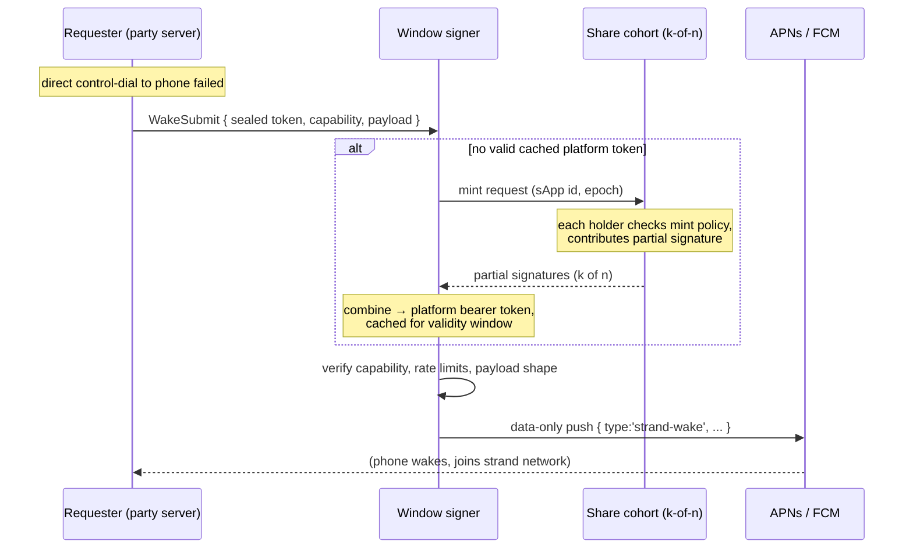

# Sereus Push Network

> **Design-stage document.** Nothing in this document is implemented. The shipped push path — per-node raw FCM/APNs credentials, party-server fan-out, mobile push-wake receive — is described in [`architecture.md`](architecture.md) → Strand Hibernation → Wake Mechanisms 5. This document designs its successor: a public, threshold-custody notification network. Survey of prior art was done 2026-08 (sources linked inline).

## Problem

Platform push is inherently centralized in two ways that the rest of Sereus is not:

1. **Credential issuance.** An APNs auth key or FCM service-account credential is bound to one Apple/Google developer account and one app id. Only the sApp publisher can hold or delegate it, and only pushes signed with it reach the store-distributed app. No architecture changes this — decentralization can distribute trust in the *use* of the credential, never its issuance.
2. **Capability shape.** The credential is an **app-wide bearer capability with no per-recipient scoping**: anyone who can produce one valid platform token can push to (wake, spam, drain the battery of) *every* install of the sApp. Both platforms mint short-lived bearer tokens from the long-term credential (an APNs ES256 JWT, refreshed every 20–60 minutes; an FCM OAuth2 access token from an RS256 service-account JWT, valid ~1 hour), so even "the key never leaves custody" designs still emit hourly all-installs capabilities.

The shipped model injects **raw** credentials into each configured node (`cadre-host` secret store / `cadre-provider` per-tenant config → `PushCredentials` → `createPushNotifier`). That is appropriate exactly when the node operator *is* the sApp developer (reference apps, single-developer deployments). For a multi-party sApp it is leak-by-design: every self-hosted basement PC that wants to wake its own party's phones would hold a credential that can wake everyone's.

The alternatives we reject:

- **sApp-developer-hosted push server** (the XMTP model): re-centralizes on the developer, who must now run infrastructure forever.
- **Foundation-hosted gateway** (the Session/SimpleX/Berty model): re-centralizes on us.

### Goals

- After onboarding, **no single machine holds a raw long-term push credential** — for FCM, ideally the full private key *never exists anywhere, ever*.
- **No mandatory service operated by the sApp developer or the foundation.** A public network of operators carries the role; the foundation is at most a bootstrap participant.
- Every push request is **policy-checked** before delivery: payload shape, rate limits, and proof that the requester is entitled to wake that recipient.
- One network serves **all sApps** (shared operator set, shared protocol), with per-sApp credential cohorts.
- Delivery remains **best-effort**. The check-in wake (Wake Mechanism 2) stays the backstop; nothing here changes that. iOS silent push remains best-effort under APNs coalescing regardless of who sends it.

### Non-goals

- Replacing the platform channels. UnifiedPush-style distributors are a possible Android escape hatch (no Google credential at all), but iOS mandates APNs, so the network must handle platform credentials either way.
- Notification *content* delivery. Sereus pushes are data-only wake signals; the strand network carries the actual data after the phone wakes. This is the Session "oblivious push" posture and it holds here.

## Prior art (surveyed 2026-08)

**Nobody does decentralized custody of push credentials.** Every surveyed P2P project decentralizes transport and metadata, then funnels last-mile delivery through a server somebody runs with the vendor credential:

| Project | Who holds APNs/FCM credential | Notes |
|---|---|---|
| [Berty](https://github.com/berty/berty) | Berty Technologies (relay self-hostable, but only useful with your own app signing identity) | Closest architectural match: open-source push relay (`bertypushrelay`), **no central token registry** — phone seals its device token to its chosen relay's pubkey (NaCl anonymous box), shares the sealed blob E2E; sender dials the recipient's relay directly; relay decrypts the token per-request and persists nothing; payload E2E, ≤4 KB |
| [Session](https://github.com/oxen-io/session-push-notification-server) | OPTF (the foundation) | Content-free "oblivious" pushes; opt-in; polling fallback |
| [SimpleX](https://github.com/simplex-chat/simplexmq/blob/stable/protocol/push-notifications.md) | SimpleX (the company), iOS only | Android avoids push entirely via a persistent background service |
| [Status/Waku](https://status.app/blog/status-app-notifications-on-ios) | Status (app-id-bound cert), push servers user-selectable | Architectural decentralization of the relay, not the credential |
| [XMTP](https://docs.xmtp.org/chat-apps/push-notifs/understand-push-notifs) | Each app developer runs their own notification server | Protocol punts on the problem |
| [Push Protocol](https://comms.push.org/docs/notifications/) | Push Inc. for mobile delivery | Decentralizes notification *content*, not OS delivery |
| [ntfy](https://ntfy.sh)/UnifiedPush | ntfy.sh operator for iOS; Android self-hostable with no Google credential | The iOS half is the tell: self-hosted servers must upstream through ntfy.sh because only it holds the APNs key for the ntfy app |

On threshold substrates: **Lit Protocol** is the closest existing network (threshold ECDSA over P-256 — matches APNs ES256 — plus policy-pinned [Lit Actions](https://developer.litprotocol.com/sdk/serverless-signing/fetch) that can decrypt in-enclave and make HTTP calls), but imported keys go through its Wrapped-Keys path — full key decrypted inside **one** node's TEE with threshold-gated *access*, not threshold *signing* — and the network is ~7 permissioned operators at ~$0.01/execution. **Nillion**'s MPC layer (nilDB) computes only store/match/sum — it cannot sign; its nilCC product is a rented SEV-SNP container, equivalent trust to a confidential-compute cloud VM. Neither has push prior art. We take Lit's *patterns* (policy rides with the quorum; sign-in-cohort) onto our own operator network rather than buying its trust model.

## Design overview

A single public network — the **push network** — operated by community + foundation nodes, shared across all sApps. Roles:

- **Operator node**: always-on Node.js server participating in the push network. Any operator may serve any sApp's *submit* traffic; a subset per sApp holds credential shares.
- **Share cohort (per sApp)**: the k-of-n subset of operators holding that sApp's credential shares. Assignment recorded in the network's config DB (below).
- **Window signer (per sApp, rotating)**: the operator that most recently combined a threshold-mint into a platform bearer token. It caches the token for its validity window, is **preferentially routed to** for that sApp's pushes during the window, and never shares the token.
- **Requester**: a party's cadre node (typically the always-on server that today runs `PushFanoutService`) whose direct control-network dial to a hibernating phone failed.
- **Recipient**: a phone that registered a device token.

### The flow

The **hot path** (WakeSubmit, mint rounds) is native libp2p request/response protocols under `/sereus/push/*`, following the seed/wake protocol pattern (length-prefixed JSON frames, read timeouts, concurrency caps). The **cold path** (registry, policy, audit) is a strand database — see [Substrate](#substrate-a-strand-plus-rpc-protocols).

### Threshold minting, per platform

The user-visible idea — *nodes don't reconstruct the credential; a signing request passes through share-holders, each applies its share, and the combiner ends up with a platform token* — is exactly how threshold signatures work, with platform-specific caveats:

**FCM (RS256 → threshold RSA — the strong case).** RSA threshold signing ([Shoup 2000](https://www.iacr.org/archive/eurocrypt2000/1807/18070209-new.pdf)) is **non-interactive**: each holder computes a partial signature `H(m)^{d_i}` locally and the combiner multiplies k of them — literally "apply share and pass along," one round, no coordination state. Better still, GCP lets you **upload a user-managed public key** for a service account ([`gcloud iam service-accounts keys upload`](https://cloud.google.com/iam/docs/keys-upload), RSA public key in an X.509 cert — Google never sees the private key). So the sApp's FCM key can be generated *distributedly* (dealer-split at a signing ceremony, or full distributed RSA keygen so **the private key never exists in one place at any time**), and only the public half goes to Google. The mint output is the RS256-signed OAuth2 assertion; the signer exchanges it for the ~1 h access token.

**APNs (ES256 → threshold ECDSA — the awkward case).** Apple generates the `.p8` and hands the developer the private key; there is no upload-your-own-public-key path. So the full key necessarily exists once, at a **one-time onboarding ceremony**: the developer (or a ceremony tool) splits it into shares, distributes them to the cohort, and destroys the original. Trust in the ceremony is unavoidable; everything after is k-of-n. Threshold ECDSA is also **interactive** (CGGMP/GG20-class multi-round protocols, or one fast online round if presignatures are precomputed offline) — not a simple pass-along chain. This is fine, because the cadence saves us: an APNs JWT is refreshed at most every 20 minutes and accepted for 60, so the cohort runs **one signing ceremony per sApp per token window**, not per push. Latency and protocol weight are irrelevant at that rate. (Operator nodes are Node servers, so native TSS library bindings are acceptable — no RN/browser constraint on this tier.)

**What minting does *not* protect.** The mint's output is still an hourly all-installs bearer token. Threshold custody buys two things: (a) no operator can exfiltrate the long-term credential (for FCM, there may be nothing to exfiltrate); (b) **policy rides with the quorum** — each share-holder independently validates the mint request (right sApp, right epoch, signer within rotation schedule, audit row committed) before contributing. What it cannot do is bind *each push*, because share-holders approve the mint, not the sends. The window signer is the residual trust:

- It can push to any install of that sApp **for one window**. The blast radius equals what a Berty-style relay has *permanently* — but time-boxed, rotated, and accountable.
- Mitigations: keep windows short (APNs floor is 20 min); rotate the signer per epoch (deterministic draw over the operator roster, e.g. hash of sApp id + epoch — so no operator can camp the role); require the signer to append per-window push counts to the audit log (accountability, not prevention); allow the cohort to skip a signer (refuse its next mint) on evidence of abuse; optionally require the signer to run in a TEE with attestation recorded at mint time (hardening, not a trust root).
- The signer is also a **per-sApp-per-window metadata concentrator**: it sees which sealed tokens get woken and when. Rotation spreads this across operators; sealed payloads (below) bound what it sees to timing + target.

### Device tokens are sealed, not published

Today `DeviceToken` rows carry the raw FCM/APNs token in the party's control DB — readable by any cadre member, and handed to a notifier the party itself runs. In the push-network model the party no longer sends the platform push, so the raw token should not transit the requester at all (a raw token lets anyone with *any* push credential for the app target that device; Berty got this right).

Instead the phone **seals its token to the sApp's network public key** (a threshold-encryption key held by the same cohort — established at onboarding for FCM-style DKG, or dealt at the APNs ceremony). The `DeviceToken` row stores the sealed blob; the requester forwards it opaquely in `WakeSubmit`; the cohort **threshold-unseals it once per window** at the signer (same k-of-n, same policy gate as minting, cached alongside the platform token for the window, never persisted). The existing row semantics — owner-signed whole-row insert, monotonic `UpdatedAt`, stamp retirement into `Revocation` on clear — carry over unchanged; only the token field's plaintext changes to a sealed box. Payloads likewise: today `{ type:'strand-wake', strandId, reason }` transits FCM/APNs in the clear to Google/Apple; sealing the payload to the device (the Berty `OutOfStoreMessage` pattern) removes the strand id from platform and signer view, leaving timing + target device as the only leaked metadata.

## App-level acceptance control

Yes — at three layers, two of which the sApp controls directly:

1. **Network policy (sApp-controlled).** The sApp's registry entry in the config DB carries a policy document the signer and every share-holder enforce: allowed payload types (v1: `strand-wake` only), payload size cap, per-token / per-requester / global rate limits, quiet-hours or batching hints, platform toggles. Violations are refused at submit (signer) and starve the mint (share-holders refuse to serve a signer that demonstrably ignores policy — via the audit log).
2. **Recipient-issued capabilities (recipient-controlled).** A `WakeSubmit` must present a **grant**: a signature by the recipient party's owner key (the same key that authorized the `DeviceToken` row) naming who may wake this device — a specific peer set, "any co-member of strand S" (proven by the requester's membership signature), an expiry, and a rate ceiling. The phone publishes grants alongside its sealed token; revocation is the existing stamp-retirement mechanism. This is the per-recipient scoping the platform credential itself can never express: the network converts an app-wide capability into recipient-scoped ones and refuses everything else.
3. **On-device (sApp-controlled).** All pushes are data-only; the OS hands them to the sApp's background task (`push-wake-native.ts` today), which decides whether to wake the strand, render anything, or drop the message. The final acceptance gate always runs the sApp's own code, plus the OS-level user notification settings above it.

## Substrate: a strand, plus RPC protocols

**A strand — but for the cold path only.** This mirrors the control network's own split: an Optimystic database for replicated authoritative state, native `/sereus/*` protocols for latency-sensitive request/response. A bare DHT is not enough: the network needs *authenticated, mutable, replicated* shared state (an operator roster with admission semantics, per-sApp policy that share-holders must agree on, an append-only audit log) — which is exactly what a strand database provides and a DHT does not. The strand would be **open** (public membership; the [`feat-open-strand-witness-policy`](../tickets/backlog/feat-open-strand-witness-policy.md) work is a dependency for making its writes trustworthy), and it doubles as the first real cross-party strand — forcing the cross-party discovery and cohort questions ([`strands.md` → Some Questions](strands.md#some-questions)) that single-party deployments have deferred.

What the database holds (the "could the DB role do more?" answer — yes, considerably):

| Table (sketch) | Purpose |
|---|---|
| `SApp` | Registry: sApp id, platform app ids/bundle ids, policy document, network public keys (threshold signing + sealing), current share epoch |
| `Operator` | Roster: operator peer key, addresses, admission record (foundation co-sign at bootstrap; stake/reputation later), optional TEE attestation |
| `ShareCohort` | Per sApp per epoch: which operators hold shares, threshold k, reshare state (operator churn forces proactive resharing — this table coordinates it) |
| `MintAudit` | Append-only: every mint (sApp, epoch, signer, contributing holders, timestamp-by-consensus) and every window's signer-reported push count. The accountability substrate for skip-a-signer and policy-starvation decisions |
| `SignerSchedule` | Derived/recorded rotation draw per epoch, so requesters can resolve "who is the current window signer for sApp X" from replicated state instead of a discovery round trip |

What it deliberately does **not** hold: device tokens or grants (those stay in each party's control DB, sealed — the push network learns a token only inside a policy-gated unseal), and rate-limit counters (too hot for consensus writes; they live in signer memory and are reconciled in aggregate through `MintAudit`, accepting the same "acceptably lossy on restart" posture as today's fan-out cooldowns).

Write rates are low (registry changes, epoch rotations, audit appends), so strand consensus costs are tolerable; the audit log is the one growth surface and is append-only by design (same reasoning as `FormationUsage`/`Revocation`).

## Staged path

- **v0 (shipped).** Raw per-node credentials. Remains correct for operator-is-developer deployments; everything below is additive.
- **v1 — the network, with simple custody.** Public network protocol, policy layer, sealed tokens + grants, signer rotation, audit — but custody is threshold *encryption* only: the cohort threshold-decrypts the raw credential into the window signer's memory per window (Lit's encrypted-secret pattern, on our operators). Much simpler than threshold signing, identical window blast radius; weaker exfiltration story (a malicious signer sees the raw key during its window — mitigated by rotation + audit, optionally TEE). All protocol surfaces, DB schema, and policy semantics are final-shape; only the mint internals are v1.
- **v2 — true threshold signing.** FCM first (Shoup threshold RSA is non-interactive and the key can be born distributed — the full-strength story with modest implementation cost), APNs second (interactive threshold ECDSA at once-per-window cadence, one-time split ceremony). v1's threshold-decrypt remains the fallback for any platform a TSS scheme doesn't cover.

## Open questions

- **Operator admission and incentives.** Who runs public nodes, what stops sybils from stacking a share cohort, whether admission is foundation-co-signed, staked, or reputation-gated — undesigned. Bootstrap reality: foundation + sApp developers run the first operators, which is still strictly better than v0 (k-of-n across distinct organizations vs. raw keys on every party's server).
- **Cohort composition.** Whether the mint cohort, unseal cohort, and audit-witness set are the same operators, and how per-sApp cohorts shard across the shared network.
- **Threshold-ECDSA implementation** maturity for Node (candidate libraries, presignature management, proactive resharing on churn) — needs a spike before v2 planning.
- **Requester → signer routing** when the scheduled signer is down: fail over to a fresh mint by the next operator in the draw, which needs the draw to be verifiable from `SignerSchedule` without a coordination round.
- **Platform ToS posture.** Third parties holding customers' push credentials is long-precedented (OneSignal et al.), and shares-not-credential should sit *better* than that — but nobody has asked Apple about a rotating signer set; worth a look before v2.
- **Cross-sApp coalescing.** One network sees all sApps' wake traffic; a phone in many sApps could get one coalesced wake per window instead of one per strand. Today's per-strand wake (a documented v1 fan-out limit) carries over; coalescing needs the payload-sealing design to land first.
