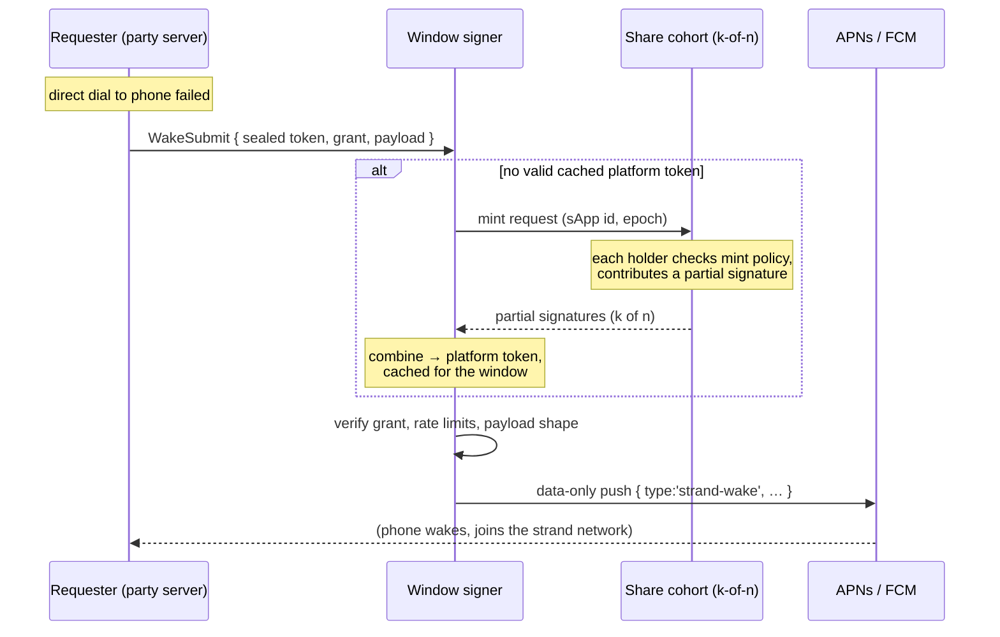

# Sereus Push Network

> **Status: design-stage.** Nothing in this document is implemented. The push system that ships today — where each server node is configured with raw push credentials and sends notifications itself — is described in [`architecture.md`](architecture.md) under *Strand Hibernation → Wake Mechanisms* (mechanism 5). This document designs its successor: a public, community-operated notification network in which no single machine ever holds a complete push credential. The survey of other projects' approaches was done in August 2026 (sources linked inline).

## Background: how mobile push notifications work

Some context before the problem statement, because the design is shaped entirely by how Apple and Google built their push systems.

A phone app that is suspended by the operating system cannot keep a network connection open. The **only** way to reach it is through the platform's push service:

- **APNs** (Apple Push Notification service) for iOS.
- **FCM** (Firebase Cloud Messaging, a Google service) for Android.

Delivering a push involves three pieces:

1. **A device token.** When an app installation registers for push, the platform gives it an opaque string identifying that specific installation. A sender must present this token to say *which device* to push to.
2. **A push credential.** The app's publisher holds a long-term secret issued by Apple/Google — an APNs *auth key* (a small ECDSA private key file, `.p8`) or an FCM *service account key* (an RSA private key in a JSON file). This credential is bound to the publisher's developer account and app id. Only pushes authorized by it are delivered to that app's installs.
3. **A short-lived access token.** Servers don't send the credential itself with every push. Instead they use the credential to *sign* a small proof, and the platform accepts pushes accompanied by that proof for a limited time:
   - APNs: the sender signs a **JWT** (JSON Web Token — a compact signed claim) with the auth key, using the **ES256** algorithm (ECDSA signatures over the P-256 elliptic curve). Apple requires refreshing it every 20–60 minutes.
   - FCM: the sender signs a JWT with the service-account key using **RS256** (RSA signatures), and exchanges it with Google for an OAuth2 access token valid for about an hour.

Two properties of this scheme drive everything below:

- **The credential is all-or-nothing.** There is no way to issue a credential that can only push to *some* installs, or only send *some kinds* of message. Anyone who can produce one valid access token can push to — wake, spam, drain the battery of — **every install of the app**.
- **The access token is a bearer token.** "Bearer" means possession is authorization: whoever holds it can use it, for its full validity window, with no further checks.

## Terminology

Sereus terms used throughout (see [`architecture.md`](architecture.md) for full definitions):

| Term | Meaning |
|---|---|
| **sApp** | A Sereus application, published by a developer, used by many independent parties |
| **Party** | A user (person or organization) and the set of machines they control |
| **Cadre** | A party's personal cluster of nodes (phone, laptop, home server, cloud VM) |
| **Control network** | The private database network connecting one party's own cadre nodes |
| **Strand** | A shared database network between multiple parties — the unit of sApp data sharing |
| **Hibernation / wake** | Inactive strands release their resources; a "wake" brings one back online. A suspended phone can only be woken by a platform push |

Cryptography terms used below:

| Term | Meaning |
|---|---|
| **Threshold cryptography** | Splitting a secret key into *n* **shares** held by different machines, such that any *k* of them ("**k-of-n**") can cooperate to use the key, but fewer than *k* learn nothing. Using the key does not require reassembling it |
| **Threshold signing** | Producing a valid signature cooperatively: each share-holder computes a *partial signature* with its share, and the partials are combined. The full private key never exists anywhere during signing |
| **Threshold encryption / "sealing"** | Encrypting data to a public key whose private counterpart is share-split; decryption ("unsealing") requires k share-holders to cooperate |
| **DKG** (distributed key generation) | A protocol where n machines *jointly generate* a keypair already in share form — the full private key never exists at any point in its life, not even at creation |
| **Dealer ceremony** | The weaker alternative to DKG: one trusted process briefly holds the full key, splits it into shares, distributes them, and destroys the original |
| **Mint** | In this document: the act of the share cohort cooperatively producing one short-lived platform access token |
| **TEE** (trusted execution environment) | A hardware-isolated enclave (e.g. AMD SEV-SNP) whose memory the machine's own operator cannot read, and which can prove ("attest") what code it runs |
| **DHT** (distributed hash table) | A peer-to-peer key/value lookup structure; provides discovery, but not authenticated shared state |

## The problem

Push notification is inherently centralized in two ways that the rest of Sereus is not:

1. **Credential issuance is centralized and can't be changed.** Only Apple/Google issue push credentials, and only to the sApp's publisher. No architecture removes this; decentralization can distribute trust in the *use* of the credential, never its issuance.
2. **The credential's shape is wrong for a multi-party system.** As described above, it is an app-wide bearer capability with no per-recipient scoping. Whoever operates the push sender is trusted with reaching every user of the sApp.

### Why the shipped model doesn't scale to multi-party sApps

Today, push works like this: a party's always-on server node is configured with the **raw** FCM/APNs credentials (via the `cadre-host` secret store or `cadre-provider` per-tenant config, flowing into `PushCredentials` → `createPushNotifier`), and it sends wake pushes to that party's own phones directly.

That is fine exactly when the node operator *is* the sApp developer — reference apps, single-developer deployments. But for a real multi-party sApp it is leak-by-design: every self-hosted server that wants to wake *its own party's* phones would have to hold a credential that can wake *everyone's*. Distributing the credential is equivalent to publishing it.

### Alternatives considered and rejected

- **The sApp developer hosts a push server** (the model XMTP uses). Every notification for every user flows through the developer's infrastructure, which the developer must run forever. Re-centralizes on the developer.
- **The Sereus foundation hosts a push gateway** (the model Session, SimpleX, and Berty use, with their respective foundations/companies). Re-centralizes on us, and makes the foundation a mandatory dependency of every sApp.

### Goals

- After a one-time onboarding, **no single machine holds a complete long-term push credential**. For FCM there is a path where the full private key *never exists anywhere, ever* (explained below).
- **No mandatory service operated by the sApp developer or the foundation.** A public network of independent operators carries the role; the foundation is at most one bootstrap participant among several.
- **Every push request is policy-checked** before delivery: what the payload may contain, how often a device may be pushed, and proof that the requester is entitled to wake that particular recipient.
- **One network serves all sApps** — shared operator set, shared protocol — with a separate credential-share group per sApp.
- **Delivery stays best-effort.** The periodic check-in wake (Wake Mechanism 2 in `architecture.md`) remains the backstop for any lost push. iOS silent pushes are throttled and coalesced by Apple regardless of who sends them; nothing here changes that.

### Non-goals

- **Replacing the platform channels.** On Android, [UnifiedPush](https://unifiedpush.org)-style distributors can eliminate the Google dependency entirely (a distributor backend would slot in as another `PushNotifier` implementation, and needs none of the machinery in this document because there is no credential to protect). But iOS forbids persistent background connections, so APNs — and its app-bound credential — is unavoidable. The network must handle platform credentials either way.
- **Delivering notification content.** Sereus pushes are *data-only wake signals*: they tell the phone "strand X has activity, come online," and the strand network itself carries the actual data once the phone wakes. No message content ever travels through the push channel. (Session calls this "oblivious push"; the posture holds here.)

## What others do (survey, August 2026)

The headline: **no project anywhere does decentralized custody of push credentials.** Every surveyed peer-to-peer system decentralizes message transport and metadata, then funnels the last mile through a server that somebody runs with the vendor credential:

| Project | Who holds the APNs/FCM credential | Notes |
|---|---|---|
| [Berty](https://github.com/berty/berty) | Berty Technologies (relay is self-hostable, but only useful if you also sign your own app build) | Closest architectural match to what we want. Open-source push relay (`bertypushrelay`) with **no central token registry**: the phone encrypts ("seals") its device token to its chosen relay's public key and shares the sealed blob with contacts inside end-to-end-encrypted conversations; a sender contacts the recipient's relay directly; the relay decrypts the token per-request and stores nothing; payloads are end-to-end encrypted, capped at 4 KB |
| [Session](https://github.com/oxen-io/session-push-notification-server) | OPTF (the project's foundation) | Content-free "oblivious" pushes; opt-in, with polling as fallback |
| [SimpleX](https://github.com/simplex-chat/simplexmq/blob/stable/protocol/push-notifications.md) | SimpleX (the company), iOS only | Android avoids push entirely with a persistent background service |
| [Status/Waku](https://status.app/blog/status-app-notifications-on-ios) | Status (the company; the certificate is bound to their app id), though users may choose or self-run a push server | Decentralizes the relay role, not the credential |
| [XMTP](https://docs.xmtp.org/chat-apps/push-notifs/understand-push-notifs) | Each app developer runs their own notification server | The protocol explicitly leaves push to the app layer |
| [Push Protocol](https://comms.push.org/docs/notifications/) | Push Inc., for mobile delivery | Decentralizes notification *content* distribution, not OS-level delivery |
| [ntfy](https://ntfy.sh) / [UnifiedPush](https://unifiedpush.org) | **None on Android/desktop** — a self-hosted "distributor" replaces the vendor channel with its own persistent connection | Not credential *custody* but credential *elimination*: the spec splits into a client↔distributor API and an app-server↔push-server API, and the per-device **endpoint URL is the capability** — shipping precedent for recipient-scoped push capabilities. iOS is the boundary case: no persistent background sockets allowed, so APNs (and its app-bound credential) is forced back in — self-hosted ntfy servers must relay through ntfy.sh, which alone holds the APNs key for the ntfy iOS app |
| [WalletConnect/Reown Echo](https://docs.reown.com/advanced/echo-server) | Hosted mode: Reown, multi-tenant over many wallets' FCM/APNs credentials. Self-host/spec modes: each operator's own | Three deployment modes (hosted platform, self-hosted Rust server, or implement the wire spec). Same custody class as XMTP — somebody's server holds the raw credential — but with interop standardized as a spec, so anyone can run a conformant instance. The hosted mode concentrates many apps' credentials in one operator, which is exactly the anti-pattern this design avoids |

On networks that might *hold* a credential for us:

- **[Lit Protocol](https://developer.litprotocol.com/resources/how-it-works)** is the closest existing substrate: a threshold-cryptography network offering threshold ECDSA over the P-256 curve (the same algorithm APNs JWTs use) and "Lit Actions" — policy scripts pinned by content hash that can decrypt secrets inside a TEE and [make HTTP calls](https://developer.litprotocol.com/sdk/serverless-signing/fetch). But keys *imported* into Lit (as an Apple-issued key would be) go through its "Wrapped Keys" path, where the full key is decrypted inside **one** node's TEE — threshold-gated *access* to the key, not threshold *signing* with it. The network is also small and permissioned (~7 operators) at ~$0.01 per execution.
- **Nillion**'s multi-party-computation layer (nilDB) supports only store/match/sum operations — it cannot produce signatures. Its confidential-compute product (nilCC) is a rented TEE container: equivalent trust to a confidential cloud VM, not threshold custody.

Neither has push prior art. The design below takes Lit's *patterns* — policy enforced by the quorum, signing inside a cohort — and runs them on Sereus's own operator network rather than adopting Lit's trust model.

## The design, step by step

### Step 1: a shared public network takes over sending

Instead of each party's server holding credentials and calling APNs/FCM itself, a single public **push network** — operated by community and foundation nodes — does the sending, for all sApps.

The roles:

- **Operator node**: an always-on server (Node.js tier — no mobile/browser constraint) run by an independent operator, participating in the push network. Any operator can accept push requests for any sApp.
- **Share cohort** (one per sApp): the k-of-n subset of operators holding that sApp's credential shares. Which operators, and what k, is recorded in the network's shared database (Step 5).
- **Window signer** (one per sApp at a time, rotating): the operator currently holding a valid short-lived platform token for that sApp, and therefore the one push requests are routed to. Explained in Step 3.
- **Requester**: a party's own cadre node — typically the always-on server that today runs `PushFanoutService` — which turns to the push network after its direct peer-to-peer dial to a hibernating phone fails (a suspended phone is unreachable directly; that is the whole reason push exists).
- **Recipient**: a phone that registered a device token.

### Step 2: the credential exists only as threshold shares

At onboarding, the sApp's push credential is split into n shares across the share cohort, threshold k. From then on, producing the short-lived platform token — the **mint** — is a cooperative act: each share-holder computes a partial signature with its share and passes it along; combining k partials yields a validly signed token. **The full credential is never reassembled.** Notably, this "each node applies its share and passes the message along" flow is not an approximation — for RSA it is literally how the math works (details in the per-platform section below).

Because every mint requires k independent operators, each of them independently checks **mint policy** before contributing: is this the scheduled signer for this sApp and time slot, is the audit record in place, is the rotation being respected. A single compromised operator can neither mint nor leak anything.

### Step 3: the window signer — cache the token, never share it

A minted platform token is a bearer token valid for a bounded window (20–60 minutes for APNs, ~1 hour for FCM). Handing it around would recreate the original problem, so it never travels:

- The operator that combines the partials — the **window signer** — caches the token in memory for its validity window and uses it to make the actual HTTPS calls to APNs/FCM.
- All push requests for that sApp are **preferentially routed to the current window signer** for the duration of the window. Requesters look up who that is from the shared database's rotation schedule (Step 5) rather than asking around.
- The signer role **rotates** each window by a deterministic draw over the operator roster (e.g. a hash of sApp id + epoch number), so no operator can hold the role indefinitely and everyone can verify whose turn it is.

The sequence, end to end:

### Step 4: device tokens and payloads are sealed

Today, `DeviceToken` rows in a party's control database carry the raw FCM/APNs token, readable by any of the party's own nodes — acceptable when the party sends its own pushes. In the push-network model the party no longer sends, so the raw token should not be visible to the requester at all: a raw device token lets *anyone holding any push credential for the app* target that device. (Berty got this right with its sealed-token design.)

Instead:

- The phone **seals** (threshold-encrypts) its device token to the sApp's network public key — a key whose private counterpart is share-split across the same cohort, established at onboarding.
- The `DeviceToken` row stores the sealed blob. Everything else about the row is unchanged: owner-signed whole-row insert, monotonic `UpdatedAt`, stamp retirement into `Revocation` on clear (see `architecture.md`).
- The requester forwards the sealed blob opaquely inside `WakeSubmit`. The cohort **unseals it once per window** at the signer, under the same k-of-n policy gate as minting; the plaintext token is cached alongside the platform token for the window and never persisted.
- The wake **payload** gets the same treatment. Today `{ type:'strand-wake', strandId, reason }` transits Google/Apple in the clear; sealing the payload to the device (Berty's `OutOfStoreMessage` pattern) hides the strand id from both the platform and the signer. What remains observable is only *timing* and *which device* — irreducible, since APNs/FCM must know the destination.

### Step 5: shared state lives in a strand; the hot path is direct RPC

The network needs two kinds of communication, and Sereus already has a pattern for each (the control network uses the same split):

- **Hot path — direct request/response.** Push submission and mint rounds are latency-sensitive, point-to-point exchanges. These are native libp2p protocols under `/sereus/push/*`, following the existing seed/wake protocol conventions (length-prefixed JSON frames, read timeouts, concurrency caps).
- **Cold path — replicated shared state.** The operator roster, per-sApp policy, cohort assignments, rotation schedule, and audit log must be *authenticated, mutable, agreed-on state* that all operators and requesters read consistently. That is precisely what a strand database provides — and what a bare DHT does not (a DHT offers lookup, not authenticated consensus over mutable records). **So yes: the push network is itself a strand**, with these consequences:
  - It is an **open** (public-membership) strand, which makes the [`feat-open-strand-witness-policy`](../tickets/backlog/feat-open-strand-witness-policy.md) backlog work a dependency — open strands need a story for making their writes trustworthy.
  - It would be the first genuinely **cross-party** strand in production, forcing the cross-party discovery and cohort-formation questions ([`strands.md` → Some Questions](strands.md#some-questions)) that single-party deployments have so far deferred.

The database earns its keep well beyond "a configuration file" (sketch — not schema):

| Table | Purpose |
|---|---|
| `SApp` | Registry: sApp id, platform app/bundle ids, the sApp's notification policy document, the network public keys (threshold signing + sealing), current share epoch |
| `Operator` | Roster: operator peer key, addresses, admission record (foundation co-signed at bootstrap; stake or reputation later), optional TEE attestation |
| `ShareCohort` | Per sApp per epoch: which operators hold shares, the threshold k, and resharing state (when operators join or leave, shares must be proactively re-dealt — this table coordinates that) |
| `MintAudit` | Append-only log: every mint (sApp, epoch, signer, contributing share-holders) and each window's signer-reported push count. This is the evidence base for refusing a misbehaving signer and for policy enforcement |
| `SignerSchedule` | The recorded rotation draw per epoch, so any requester can resolve "who is the current window signer for sApp X" from replicated state |

What the database deliberately does **not** hold:

- **Device tokens and grants** — those stay in each party's own control database, sealed. The push network learns a token only inside a policy-gated unseal.
- **Rate-limit counters** — far too write-hot for a consensus database. They live in the signer's memory and are reconciled in aggregate through `MintAudit`, accepting the same "acceptably lossy across a restart" posture the shipped fan-out already documents for its cooldowns.

Write rates on the strand are low (registry changes, epoch rotations, audit appends), so consensus costs are tolerable. The audit log is the one unbounded-growth surface and is append-only by design, the same reasoning as the control schema's `FormationUsage` and `Revocation` tables.

## Platform specifics: how the threshold mint actually works

The two platforms use different signature algorithms, and that difference decides how clean the story is on each.

**FCM — the strong case.** FCM's JWTs use RS256, i.e. RSA signatures, and RSA has a remarkably clean threshold scheme ([Shoup 2000](https://www.iacr.org/archive/eurocrypt2000/1807/18070209-new.pdf)): signing is **non-interactive** — each share-holder computes its partial signature locally in one step, and the combiner multiplies k partials together. No rounds, no coordination state; exactly the "apply your share and pass it along" flow. Even better, Google's cloud platform allows **[uploading a user-managed public key](https://cloud.google.com/iam/docs/keys-upload)** for a service account (`gcloud iam service-accounts keys upload` — Google never sees the private key). Combining the two: the sApp's FCM key can be **generated distributedly (DKG)**, so the full private key *never exists in one place at any moment of its life*, and only the public half is registered with Google. The mint's output is the signed JWT, which the window signer exchanges with Google for the ~1-hour access token.

**APNs — the awkward case.** Apple's JWTs use ES256 (ECDSA), and Apple offers no upload-your-own-key path: Apple generates the `.p8` file and hands the developer the complete private key. Two consequences:

1. The full key necessarily exists once, at a **one-time onboarding ceremony**: the developer (or a ceremony tool) splits it into shares, distributes them to the cohort, and destroys the original. Trust in that ceremony is unavoidable; everything afterward is k-of-n.
2. Threshold ECDSA is **interactive** — multi-round protocols of the CGGMP/GG20 family (or one fast online round if "presignatures" are precomputed offline). Not a simple pass-along chain. This is acceptable because of cadence: an APNs JWT may be refreshed at most every 20 minutes and stays valid for 60, so the cohort runs **one signing ceremony per sApp per token window** — not per push. At that rate, protocol latency and weight are irrelevant. (Operator nodes are servers, so native threshold-signature libraries are fine — no mobile/browser constraint on this tier.)

## Honest limits: what threshold custody does and doesn't protect

The mint's output is still an app-wide bearer token, valid for one window. Threshold custody buys exactly two things:

1. **No operator can steal the long-term credential.** For FCM under DKG, there is nothing to steal — the key has never existed in complete form.
2. **Policy travels with the quorum.** Every mint needs k independent operators, each applying the policy checks before contributing. A signer that violates policy finds its next mint refused ("starved") by the cohort, on the evidence in `MintAudit`.

What it cannot do is bind *individual pushes* — the cohort approves the mint, not the sends. **The window signer is the residual trust** in this design:

- For one window, it can push to any install of that sApp. That blast radius equals what a Berty-style relay operator has *permanently* — here it is time-boxed, rotated across operators, and accountable after the fact.
- Mitigations, in increasing order of cost: keep windows short (Apple's floor is 20 minutes); rotate the signer every window by verifiable draw, so no operator can camp the role; require the signer to append its per-window push counts to `MintAudit` (accountability, not prevention); let the cohort refuse a mint to a signer with evidence of abuse; optionally require signers to run in a TEE with attestation recorded at mint time (a hardening layer, not a trust root).
- The signer is also a **metadata concentrator for its sApp and window**: it sees which sealed tokens are woken and when. Rotation spreads this across operators; sealed payloads limit what it sees to timing and target.

## Who controls what a notification can do

Yes — the question "is there app-level control over what notifications are accepted?" has a three-layer answer, and the sApp controls two of the layers directly:

1. **Network policy — sApp-controlled.** The sApp's `SApp` registry row carries a policy document that the signer and every share-holder enforce: allowed payload types (initially only `strand-wake`), payload size cap, per-device / per-requester / global rate limits, optional quiet-hours or batching hints, per-platform toggles. Violations are refused at submission by the signer — and a signer that doesn't refuse them gets starved at its next mint.
2. **Recipient-issued grants — recipient-controlled.** A `WakeSubmit` must present a **grant**: a statement signed by the recipient party's owner key (the same key that authorized the `DeviceToken` row) declaring who may wake this device — a specific set of peers, or "any co-member of strand S" (which the requester proves with its own membership signature) — plus an expiry and a rate ceiling. The phone publishes grants alongside its sealed token; revocation reuses the existing stamp-retirement mechanism. This layer is the per-recipient scoping that the platform credential itself can never express: the network converts an app-wide capability into recipient-scoped ones and refuses everything else. (UnifiedPush's per-device endpoint URL is the shipping precedent for exactly this shape — there the URL *is* the capability; here the grant is, because APNs/FCM sit between us and the device.)
3. **On-device — sApp-controlled.** Every push is data-only. The operating system hands it to the sApp's own background task (`push-wake-native.ts` today), which decides whether to wake the strand, show anything to the user, or drop the message entirely. The final acceptance gate is always the sApp's own code — with the user's OS-level notification settings above even that.

## Rollout in stages

- **v0 — shipped today.** Raw per-node credentials. Remains the right answer when the operator *is* the sApp developer; everything below is additive.
- **v1 — the network, with simpler custody.** Build the public network — protocols, policy layer, sealed tokens and grants, signer rotation, audit log — but implement custody as threshold *encryption* only: the cohort threshold-decrypts the raw credential into the window signer's memory each window (the pattern Lit's encrypted-secrets use, running on our operators). This is far simpler than threshold signing and has the identical window blast radius; the tradeoff is a weaker theft story, since a malicious signer sees the raw key during its window (mitigated by rotation and audit, optionally by a TEE requirement). Everything externally visible — protocol surfaces, database schema, policy semantics — is already final-shape; only the mint internals are provisional.
- **v2 — true threshold signing.** FCM first: Shoup threshold RSA is non-interactive and the key can be born distributed, so it delivers the full-strength story at modest implementation cost. APNs second: interactive threshold ECDSA at once-per-window cadence, behind the one-time split ceremony. v1's threshold-decryption remains the fallback for any platform a threshold-signature scheme doesn't cover.

## Open questions

- **Operator admission and incentives.** Who runs public operator nodes, what prevents one actor from registering many fake operators (a *sybil attack*) and stacking a share cohort, and whether admission is foundation-co-signed, stake-based, or reputation-based — all undesigned. The bootstrap reality is that the foundation and sApp developers run the first operators, which is already strictly better than v0: k-of-n across a few distinct organizations versus raw keys on every party's server.
- **Cohort composition.** Whether the minting cohort, the unsealing cohort, and the audit-witness set should be the same operators, and how per-sApp cohorts are sharded across the shared network.
- **Threshold-ECDSA implementation maturity** for Node.js — candidate libraries, presignature management, proactive resharing on operator churn. Needs a technical spike before v2 planning.
- **Failover when the scheduled signer is down.** The next requester should trigger a fresh mint by the next operator in the draw — which requires the draw to be verifiable from `SignerSchedule` alone, without a live coordination round.
- **Platform terms-of-service posture.** Third parties holding customers' push credentials is long-precedented (OneSignal and every push-provider SaaS), and holding *shares* rather than the credential should sit better than that — but nobody has asked Apple about a rotating signer set. Worth checking before v2.
- **Cross-sApp coalescing.** One network sees all sApps' wake traffic, so a phone participating in many strands could receive one coalesced wake per window instead of one per strand. Today's per-strand wake (a documented limit of the shipped fan-out) carries over; coalescing needs the payload-sealing design settled first.
