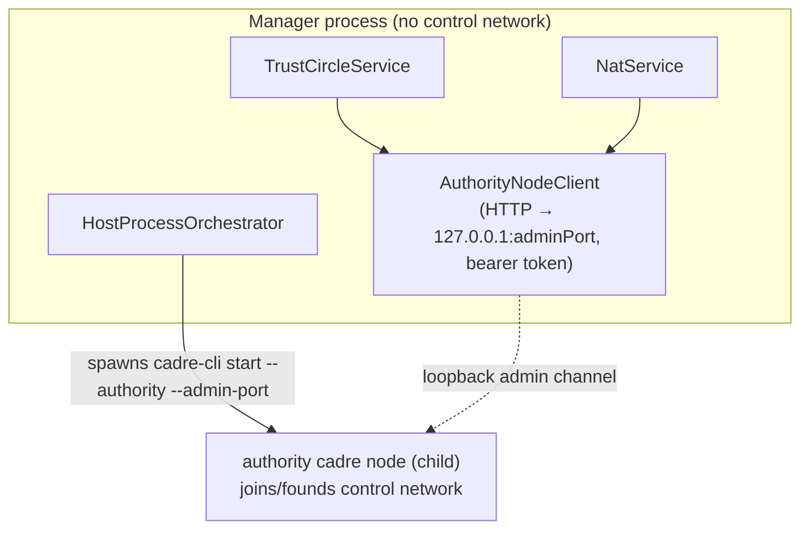

## Why

`cadre-host start` wires `TrustCircleService` and `NatService` with `CadreNodeLike` adapters that are throwing stubs (`missingCadreNodeStub` / `missingNatNodeStub` in `bin/host.ts:397-412`). Issuing/redeeming invites and building invite addresses return HTTP 500; the installer's first-enrollment-invite step degrades silently. The shipped `CadreNodeLike` hands back a live in-process `ControlDatabase` (`auth/trust-circle.ts:44`), whose only satisfier is an in-process `CadreNode` — making the manager a control-network participant, which violates the package's model (`docs/cadre-host.md` § Control-plane separation; provider holds no keys — `docs/architecture.md` line 524).

This ticket makes the manager spawn the admin's **authority node** through `HostProcessOrchestrator` and delegate to it over the admin channel built in `6.6-cadre-node-admin-channel`.

## Target shape



## Components

### `AuthorityNodeClient` (new, in cadre-host)

A thin HTTP client of the 6.6 admin contract, holding `{ baseUrl: http://127.0.0.1:<adminPort>, token }`. It implements **both** trimmed `CadreNodeLike` interfaces:

- For trust-circle: `createInvite`, `acceptPhone`, `removePeer`, `encodeInvite`, plus the new membership methods (see below) — **no `getControlDatabase`**.
- For NAT: `getPeerId()`, `getMultiaddrs()` (now async over the channel — see interface change).
- Plus `pushInviteAddresses(addrs)` → `PUT /admin/invite-addresses`.

Connection-refused / non-2xx map to a typed `AuthorityNodeUnavailableError`; the services translate that to `TrustCircleError('node_unavailable')` / `NatError` so the server returns a clear 503, not a raw 500.

### `CadreNodeLike` interface changes (`auth/trust-circle.ts`)

Drop `getControlDatabase(): ControlDatabase | null`. The two consumers of it — `isMember(peerId)` and `list()`'s `CadrePeer` enumeration — move to channel calls:

```ts
export interface CadreNodeLike {
  createInvite(token?: string, expiresInMs?: number): Promise<{ invite: CadreInvite; encodedInvite: string }>;
  acceptPhone(opts: { phonePeerId: string; token?: string }, issuedInvite?: CadreInvite): Promise<void>;
  removePeer(peerId: string): Promise<void>;
  encodeInvite(invite: CadreInvite): string;
  // replaces getControlDatabase():
  listMembers(): Promise<{ peerId: string; multiaddr: string }[]>;
  isMember(peerId: string): Promise<boolean>;
}
```

`TrustCircleService.isMember` / `.list` call `this.cadreNode.listMembers()` / `.isMember()` instead of reaching into a DB. The local-state fallback in `list()` (return labels as-is when the node can't be reached) is preserved by catching `node_unavailable` and degrading to the labels file — **listing must still work when the node is down** (requirement).

### NAT `CadreNodeLike` (`nat/nat-service.ts:35`)

`getPeerId()` / `getMultiaddrs()` become `Promise`-returning (channel round-trips). Update `getInviteAddresses()` accordingly (it already `await`s a status build). Keep the synchronous test-mock ergonomics by allowing the adapter methods to be async; update the existing NAT tests' mock.

### Orchestrator: spawn-the-authority-node path

`HostProcessOrchestrator` currently only `createContainer(request)` with a full `OrchestratorCreateRequest`. Add an authority-node lifecycle:

- Allocate a 4th port (`admin`) alongside `health/metrics/p2p`; persist it in the `Handle`/`PersistedHandle`/`ManagedNodeInfo.ports` (add `admin`).
- Spawn args gain `--authority --admin-port <admin>` and pass the host identity (via `--identity-protobuf <identityPath>` per 6.6) and `controlNetwork.partyId = installId`, `libp2pPort` mapped to the listen addr. Reuse the existing `CADRE_STARTUP_TOKEN` env (already set per child) as the admin bearer token.
- Expose `getAuthorityAdminEndpoint(): { baseUrl, token } | undefined` so `start` can build the `AuthorityNodeClient` after spawn, and so re-attach (`init()`) restores it from persisted state.
- A "spawn from saved config" entry the nodes routes can call: a method like `ensureAuthorityNode(cfg)` that creates the node if absent, returns its handle. This is what makes `/api/nodes/:id/{start,restart}` real.

### `bin/host.ts` wiring

Replace the stub block (`bin/host.ts:275-285`, helpers `397-412`):
1. `orchestrator.init()` (existing) then `orchestrator.ensureAuthorityNode({ identityPath: cfg.identityPath, partyId: cfg.installId, libp2pPort: cfg.libp2pPort })`.
2. Build `const authority = new AuthorityNodeClient(orchestrator.getAuthorityAdminEndpoint())`.
3. `new TrustCircleService({ cadreNode: authority, store })` and `new NatService({ rootDir, cadreNode: authority })`.
4. After `natService.start()`, push initial invite addresses: `await authority.pushInviteAddresses(await natService.getInviteAddresses())`; re-push on NAT change. Cleanest: give `NatService` an `onAddressesChanged` hook (fired from `start`/`putSettings`/`testReachability`) that `start` wires to `authority.pushInviteAddresses`. (Document the hook in `nat-service.ts`.)
5. Graceful shutdown stops the authority node via the orchestrator alongside the existing teardown.

Startup ordering: the admin channel isn't up until the child binds its admin port. `AuthorityNodeClient` calls already map refused-connections to `node_unavailable`; `start` should not block on node readiness (mirrors the current best-effort NAT start). The initial `pushInviteAddresses` is best-effort + retried on the next NAT event.

### `/api/nodes/:id/{start,restart}` (`server/routes/nodes.ts:91-113`)

Replace the 501 stubs: `start` → `orchestrator.ensureAuthorityNode(...)` (or generic re-spawn from persisted config) for the authority node id; `restart` → stop-then-ensure. Keep 404 for unknown ids. Non-authority generic spawn remains out of scope (only the authority node must be start/stoppable per the requirement) — return a clear `not_implemented` only for ids that have no saved config, not a blanket stub.

### Error mapping

Add `node_unavailable` to `TrustCircleErrorCode` (`auth/types.ts`) and a matching NAT code; map both to **503** in `server/error-handler.ts` / the trust-circle + nat routes. Confirm the existing `TrustCircleError.code` → status switch covers it.

## Docs

- `docs/cadre-host.md`: remove the "Known architectural gap (realignment pending)" framing and the "Honest gaps" stub bullet; update the "Status" section to reflect that the authority node is spawned and delegation works. Settle the topology open-reconciliation note (line ~52) on **single authority node**. Drop/redraw the "one node per member" diagram to the single-authority-node form.
- `docs/architecture.md`: qualify or restore the `@serfab/cadre-host (Complete)` status line now that the gap is closed (the plan flagged this as an open question — closing the gap means it can read Complete again; verify no other gaps remain).

## Tests (TDD targets)

- **AuthorityNodeClient** (against a stub HTTP server matching the 6.6 contract): each method issues the right request with the bearer header and parses the envelope; refused/500 → `AuthorityNodeUnavailableError`.
- **TrustCircleService with channel adapter** (mock client): `issueInvite` round-trips `createInvite`; `redeemInvite` calls `acceptPhone` + consumes the pending row; `list()` joins `listMembers()` with labels; when the client throws `node_unavailable`, `list()` still returns the local labels (degradation) and `issueInvite` surfaces a mapped error.
- **NatService**: `getInviteAddresses()` uses async `getPeerId()`/`getMultiaddrs()` from the channel; `onAddressesChanged` fires on `putSettings`/`testReachability`.
- **Orchestrator authority spawn**: `ensureAuthorityNode` is idempotent (no second child), allocates+persists the admin port, and `getAuthorityAdminEndpoint()` survives an `init()` re-attach. Use the existing `spawn.entrypoint` test hook with a fake CLI that just binds an admin port and echoes the token.
- **nodes route**: `POST /api/nodes/:authorityId/restart` stops then re-ensures; unknown id → 404.
- **start smoke** (host): with a fake authority CLI, `POST /auth/invites` returns an `encodedInvite` (no 500); with the fake node refusing connections, `GET /auth/trust-circle` still lists local labels and `POST /auth/invites` returns 503.

## TODO

- [ ] Add the `admin` port to orchestrator `Handle` / `PersistedHandle` / `ManagedNodeInfo.ports`; allocate it in the spawn path.
- [ ] Implement `ensureAuthorityNode(cfg)` + `getAuthorityAdminEndpoint()` on `HostProcessOrchestrator`; spawn `cadre-cli start --authority --admin-port <p> --identity-protobuf <identityPath>` with `partyId=installId` and the libp2p listen addr; reuse `CADRE_STARTUP_TOKEN` as the admin bearer.
- [ ] Implement `AuthorityNodeClient` (both `CadreNodeLike` shapes + `pushInviteAddresses`) with `AuthorityNodeUnavailableError`.
- [ ] Change trust-circle `CadreNodeLike`: drop `getControlDatabase`, add `listMembers`/`isMember`; rewrite `TrustCircleService.isMember`/`list` to use them; preserve the node-down listing fallback.
- [ ] Change NAT `CadreNodeLike` `getPeerId`/`getMultiaddrs` to async; update `getInviteAddresses`; add `onAddressesChanged` hook.
- [ ] Rewrite `bin/host.ts start`: spawn authority node, build the client, wire trust-circle + NAT + invite-address push, graceful stop. Delete `missingCadreNodeStub`/`missingNatNodeStub`.
- [ ] Make `/api/nodes/:id/{start,restart}` real for the authority node.
- [ ] Add `node_unavailable` error code + 503 mapping (trust-circle + nat).
- [ ] Update `docs/cadre-host.md` (settle topology, drop the gap/stub framing, fix diagram) and `docs/architecture.md` status line.
- [ ] `yarn workspace @serfab/cadre-host build && test` green; stream long runs with `tee`.
