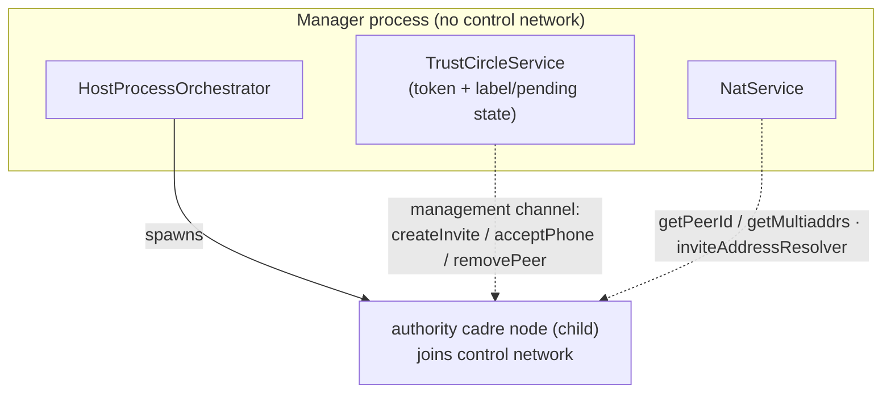

## Problem

`cadre-host start` wires `TrustCircleService` and `NatService` with `CadreNodeLike` adapters that are **throwing stubs** (`missingCadreNodeStub` / `missingNatNodeStub` in `packages/cadre-host/src/bin/host.ts`). As a result, issuing/redeeming invites and building invite addresses return HTTP 500, and the installer's first-enrollment-invite step degrades silently. Listing the trust circle works only because it falls back to the local labels file.

The shipped `CadreNodeLike` interface (`auth/trust-circle.ts`) hands back a **live in-process `ControlDatabase`** and exposes async `createInvite`/`acceptPhone`/`removePeer`. The only way to satisfy it is for the manager process to construct an in-process cadre-core `CadreNode` — which would make the manager a **participant in the cadre control network**. That contradicts the package's own model: cadre-host is the local-deployment sibling of `@serfab/cadre-provider`, and a provider is emphatically *not* a control-network participant (it holds no authority keys; the authority operations run on the customer's own node — see `docs/architecture.md` § Provider Integration, line 524).

`docs/cadre-host.md` has been corrected to state the intended model (see § "Control-plane separation"). This ticket brings the code into alignment with that corrected spec.

## Target architecture

Two planes, never conflated:

- **Management plane** — the manager process: loopback Fastify API + Svelte UI + the `cadre-host` CLI (a thin HTTP client). Carries no authority keys as cadre credentials; grants no membership. This is same-machine admin access only.
- **Cadre control network** — the party's private Optimystic network (`CadreControl` schema). Only *cadre nodes* join it. All authority operations (`createInvite`, `acceptPhone`, `authorizePeer`, `removePeer`, multiaddr reporting) execute **inside a cadre node**.

The manager spawns the admin's **authority node** (the child that carries the host identity and joins the control network) via `HostProcessOrchestrator`, and `TrustCircleService` / `NatService` delegate to it over a **management channel** (local IPC / loopback) — mirroring how cadre-provider drives its Docker drones over REST.

## Requirements

- The manager process must **not** instantiate an in-process `CadreNode` and must **not** open the control DB directly. The `missingCadreNodeStub` / `missingNatNodeStub` adapters and the `getControlDatabase(): ControlDatabase` shape of `CadreNodeLike` are removed/replaced.
- `cadre-host start` spawns (or adopts) the admin's authority node through `HostProcessOrchestrator`, using the persisted host identity from the installer and the configured libp2p port. The node joins the host's control network.
- `TrustCircleService` and `NatService` depend on a **channel-based adapter** to the authority node rather than a live node object:
  - `createInvite(token?, expiresIn?)`, `acceptPhone({ phonePeerId, token }, issuedInvite?)`, `removePeer(peerId)`, `encodeInvite(invite)` — round-trip to the node.
  - membership queries (`isMember`, `list`'s `CadrePeer` enumeration) — served by a node-side query endpoint, not by handing a `ControlDatabase` to the manager. The manager keeps owning token generation and the label/pending store.
  - `getPeerId()` / `getMultiaddrs()` — query the node.
  - the `network.inviteAddressResolver` hook — currently a synchronous in-process callback on `CadreNodeConfig`; it must be redesigned to cross the process boundary (e.g. the manager pushes NAT-resolved addresses to the node at spawn/refresh time, or the node calls back over the channel). Pick and document the transport.
- The node-side management surface must be reachable only by the local manager (loopback / unix socket / authenticated pipe), consistent with cadre-host's "no public manager surface" posture.
- `POST /api/nodes/:id/{start,restart}` (currently 501) become real once a "spawn node from saved config" path exists; at minimum the authority node is start/stoppable.
- Graceful degradation: if the authority node is down, authority operations return a clear, mapped error (not a raw 500); trust-circle *listing* still works from local state.

## Open questions for the plan stage to resolve

- **Topology:** does cadre-host spawn exactly one authority node (household = one party, members are `CadrePeer` devices that dial in — consistent with `architecture.md`), or per-member hosted nodes (as the older cadre-host.md diagram implied)? `docs/cadre-host.md` flags this as unresolved; settle it here. The rest of this spec assumes at least the single admin authority node.
- **Management channel transport:** does cadre-cli gain a loopback admin endpoint the manager calls, or does the orchestrator speak to children over a private IPC protocol? Reuse of the existing startup-token / `dockerId` plumbing in `orchestrator/` is a candidate.
- **cadre-cli surface:** `packages/cadre-cli/src/commands/start.ts` already constructs `new CadreNode(...)`. Determine whether the authority node is a normal cadre-cli child plus an admin endpoint, or a dedicated entrypoint.
- Whether `docs/architecture.md`'s "`@serfab/cadre-host` (Complete)" status line should be downgraded as part of this work.

## Non-goals

- Cross-WAN redemption via the management API (still localhost/LAN only; tracked separately).
- Circuit-relay client work (already parked in `backlog/4-relay-bootstrap-infrastructure`).
